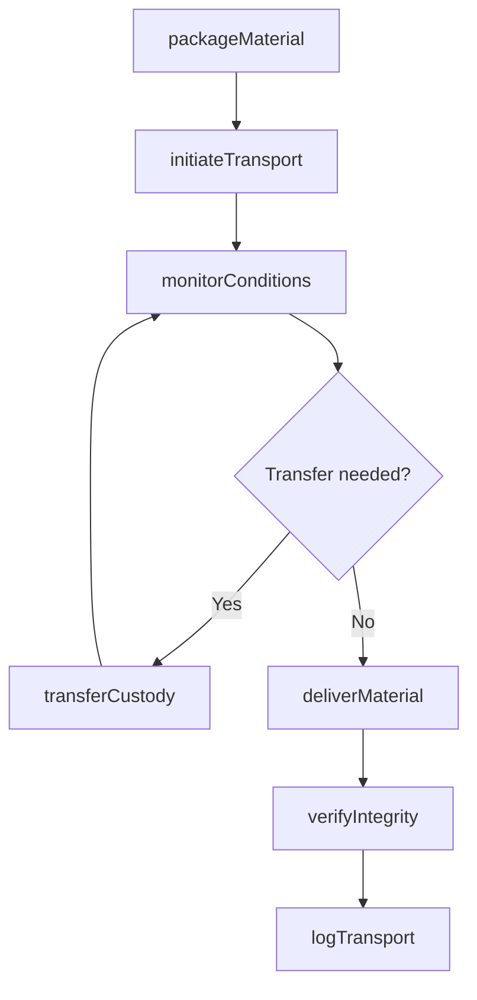
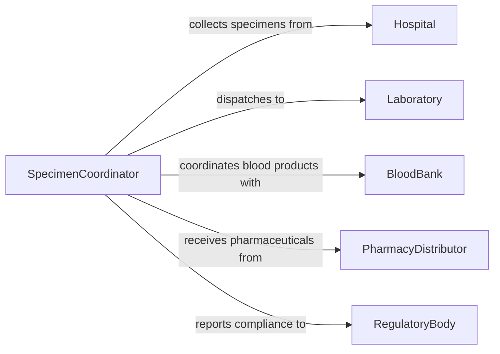

# Transport Biological Medical Materials

> Business-as-Code definition for biological and medical material transport. Models the chain-of-custody handling of specimens, blood products, pharmaceuticals, and laboratory samples under strict temperature and safety controls.

## Overview

Transporting biological and medical materials involves the safe, compliant movement of specimens, blood products, organ tissue, pharmaceuticals, and hazardous biological agents between healthcare facilities, laboratories, and research institutions. Every transport must maintain cold chain integrity, adhere to biohazard containment protocols, and preserve an unbroken chain of custody. Regulatory requirements from agencies such as OSHA, DOT, and IATA govern packaging, labeling, and documentation for all shipments.

## Actors

| Actor | Description |
|-------|-------------|
| Hospital | Healthcare facility originating or receiving biological materials |
| Laboratory | Testing facility processing specimens and returning results |
| BloodBank | Organization collecting, storing, and distributing blood products |
| PharmacyDistributor | Supplier shipping pharmaceuticals and medical solutions |
| RegulatoryBody | Government agency enforcing biohazard transport regulations |

## Roles

| Role | Description |
|------|-------------|
| MedicalCourier | Transports biological materials between facilities following safety protocols |
| SpecimenCoordinator | Packages, labels, and documents specimens for transport |
| ComplianceOfficer | Ensures transport operations meet regulatory and safety standards |
| ReceivingTechnician | Accepts, inspects, and logs incoming biological materials at the destination |

## Entities

| Entity | Description |
|--------|-------------|
| Specimen | A biological sample collected for testing or research purposes |
| ShipmentPackage | A sealed, labeled container meeting biohazard transport standards |
| ChainOfCustody | Documentation tracking every handler and location of a material |
| TemperatureLog | Continuous record of thermal conditions during transit |
| TransportManifest | Detailed listing of all materials, quantities, and classifications in a shipment |
| HazardClassification | The biohazard or dangerous goods category assigned to the material |

## Actions

| Action | Description |
|--------|-------------|
| packageMaterial | Seal biological material in compliant containers with proper labeling |
| initiateTransport | Dispatch a courier or carrier with the packaged material |
| monitorConditions | Track temperature, humidity, and transit time during transport |
| transferCustody | Hand off the material to the next authorized handler in the chain |
| deliverMaterial | Complete the transport by presenting the material at the destination |
| verifyIntegrity | Inspect the package and confirm material condition upon arrival |
| logTransport | Record all transport events in the chain-of-custody system |

## Events

| Event | Description |
|-------|-------------|
| materialPackaged | The biological material has been sealed and labeled for transport |
| transportInitiated | The courier has departed with the packaged material |
| conditionsMonitored | A temperature or condition checkpoint has been recorded |
| custodyTransferred | The material has been handed to the next authorized handler |
| materialDelivered | The material has arrived at the destination facility |
| integrityVerified | The package condition and material viability have been confirmed |
| transportLogged | All transport events have been recorded in the chain-of-custody system |

## Searches

| Search | Description |
|--------|-------------|
| findShipments | List shipments by material type, origin, destination, or status |
| getChainOfCustody | Retrieve the full custody history for a specific specimen or shipment |
| getTemperatureLogs | Look up thermal condition records for a transport run |
| getPendingDeliveries | Find shipments currently in transit or awaiting pickup |

## Workflow



## Actor Relationships



## Usage

### Calling Actions

```typescript
import { transportBiologicalMedicalMaterials } from '@headlessly/transport-biological-medical-materials'

const bioTransport = transportBiologicalMedicalMaterials()

// Package a specimen for transport
const pkg = await bioTransport.packageMaterial({
  materialType: 'blood-sample',
  specimenId: 'SPEC-2026-08814',
  hazardClass: 'UN3373-Category-B',
  containerType: 'triple-packaging',
  temperatureRequirement: { min: 2, max: 8, unit: 'C' }
})

// Initiate courier transport
await bioTransport.initiateTransport({
  packageId: pkg.id,
  courierId: 'courier-mreyes',
  origin: 'St. Mary Medical Center - Lab',
  destination: 'Regional Reference Laboratory',
  urgency: 'stat'
})

// Verify integrity at delivery
await bioTransport.verifyIntegrity({
  packageId: pkg.id,
  receivedBy: 'tech-akim',
  sealIntact: true,
  temperatureOnArrival: 4.2,
  conditionNotes: 'Package intact, specimen viable'
})
```

### Event-Driven Automation

```typescript
// Alert if cold chain is compromised
bioTransport.conditionsMonitored(async ({ packageId, temperature, threshold }) => {
  if (temperature > threshold.max || temperature < threshold.min) {
    await notify({
      to: 'lab-supervisor',
      message: `Cold chain breach on ${packageId}: ${temperature}C (allowed ${threshold.min}-${threshold.max}C)`
    })
  }
})

// Auto-update lab information system upon delivery
bioTransport.materialDelivered(async ({ packageId, specimenId, destination }) => {
  await updateLIS({
    specimenId,
    status: 'received',
    facility: destination,
    receivedAt: new Date().toISOString()
  })
})
```
