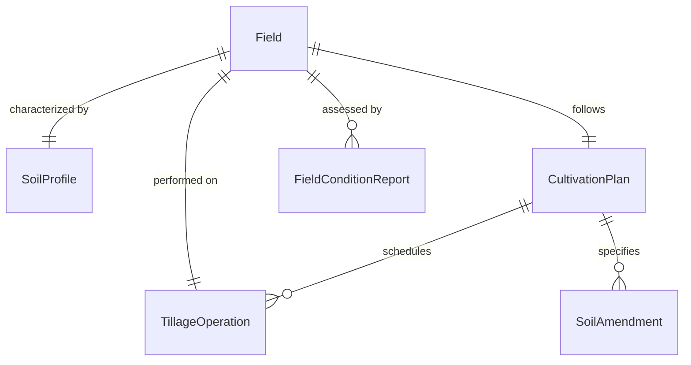
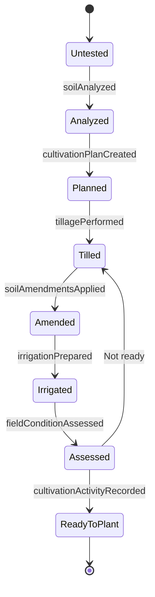
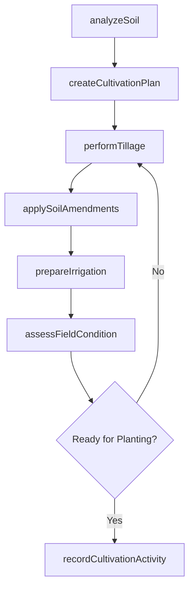
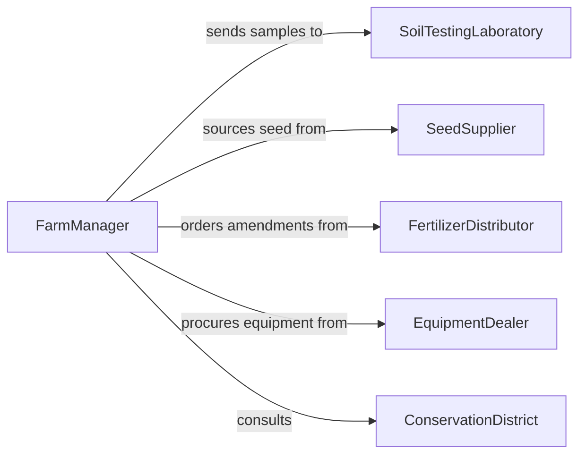

# Cultivate Land

> Business-as-Code definition for land cultivation activities. Models soil preparation, tillage, planting bed creation, and ongoing field management to support crop production.

## Overview

Cultivating land involves preparing soil for planting through tillage, amendment application, irrigation setup, and field conditioning. This definition exposes actions for soil analysis, cultivation planning, field preparation, and condition monitoring, along with events for tracking field readiness and searches for soil health and cultivation records.

## Actors

| Actor | Description |
|-------|-------------|
| SoilTestingLaboratory | Analyzes soil samples and provides nutrient and composition reports |
| SeedSupplier | Provides seed varieties and planting recommendations for prepared land |
| FertilizerDistributor | Supplies soil amendments, fertilizers, and conditioners |
| EquipmentDealer | Provides tillage implements, tractors, and cultivation machinery |
| ConservationDistrict | Advises on erosion control, soil conservation, and sustainable practices |

## Roles

| Role | Description |
|------|-------------|
| FarmManager | Plans cultivation schedules and makes land use decisions |
| FieldOperator | Operates tillage equipment and executes cultivation tasks |
| Agronomist | Recommends soil treatments, crop rotations, and cultivation methods |
| IrrigationTechnician | Manages water delivery systems for cultivated fields |

## Entities

| Entity | Description |
|--------|-------------|
| Field | A defined parcel of land designated for cultivation |
| SoilProfile | Composition, nutrient levels, pH, and moisture data for a field |
| CultivationPlan | A documented strategy specifying tillage methods, timing, and amendments |
| TillageOperation | A specific pass of equipment to break, turn, or condition soil |
| SoilAmendment | A material applied to soil to improve its properties for planting |
| FieldConditionReport | A periodic assessment of soil readiness and field status |

## Actions

| Action | Description |
|--------|-------------|
| analyzeSoil | Collect and test soil samples to assess nutrient content and structure |
| createCultivationPlan | Define the tillage sequence, amendments, and timeline for a field |
| performTillage | Execute primary or secondary tillage passes on the field |
| applySoilAmendments | Spread fertilizer, lime, comite, or other amendments on the field |
| prepareIrrigation | Set up or activate irrigation infrastructure for the cultivated area |
| assessFieldCondition | Evaluate soil moisture, tilth, and readiness for planting |
| recordCultivationActivity | Document completed cultivation operations and soil condition data |

## Events

| Event | Description |
|-------|-------------|
| soilAnalyzed | Soil samples have been tested and results are available |
| cultivationPlanCreated | A cultivation strategy has been defined for a field |
| tillagePerformed | A tillage pass has been completed on the field |
| soilAmendmentsApplied | Fertilizer or soil conditioners have been spread on the field |
| irrigationPrepared | Irrigation system has been configured for the cultivated area |
| fieldConditionAssessed | Field readiness evaluation has been completed |
| cultivationActivityRecorded | Cultivation operations have been documented |

## Searches

| Search | Description |
|--------|-------------|
| findFieldsByStatus | Locate fields by cultivation stage or readiness for planting |
| getSoilProfiles | Retrieve soil analysis data for specific fields or zones |
| getCultivationHistory | Query past tillage and amendment records for a field |
| findAmendmentSchedule | List upcoming soil amendment applications by field and date |

## Entity Relationships



## State Diagram



## Workflow



## Actor Relationships



## Usage

### Calling Actions

```typescript
import { cultivateLand } from '@headlessly/cultivate-land'

const land = cultivateLand()

// Analyze soil for a field before cultivation
const soilResults = await land.analyzeSoil({
  fieldId: 'FIELD-SOUTH-08',
  sampleDepthInches: 12,
  testsRequested: ['nitrogen', 'phosphorus', 'potassium', 'pH', 'organic-matter']
})

// Create a cultivation plan based on soil analysis
const plan = await land.createCultivationPlan({
  fieldId: 'FIELD-SOUTH-08',
  tillageMethod: 'chisel-plow',
  amendments: [
    { type: 'lime', ratePerAcre: '2-tons' },
    { type: 'nitrogen-fertilizer', ratePerAcre: '150-lbs' }
  ],
  targetPlantingDate: '2026-04-15'
})

// Perform tillage
await land.performTillage({
  fieldId: 'FIELD-SOUTH-08',
  implementType: 'chisel-plow',
  depthInches: 10,
  passNumber: 1
})
```

### Event-Driven Automation

```typescript
// Schedule amendment application after tillage
land.tillagePerformed(async ({ fieldId, passNumber }) => {
  if (passNumber === 1) {
    await land.applySoilAmendments({
      fieldId,
      amendments: ['lime', 'starter-fertilizer']
    })
  }
})

// Notify farm manager when field is ready for planting
land.fieldConditionAssessed(async ({ fieldId, readyForPlanting, soilMoisture }) => {
  if (readyForPlanting) {
    await notify({
      to: 'farm-manager',
      message: `${fieldId} is cultivated and ready for planting. Soil moisture: ${soilMoisture}%`
    })
  }
})
```
