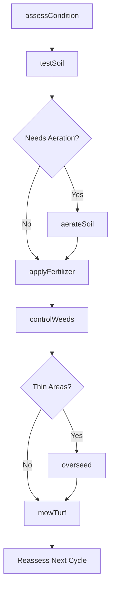
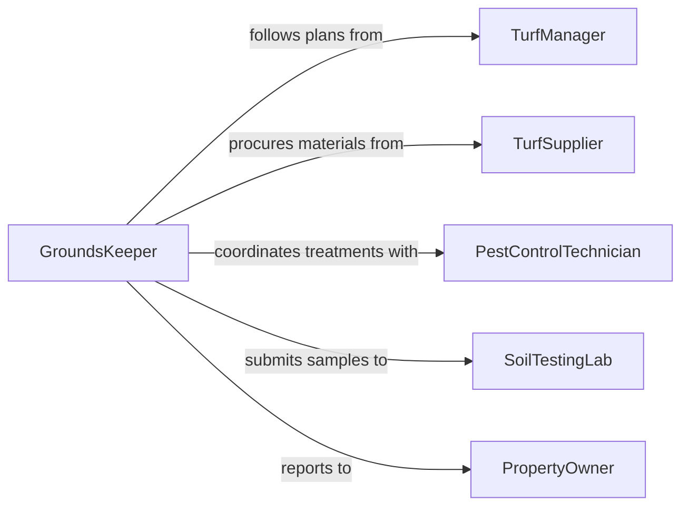

# Cultivate Lawns Turf Gardens

> Business-as-Code definition for cultivating and maintaining lawns, turf areas, and gardens through mowing, fertilizing, aerating, weeding, and soil management. Models the ongoing care cycle from condition assessment through treatment application and health monitoring.

## Overview

Cultivating lawns, turf, or gardens involves the ongoing physical care activities that maintain healthy, attractive ground cover and garden beds. This definition covers soil testing, mowing and trimming, aeration, overseeding, fertilization, weed control, and seasonal cleanup across residential lawns, commercial turf, sports fields, and ornamental gardens. It standardizes the assessment-treatment-monitoring loop that drives effective grounds maintenance.

## Actors

| Actor | Description |
|-------|-------------|
| TurfSupplier | Provides seed, sod, fertilizers, and soil amendments |
| ChemicalVendor | Supplies herbicides, fungicides, and pest control products |
| SoilTestingLab | Analyzes soil samples and provides nutrient recommendations |
| PropertyOwner | Defines maintenance expectations and approves treatment plans |
| EquipmentDealer | Provides mowers, aerators, and cultivation equipment |

## Roles

| Role | Description |
|------|-------------|
| GroundsKeeper | Performs daily mowing, trimming, and garden maintenance tasks |
| TurfManager | Plans fertilization, aeration, and overseeding programs |
| PestControlTechnician | Applies herbicides and fungicides per integrated pest management plans |
| GardenSpecialist | Manages ornamental beds including planting, pruning, and weeding |

## Entities

| Entity | Description |
|--------|-------------|
| LawnArea | A defined section of turf grass requiring regular maintenance |
| GardenBed | An ornamental or vegetable planting area within the property |
| SoilTest | Laboratory analysis of pH, nutrients, and organic matter |
| MaintenancePlan | A seasonal schedule of cultivation activities for a property |
| TreatmentRecord | Documentation of products applied, rates, and dates |
| MowingSchedule | A recurring calendar for grass cutting frequency and height |

## Actions

| Action | Description |
|--------|-------------|
| assessCondition | Evaluate turf density, color, weed pressure, and soil compaction |
| testSoil | Collect and submit soil samples for nutrient analysis |
| mowTurf | Cut grass to the specified height using appropriate equipment |
| aerateSoil | Remove soil plugs to relieve compaction and improve root growth |
| applyFertilizer | Spread granular or liquid nutrients per soil test recommendations |
| controlWeeds | Apply pre-emergent or post-emergent herbicides to manage weed growth |
| overseed | Broadcast seed over thin or bare areas to improve turf density |

## Events

| Event | Description |
|-------|-------------|
| conditionAssessed | Turf and garden health evaluation has been completed |
| soilTested | Soil samples have been analyzed and nutrient recommendations received |
| turfMowed | Lawn area has been cut to the specified height |
| soilAerated | Aeration plugs have been pulled across the target area |
| fertilizerApplied | Nutrients have been spread at the recommended rate |
| weedsControlled | Herbicide treatment has been applied to the property |
| overseedingComplete | Seed has been broadcast and establishment watering initiated |

## Searches

| Search | Description |
|--------|-------------|
| findMaintenancePlans | Look up care schedules by property, season, or service type |
| getSoilTestResults | Retrieve nutrient analysis and recommendations for a property |
| getTreatmentHistory | Review past fertilizer, herbicide, and amendment applications |
| getMowingSchedule | Check the current mowing frequency and height settings |

## Workflow



## Actor Relationships



## Usage

### Calling Actions

```typescript
import { cultivateLawnsTurfGardens } from '@headlessly/cultivate-lawns-turf-gardens'

const cultivation = cultivateLawnsTurfGardens()

// Assess current turf condition
const condition = await cultivation.assessCondition({
  propertyId: 'PROP-2026-0122',
  areas: ['front-lawn', 'backyard', 'side-strip'],
  metrics: ['density', 'color-score', 'weed-percentage', 'compaction']
})

// Submit soil test based on assessment
const soilTest = await cultivation.testSoil({
  propertyId: 'PROP-2026-0122',
  sampleLocations: condition.areas.map(a => a.id),
  tests: ['pH', 'nitrogen', 'phosphorus', 'potassium', 'organic-matter']
})

// Apply recommended fertilizer
await cultivation.applyFertilizer({
  propertyId: 'PROP-2026-0122',
  product: '24-0-6-slow-release',
  rate: { amount: 4, unit: 'lbs-per-1000sqft' },
  areas: ['front-lawn', 'backyard']
})
```

### Event-Driven Automation

```typescript
// Schedule aeration when compaction is detected
cultivation.conditionAssessed(async ({ propertyId, areas }) => {
  const compacted = areas.filter(a => a.compaction > 300)
  if (compacted.length > 0) {
    await workOrder.create({
      type: 'aeration',
      propertyId,
      areas: compacted.map(a => a.id),
      priority: 'seasonal'
    })
  }
})

// Auto-generate treatment record after fertilizer application
cultivation.fertilizerApplied(async ({ propertyId, product, rate, appliedBy }) => {
  await treatmentRecord.create({
    propertyId,
    product,
    rate,
    appliedBy,
    date: new Date().toISOString(),
    type: 'fertilizer'
  })
})
```
