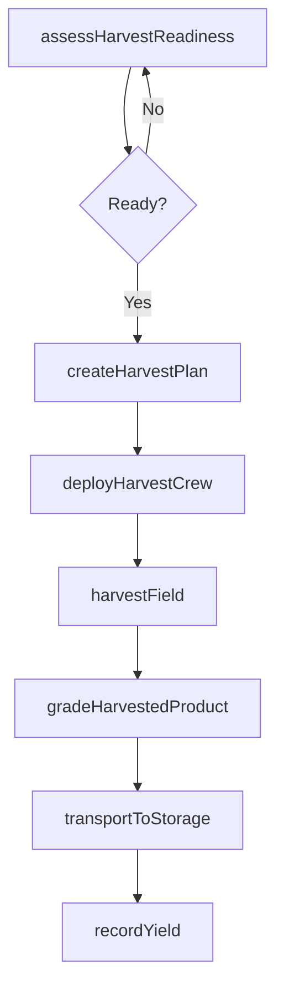
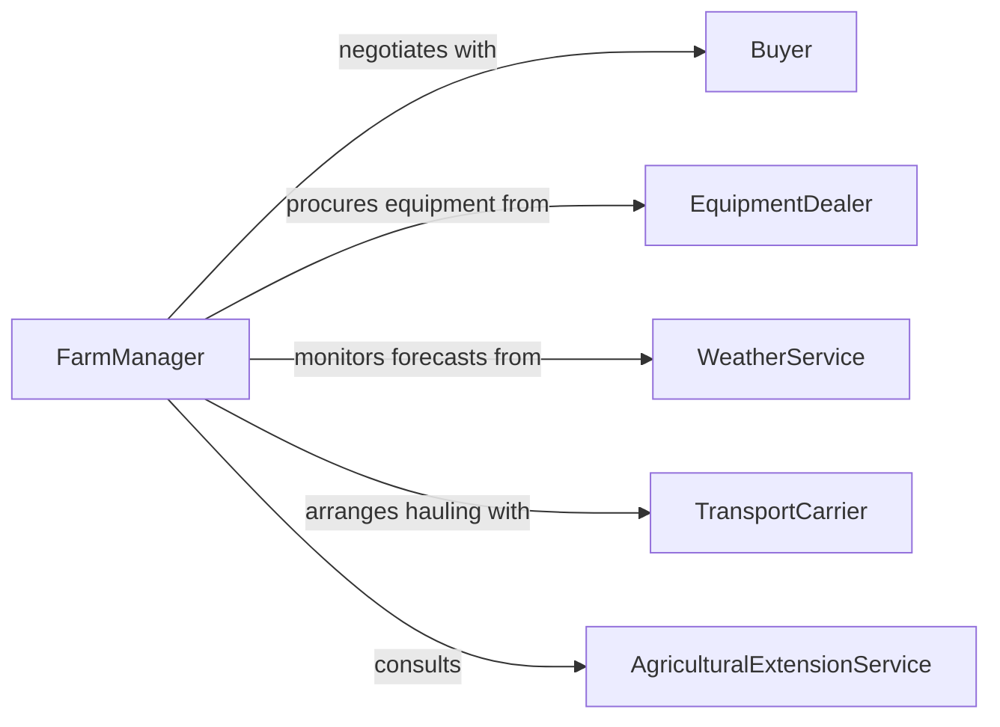

# Harvest Agricultural Products

> Business-as-Code definition for harvesting agricultural products. Models the complete harvest lifecycle from readiness assessment through collection, handling, and post-harvest storage of crops and produce.

## Overview

Harvesting agricultural products involves assessing crop maturity, planning harvest operations, deploying labor and equipment, collecting produce, and managing post-harvest handling to preserve quality. This definition exposes actions for scheduling and executing harvests, events for tracking yield and quality, and searches for field status and production records.

## Actors

| Actor | Description |
|-------|-------------|
| Buyer | Purchases harvested products and specifies quality and delivery requirements |
| EquipmentDealer | Supplies and services harvesting machinery and implements |
| WeatherService | Provides forecasts that influence harvest timing decisions |
| TransportCarrier | Hauls harvested products from fields to storage or processing facilities |
| AgriculturalExtensionService | Advises on optimal harvest timing, techniques, and post-harvest handling |

## Roles

| Role | Description |
|------|-------------|
| FarmManager | Plans harvest schedules and allocates resources across fields |
| HarvestOperator | Operates harvesting equipment and collects crops from the field |
| QualityGrader | Evaluates harvested products for grade, size, and condition |
| StorageCoordinator | Manages post-harvest storage conditions and inventory |

## Entities

| Entity | Description |
|--------|-------------|
| Field | A defined parcel of land planted with a crop ready for harvest |
| Crop | The agricultural product being grown and harvested |
| HarvestPlan | A schedule specifying which fields to harvest, when, and with what equipment |
| YieldRecord | Documentation of harvested quantity per field or section |
| GradeReport | Quality assessment of harvested produce by grade and condition |
| StorageFacility | A barn, silo, or cold storage unit for post-harvest product holding |

## Actions

| Action | Description |
|--------|-------------|
| assessHarvestReadiness | Evaluate crop maturity, moisture content, and weather conditions |
| createHarvestPlan | Schedule fields, equipment, and labor for upcoming harvest operations |
| deployHarvestCrew | Assign workers and equipment to designated fields |
| harvestField | Execute the collection of crops from a specific field |
| gradeHarvestedProduct | Evaluate quality, size, and condition of the harvested crop |
| transportToStorage | Move harvested products from the field to storage or processing |
| recordYield | Document the quantity and quality of crops harvested per field |

## Events

| Event | Description |
|-------|-------------|
| harvestReadinessAssessed | Crop maturity and conditions have been evaluated for a field |
| harvestPlanCreated | Harvest schedule and resource allocation have been finalized |
| harvestCrewDeployed | Workers and equipment have been assigned and dispatched to the field |
| fieldHarvested | Crops have been collected from a designated field |
| productGraded | Harvested produce has been evaluated and assigned quality grades |
| productTransported | Harvested goods have been moved to storage or processing |
| yieldRecorded | Harvest quantities and quality data have been documented |

## Searches

| Search | Description |
|--------|-------------|
| findFieldsByReadiness | Locate fields by crop maturity status and estimated harvest date |
| getYieldRecords | Retrieve harvest yield data by field, crop, or season |
| getGradeReports | Query quality grading results for harvested batches |
| findStorageAvailability | Check capacity at storage facilities for incoming harvested product |

## Workflow



## Actor Relationships



## Usage

### Calling Actions

```typescript
import { harvestAgriculturalProducts } from '@headlessly/harvest-agricultural-products'

const harvest = harvestAgriculturalProducts()

// Assess readiness of a wheat field
const readiness = await harvest.assessHarvestReadiness({
  fieldId: 'FIELD-NW-12',
  crop: 'winter-wheat',
  moistureContent: 13.5,
  maturityIndex: 0.92
})

// Create a harvest plan
const plan = await harvest.createHarvestPlan({
  fields: ['FIELD-NW-12', 'FIELD-NW-14'],
  startDate: '2026-07-15',
  equipment: ['combine-01', 'grain-cart-03'],
  crewSize: 6
})

// Record yield after harvest
await harvest.recordYield({
  fieldId: 'FIELD-NW-12',
  crop: 'winter-wheat',
  quantityBushels: 4200,
  averageGrade: 'US-No-1'
})
```

### Event-Driven Automation

```typescript
// Auto-arrange transport when a field is harvested
harvest.fieldHarvested(async ({ fieldId, crop, quantityBushels }) => {
  await harvest.transportToStorage({
    fieldId,
    destination: 'SILO-EAST-02',
    estimatedLoad: quantityBushels
  })
})

// Alert buyer when product is graded
harvest.productGraded(async ({ fieldId, crop, grade }) => {
  await notify({
    to: 'buyer-relations',
    message: `${crop} from ${fieldId} graded ${grade}. Ready for delivery scheduling.`
  })
})
```
