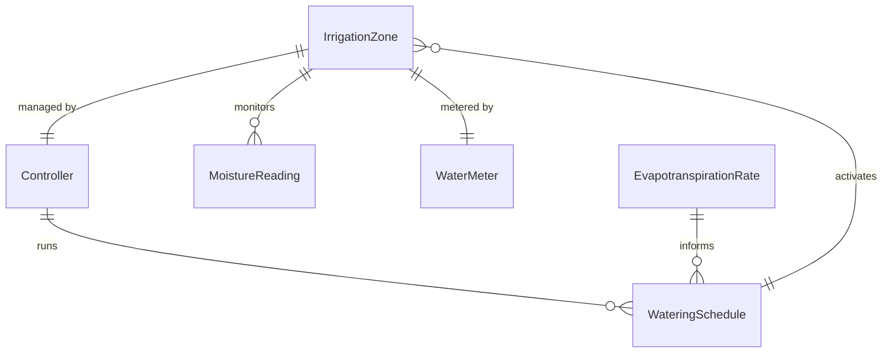
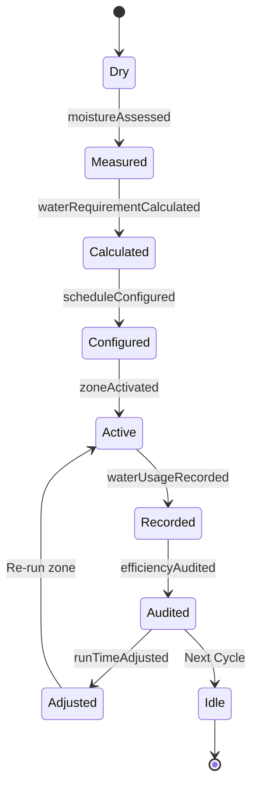
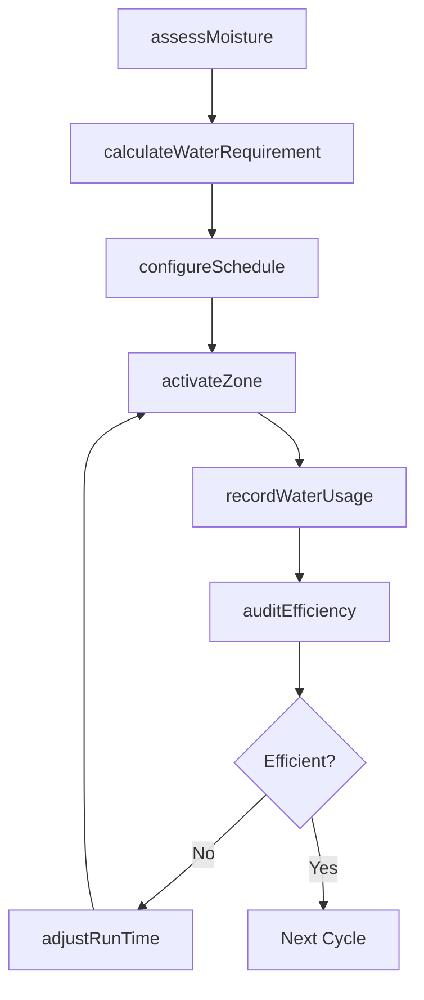
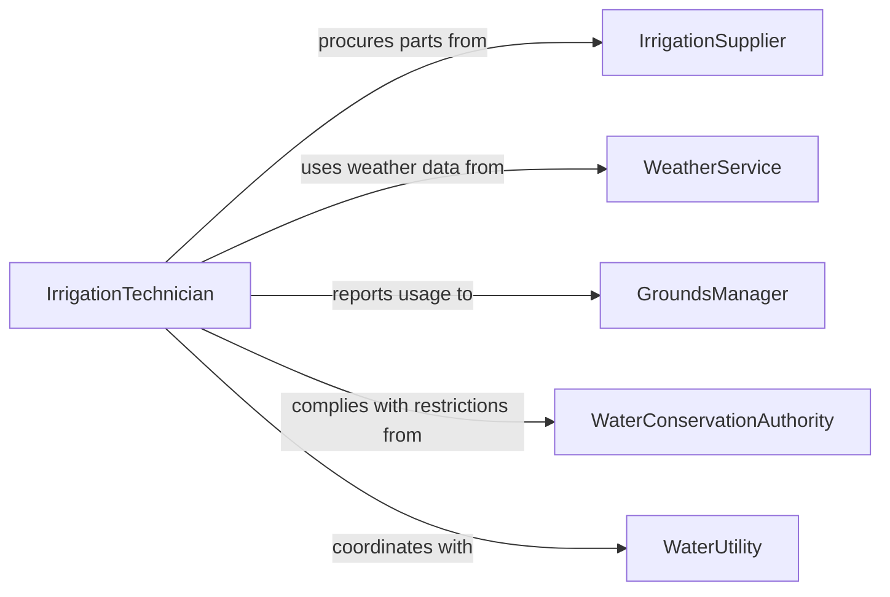

# Irrigate Lawns Trees Plants

> Business-as-Code definition for delivering water to lawns, trees, and ornamental or agricultural plants through manual and automated irrigation methods. Models the water management lifecycle from moisture assessment through scheduling, delivery, and efficiency monitoring.

## Overview

Irrigating lawns, trees, or plants involves assessing soil moisture levels, determining water requirements based on plant type and weather conditions, configuring irrigation systems or manual watering methods, and monitoring water delivery efficiency. This definition covers sprinkler operation, drip irrigation management, hose watering, and smart controller scheduling across residential landscapes, commercial properties, parks, nurseries, and agricultural fields.

## Actors

| Actor | Description |
|-------|-------------|
| IrrigationSupplier | Provides sprinkler heads, drip lines, controllers, and fittings |
| WaterUtility | Supplies municipal water and enforces usage restrictions |
| WeatherService | Provides precipitation forecasts and evapotranspiration data |
| PropertyOwner | Specifies landscape watering preferences and budget constraints |
| WaterConservationAuthority | Enforces irrigation schedules and water-use regulations |

## Roles

| Role | Description |
|------|-------------|
| IrrigationTechnician | Operates, adjusts, and repairs irrigation systems |
| GroundsManager | Oversees watering schedules and landscape health |
| WaterAuditor | Measures system efficiency and identifies waste |
| Landscaper | Performs manual watering and monitors plant moisture needs |

## Entities

| Entity | Description |
|--------|-------------|
| IrrigationZone | A section of landscape served by a group of sprinklers or drip lines |
| WateringSchedule | A timed plan specifying run days, start times, and durations per zone |
| MoistureReading | A sensor or manual measurement of soil water content |
| Controller | An electronic device that automates irrigation zone activation |
| WaterMeter | A device measuring total water volume delivered to the property |
| EvapotranspirationRate | The calculated water loss from soil and plant surfaces |

## Actions

| Action | Description |
|--------|-------------|
| assessMoisture | Measure soil moisture levels to determine watering needs |
| calculateWaterRequirement | Compute gallons needed based on plant type, area, and ET rate |
| configureSchedule | Set zone run times, days, and start times on the controller |
| activateZone | Start water delivery to a specific irrigation zone |
| adjustRunTime | Increase or decrease zone duration based on conditions |
| auditEfficiency | Measure distribution uniformity and identify leaks or dry spots |
| recordWaterUsage | Log total gallons applied per zone for tracking and compliance |

## Events

| Event | Description |
|-------|-------------|
| moistureAssessed | Soil moisture readings have been collected for the property |
| waterRequirementCalculated | Gallons needed per zone have been determined |
| scheduleConfigured | The irrigation controller has been programmed with new run times |
| zoneActivated | Water delivery has started for a specific zone |
| runTimeAdjusted | Zone duration has been modified based on weather or moisture data |
| efficiencyAudited | Distribution uniformity and waste metrics have been measured |
| waterUsageRecorded | Consumption data has been logged for the watering cycle |

## Searches

| Search | Description |
|--------|-------------|
| findZones | List irrigation zones by property, plant type, or controller |
| getMoistureHistory | Retrieve past moisture readings for a zone or sensor |
| getWaterUsage | Look up consumption totals by zone, date range, or property |
| getWeatherForecast | Retrieve precipitation and ET data for irrigation planning |

## Entity Relationships



## State Diagram



## Workflow



## Actor Relationships



## Usage

### Calling Actions

```typescript
import { irrigateLawnsTreesPlants } from '@headlessly/irrigate-lawns-trees-plants'

const irrigation = irrigateLawnsTreesPlants()

// Assess current moisture levels across all zones
const moisture = await irrigation.assessMoisture({
  propertyId: 'PROP-2026-0088',
  zones: ['front-lawn', 'perennial-beds', 'tree-line', 'rear-turf']
})

// Calculate water requirements based on ET data
const requirements = await irrigation.calculateWaterRequirement({
  propertyId: 'PROP-2026-0088',
  etRate: 0.25,
  moistureReadings: moisture.readings,
  plantTypes: ['cool-season-turf', 'perennials', 'deciduous-trees']
})

// Configure and activate irrigation
await irrigation.configureSchedule({
  controllerId: 'CTRL-0088-A',
  zones: requirements.zoneSchedules,
  startTime: '05:30',
  runDays: ['monday', 'wednesday', 'friday']
})
```

### Event-Driven Automation

```typescript
// Skip irrigation when rain is forecast
irrigation.scheduleConfigured(async ({ controllerId, nextRunDate }) => {
  const forecast = await weather.getForecast({ date: nextRunDate })
  if (forecast.precipitationProbability > 0.7) {
    await irrigation.adjustRunTime({
      controllerId,
      adjustment: 'skip-cycle',
      reason: `Rain forecast: ${Math.round(forecast.precipitationProbability * 100)}% chance`
    })
  }
})

// Alert grounds manager when water usage exceeds budget
irrigation.waterUsageRecorded(async ({ propertyId, gallonsUsed, monthlyBudget }) => {
  if (gallonsUsed > monthlyBudget * 0.9) {
    await notify({
      to: 'grounds-manager',
      message: `Property ${propertyId} at ${Math.round(gallonsUsed / monthlyBudget * 100)}% of monthly water budget`
    })
  }
})
```
