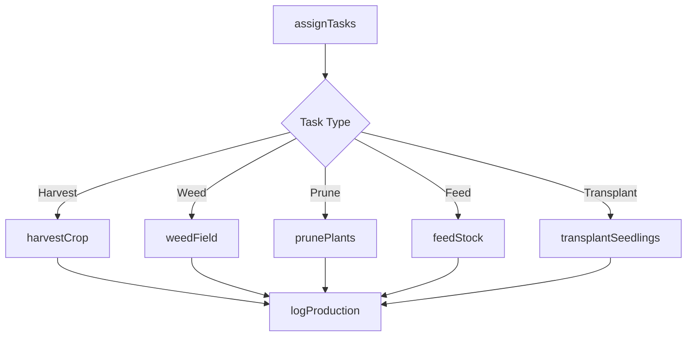
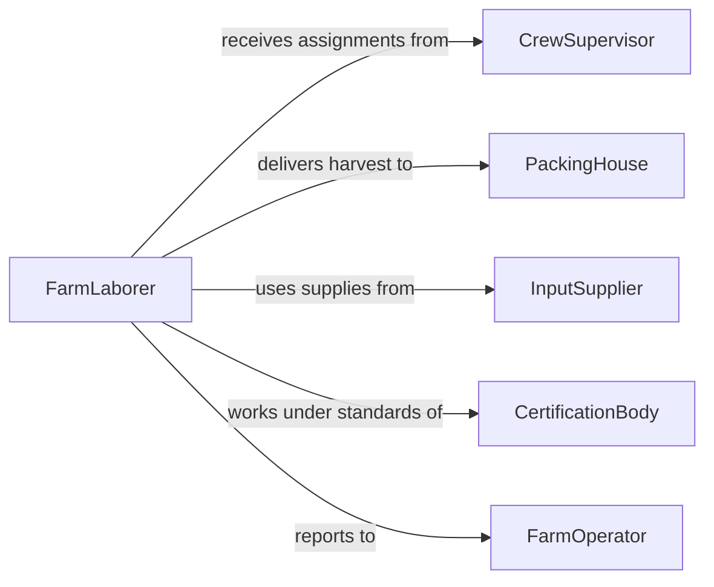

# Perform Manual Agricultural Aquacultural Horticultural

> Business-as-Code definition for carrying out hands-on agricultural, aquacultural, and horticultural labor including harvesting, weeding, pruning, feeding fish, and tending greenhouse plants. Models the task assignment and execution lifecycle for manual production work.

## Overview

Performing manual agricultural, aquacultural, or horticultural tasks covers the physical labor activities that sustain crop production, fish farming, and plant cultivation. This includes hand-harvesting produce, weeding fields, pruning vines and trees, feeding and monitoring aquaculture stock, potting and transplanting nursery plants, and maintaining greenhouse environments. The definition standardizes how manual tasks are assigned, tracked, and verified across diverse growing operations.

## Actors

| Actor | Description |
|-------|-------------|
| FarmOperator | Owns or leases the agricultural or aquacultural operation |
| InputSupplier | Provides feed, fertilizer, growing media, and hand tools |
| PackingHouse | Receives harvested produce for grading, packing, and distribution |
| AquacultureHatchery | Supplies fingerlings, fry, and broodstock for fish farming |
| CertificationBody | Audits organic, GAP, or sustainability compliance |

## Roles

| Role | Description |
|------|-------------|
| FarmLaborer | Performs manual tasks such as planting, weeding, and harvesting |
| AquacultureWorker | Feeds fish, monitors water quality, and maintains ponds or tanks |
| GreenhouseAttendant | Tends potted plants, manages climate controls, and transplants seedlings |
| CrewSupervisor | Assigns daily tasks, monitors productivity, and ensures quality |

## Entities

| Entity | Description |
|--------|-------------|
| TaskAssignment | A specific manual job with location, crop or stock, and instructions |
| HarvestBatch | A quantity of produce or fish collected during a work session |
| Field | A crop-growing area assigned to manual labor activities |
| Pond | An aquaculture enclosure containing fish or shellfish stock |
| Greenhouse | A controlled-environment structure for plant propagation |
| ProductionLog | A daily record of tasks completed, quantities, and labor hours |
| QualityCheck | An inspection verifying harvest grade, size, or condition |

## Actions

| Action | Description |
|--------|-------------|
| assignTasks | Distribute daily manual work orders to crew members |
| harvestCrop | Hand-pick or cut mature produce from the field |
| weedField | Remove unwanted plants from crop rows by hand or with hand tools |
| prunePlants | Trim branches, shoots, or roots to promote healthy growth |
| feedStock | Distribute feed to aquaculture ponds or tanks at scheduled intervals |
| transplantSeedlings | Move young plants from nursery containers into growing beds or fields |
| logProduction | Record completed tasks, quantities, and labor time |

## Events

| Event | Description |
|-------|-------------|
| tasksAssigned | Daily work orders have been distributed to the crew |
| cropHarvested | Produce has been collected and staged for transport |
| fieldWeeded | Weed removal has been completed for the assigned rows |
| plantsPruned | Pruning work has been finished on the designated plants |
| stockFed | Aquaculture feed has been distributed at the scheduled time |
| seedlingsTransplanted | Young plants have been moved into their growing positions |
| productionLogged | Daily output and labor records have been documented |

## Searches

| Search | Description |
|--------|-------------|
| findTaskAssignments | List pending manual tasks by crew, field, or date |
| getHarvestTotals | Retrieve harvest quantities by crop, field, or date range |
| getProductionLogs | Review daily labor and output records for the operation |
| getStockFeedSchedule | Check aquaculture feeding times and quantities |

## Workflow



## Actor Relationships



## Usage

### Calling Actions

```typescript
import { performManualAgriculturalAquaculturalHorticultural } from '@headlessly/perform-manual-agricultural-aquacultural-horticultural'

const manual = performManualAgriculturalAquaculturalHorticultural()

// Assign daily tasks to the field crew
const assignments = await manual.assignTasks({
  date: '2026-06-15',
  crew: ['L-001', 'L-002', 'L-003', 'L-004'],
  tasks: [
    { type: 'harvest', field: 'strawberry-block-A', rows: '1-12' },
    { type: 'weed', field: 'tomato-rows-north', rows: '1-8' },
    { type: 'feed', pond: 'tilapia-pond-3', feedType: 'floating-pellet', amount: { kg: 25 } }
  ]
})

// Log completed harvest
await manual.harvestCrop({
  fieldId: 'strawberry-block-A',
  crop: 'strawberries',
  quantity: { amount: 340, unit: 'lbs' },
  grade: 'premium',
  laborerIds: ['L-001', 'L-002']
})

// Record the production day
await manual.logProduction({
  date: '2026-06-15',
  completedTasks: assignments.tasks.length,
  totalLaborHours: 32
})
```

### Event-Driven Automation

```typescript
// Notify packing house when harvest batch is ready
manual.cropHarvested(async ({ fieldId, crop, quantity, grade }) => {
  await notify({
    to: 'packing-house',
    message: `${quantity.amount} ${quantity.unit} of ${grade} ${crop} ready for pickup from ${fieldId}`
  })
})

// Alert supervisor when feed schedule is missed
manual.stockFed(async ({ pondId, scheduledTime, actualTime }) => {
  const delayMinutes = (new Date(actualTime).getTime() - new Date(scheduledTime).getTime()) / 60000
  if (delayMinutes > 30) {
    await notify({
      to: 'crew-supervisor',
      message: `Feeding at ${pondId} delayed by ${Math.round(delayMinutes)} minutes`
    })
  }
})
```
