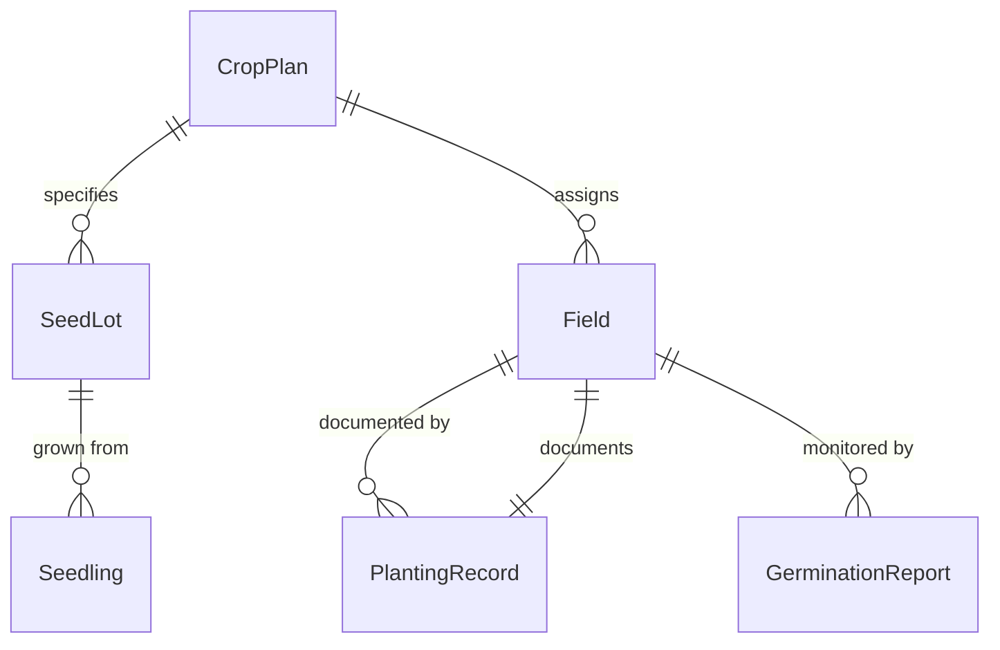
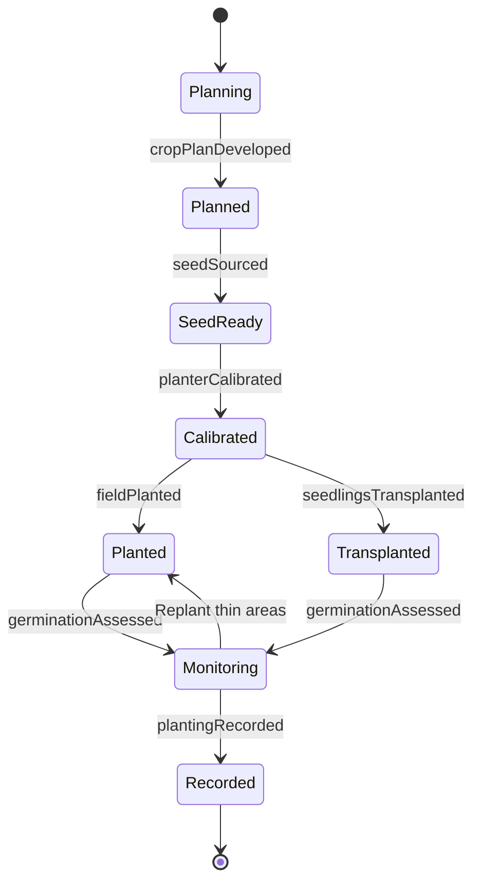
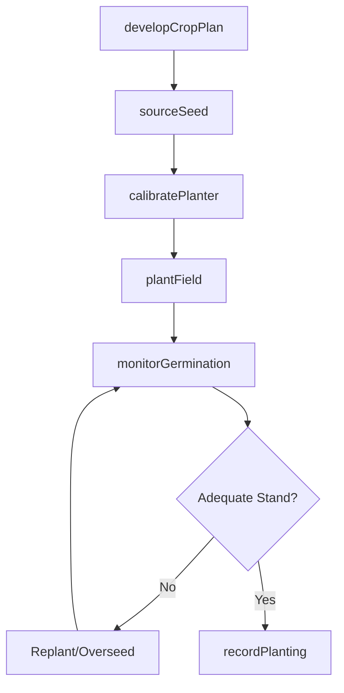
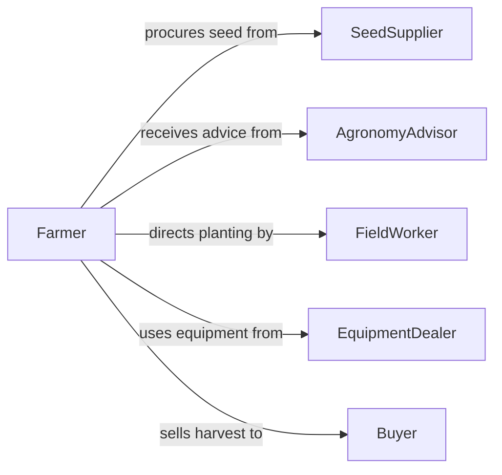

# Plant Crops Trees Plants

> Business-as-Code definition for planting agricultural crops, orchard trees, and other plants for food production, timber, and commercial cultivation. Models the planting cycle from seed selection through field establishment and germination monitoring.

## Overview

Planting crops, trees, or other plants encompasses the agricultural activities of sowing seeds, transplanting seedlings, and establishing orchards and plantations for commercial harvest. This definition covers crop planning, seed and seedling sourcing, soil preparation, planting method execution (mechanical or manual), spacing and depth control, and post-planting germination monitoring across row crops, tree fruits, forestry, and specialty plantings.

## Actors

| Actor | Description |
|-------|-------------|
| SeedSupplier | Provides certified seeds, seedlings, and rootstock |
| AgronomyAdvisor | Recommends crop varieties, planting dates, and field practices |
| EquipmentDealer | Supplies planters, seed drills, and transplanting machinery |
| Buyer | Contracts for future harvest output, influencing crop selection |
| ExtensionService | Provides planting guidance and pest management recommendations |

## Roles

| Role | Description |
|------|-------------|
| Farmer | Plans and executes planting operations across fields |
| FieldWorker | Performs manual planting, thinning, and transplanting tasks |
| EquipmentOperator | Drives planters and seed drills during mechanical planting |
| CropScout | Monitors germination rates and early seedling health |

## Entities

| Entity | Description |
|--------|-------------|
| CropPlan | A seasonal schedule specifying crops, varieties, and field assignments |
| SeedLot | A batch of seeds with certified variety, germination rate, and origin |
| Field | A delineated parcel of land prepared for planting |
| PlantingRecord | Documentation of date, depth, spacing, and seed rate for each field |
| Seedling | A young plant grown in a nursery for transplanting |
| GerminationReport | Data on emergence rates and stand uniformity after planting |

## Actions

| Action | Description |
|--------|-------------|
| developCropPlan | Define crop selection, rotation, and planting schedule for the season |
| sourceSeed | Procure certified seed or seedlings for planned crops |
| calibratePlanter | Adjust planting equipment for correct depth, spacing, and seed rate |
| plantField | Execute planting operations across prepared field rows |
| transplantSeedlings | Move nursery-grown seedlings into field positions |
| monitorGermination | Scout fields to assess emergence rates and stand density |
| recordPlanting | Log planting details for traceability and compliance |

## Events

| Event | Description |
|-------|-------------|
| cropPlanDeveloped | Seasonal planting schedule and crop selections are finalized |
| seedSourced | Seed lots or seedlings have been procured and received |
| planterCalibrated | Equipment has been adjusted and verified for planting specifications |
| fieldPlanted | Planting operations are complete for a field |
| seedlingsTransplanted | Nursery stock has been installed in the field |
| germinationAssessed | Emergence data has been collected and stand quality evaluated |
| plantingRecorded | All planting details have been documented for the field |

## Searches

| Search | Description |
|--------|-------------|
| findSeedVarieties | Look up seed varieties by crop type, maturity, and region |
| getFieldStatus | Check planting status and readiness for each field |
| getGerminationData | Retrieve emergence rates and stand counts by field |
| getCropHistory | Review past planting records and yields for a field |

## Entity Relationships



## State Diagram



## Workflow



## Actor Relationships



## Usage

### Calling Actions

```typescript
import { plantCropsTreesPlants } from '@headlessly/plant-crops-trees-plants'

const planting = plantCropsTreesPlants()

// Develop the seasonal crop plan
const plan = await planting.developCropPlan({
  season: '2026-spring',
  fields: ['north-40', 'south-80', 'river-bottom-60'],
  crops: [
    { crop: 'corn', variety: 'Pioneer P1185', acres: 80 },
    { crop: 'soybeans', variety: 'Asgrow AG36X6', acres: 60 },
    { crop: 'apple', variety: 'Honeycrisp', acres: 40 }
  ]
})

// Source seed and calibrate planter
const seed = await planting.sourceSeed({
  cropPlanId: plan.id,
  seedLots: [
    { variety: 'Pioneer P1185', units: 50, unitType: 'bags-80k' },
    { variety: 'Asgrow AG36X6', units: 30, unitType: 'bags-140k' }
  ]
})

await planting.calibratePlanter({
  equipmentId: 'PLANTER-JD-1775',
  seedRate: 34000,
  rowSpacing: 30,
  depth: 2.0
})

// Plant the field
await planting.plantField({
  fieldId: 'north-40',
  cropPlanId: plan.id,
  seedLotId: seed.lots[0].id
})
```

### Event-Driven Automation

```typescript
// Alert crop scout when planting is complete to begin germination monitoring
planting.fieldPlanted(async ({ fieldId, cropPlanId, plantedDate }) => {
  const scoutDate = new Date(new Date(plantedDate).getTime() + 7 * 86400000)
  await scheduler.schedule({
    action: 'monitorGermination',
    fieldId,
    executeAt: scoutDate.toISOString()
  })
})

// Notify farmer when germination is below threshold
planting.germinationAssessed(async ({ fieldId, emergenceRate }) => {
  if (emergenceRate < 0.85) {
    await notify({
      to: 'farmer',
      message: `Field ${fieldId} has ${Math.round(emergenceRate * 100)}% emergence - replanting may be needed`
    })
  }
})
```
