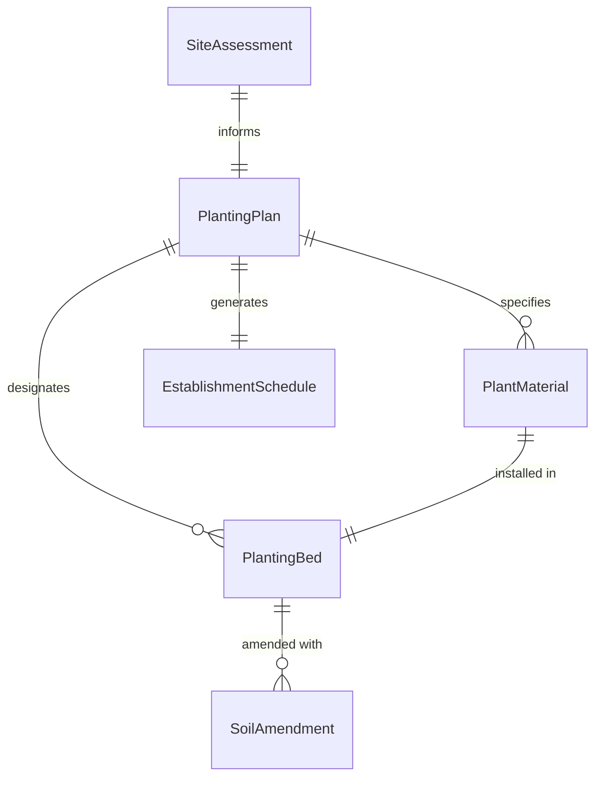
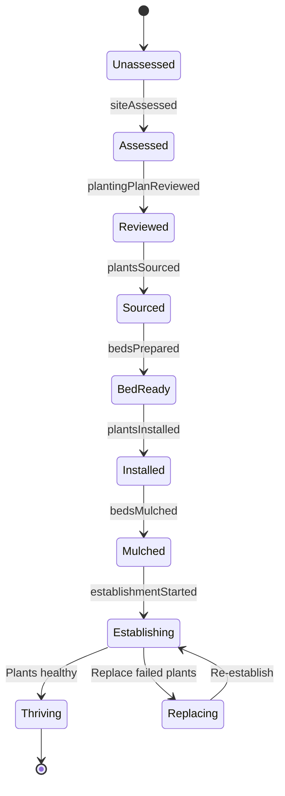
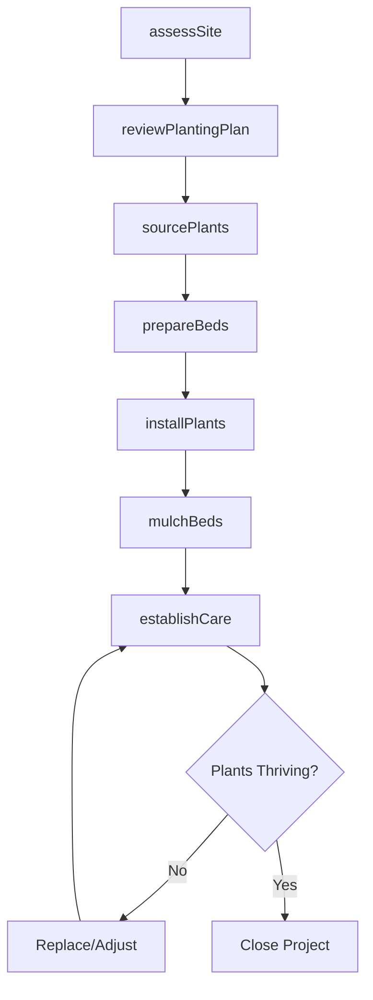
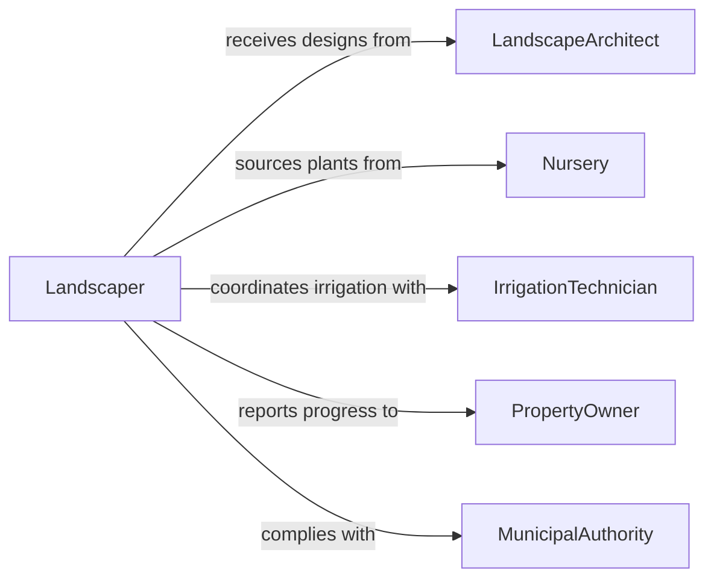

# Plant Greenery Improve Landscape Appearance

> Business-as-Code definition for installing ornamental plants, shrubs, trees, and ground covers to enhance the visual appearance of landscapes. Models the design-to-installation lifecycle from site assessment through planting and establishment care.

## Overview

Planting greenery to improve landscape appearance encompasses selecting, sourcing, and installing ornamental plantings that enhance the aesthetic value of residential, commercial, and public properties. This definition covers landscape design interpretation, plant selection based on climate and soil conditions, site preparation, installation techniques, and post-planting establishment care to ensure long-term visual impact and plant survival.

## Actors

| Actor | Description |
|-------|-------------|
| Nursery | Supplies ornamental plants, trees, shrubs, and ground covers |
| PropertyOwner | Commissions landscape improvements and approves designs |
| LandscapeArchitect | Creates planting plans and selects plant species |
| SoilTestingLab | Analyzes soil composition and recommends amendments |
| MunicipalAuthority | Enforces planting setbacks, tree protection, and water-use ordinances |

## Roles

| Role | Description |
|------|-------------|
| Landscaper | Installs plants according to the landscape plan |
| DesignConsultant | Translates client preferences into actionable planting layouts |
| IrrigationTechnician | Installs watering systems to support newly planted greenery |
| CrewForeman | Coordinates planting crews and manages daily installation schedules |

## Entities

| Entity | Description |
|--------|-------------|
| PlantingPlan | A layout specifying species, locations, spacing, and quantities |
| PlantMaterial | An individual tree, shrub, perennial, or ground cover to be installed |
| SoilAmendment | Compost, fertilizer, or conditioner added to improve planting conditions |
| PlantingBed | A prepared area of soil designated for ornamental plantings |
| EstablishmentSchedule | A watering and care plan for the first growing season |
| SiteAssessment | Evaluation of light, drainage, soil, and microclimate conditions |

## Actions

| Action | Description |
|--------|-------------|
| assessSite | Evaluate soil, light exposure, drainage, and existing vegetation |
| reviewPlantingPlan | Interpret the landscape design and confirm plant selections |
| sourcePlants | Order plant material from nurseries based on the planting plan |
| prepareBeds | Excavate, amend soil, and grade planting areas |
| installPlants | Position and plant each specimen at the specified location and depth |
| mulchBeds | Apply organic or decorite mulch around installed plantings |
| establishCare | Initiate watering, staking, and monitoring for the establishment period |

## Events

| Event | Description |
|-------|-------------|
| siteAssessed | Soil, light, and drainage conditions have been documented |
| plantingPlanReviewed | Design has been confirmed and plant list finalized |
| plantsSourced | All plant material has been ordered and delivery confirmed |
| bedsPrepared | Planting areas have been excavated, amended, and graded |
| plantsInstalled | All specimens have been placed and backfilled at their locations |
| bedsMulched | Mulch has been applied to all planting beds |
| establishmentStarted | Post-planting watering and care schedule has been initiated |

## Searches

| Search | Description |
|--------|-------------|
| findPlantsByZone | Look up ornamental plants suitable for a specific hardiness zone |
| getPlantingPlans | Retrieve landscape designs for a property or project |
| getNurseryAvailability | Check nursery stock for specific species, sizes, and quantities |
| getSiteConditions | Retrieve soil test results and microclimate data for a site |

## Entity Relationships



## State Diagram



## Workflow



## Actor Relationships



## Usage

### Calling Actions

```typescript
import { plantGreeneryImproveLandscapeAppearance } from '@headlessly/plant-greenery-improve-landscape-appearance'

const landscaping = plantGreeneryImproveLandscapeAppearance()

// Assess the property site conditions
const site = await landscaping.assessSite({
  propertyId: 'PROP-2026-0155',
  areas: ['front-entry', 'side-border', 'rear-patio'],
  factors: ['soil-type', 'sun-exposure', 'drainage', 'hardiness-zone']
})

// Source plants from the approved planting plan
const order = await landscaping.sourcePlants({
  plantingPlanId: 'PP-2026-0042',
  items: [
    { species: 'Acer rubrum', size: '2-inch-caliper', quantity: 3 },
    { species: 'Hydrangea paniculata', size: '5-gallon', quantity: 12 },
    { species: 'Liriope muscari', size: 'flat-of-18', quantity: 8 }
  ]
})

// Install and establish
await landscaping.installPlants({
  plantingPlanId: 'PP-2026-0042',
  deliveryId: order.deliveryId
})
```

### Event-Driven Automation

```typescript
// Notify property owner when installation is complete
landscaping.plantsInstalled(async ({ propertyId, plantingPlanId, plantCount }) => {
  await notify({
    to: 'property-owner',
    message: `${plantCount} plants installed at ${propertyId} per plan ${plantingPlanId}`
  })
})

// Schedule follow-up watering checks during establishment
landscaping.establishmentStarted(async ({ propertyId, schedule }) => {
  for (const checkDate of schedule.wateringDates) {
    await scheduler.schedule({
      action: 'checkWatering',
      propertyId,
      executeAt: checkDate
    })
  }
})
```
