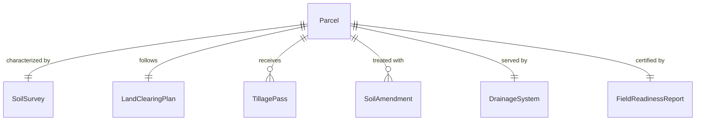
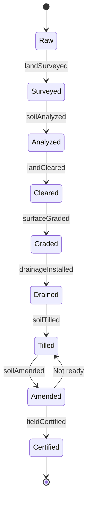
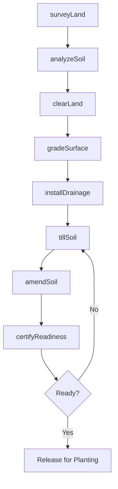
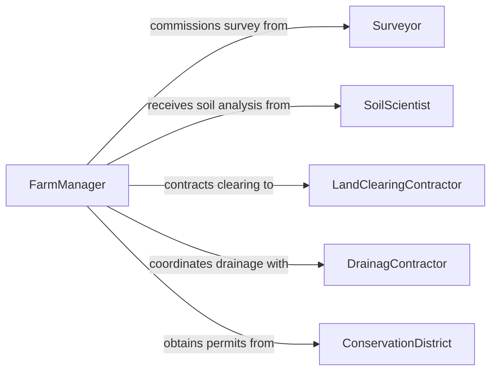

# Prepare Land Agricultural Use

> Business-as-Code definition for preparing raw or fallow land for agricultural production through clearing, grading, tilling, amending, and drainage installation. Models the land conversion lifecycle from survey through field readiness certification.

## Overview

Preparing land for agricultural use involves converting undeveloped, forested, or fallow ground into productive farmland capable of supporting crop cultivation. This definition covers land survey and soil analysis, clearing of vegetation and debris, grading and leveling, primary and secondary tillage, soil amendment application, drainage installation, and final field readiness verification. It applies to new farm development, field reclamation, and seasonal seedbed preparation.

## Actors

| Actor | Description |
|-------|-------------|
| Landowner | Owns the property being converted to agricultural use |
| SoilScientist | Analyzes soil composition and recommends amendments and drainage |
| LandClearingContractor | Removes trees, brush, rocks, and debris from the site |
| DrainagContractor | Installs tile drainage, ditches, and water management structures |
| ConservationDistrict | Advises on erosion control, wetland setbacks, and land-use permits |

## Roles

| Role | Description |
|------|-------------|
| FarmManager | Plans and oversees the land preparation program |
| EquipmentOperator | Runs tractors, plows, discs, and grading equipment |
| Surveyor | Maps topography, boundaries, and drainage patterns |
| SoilAmendmentTechnician | Applies lime, gypsum, compost, or other soil conditioners |

## Entities

| Entity | Description |
|--------|-------------|
| Parcel | A delineated tract of land targeted for agricultural conversion |
| SoilSurvey | A mapped analysis of soil types, depths, and drainage characteristics |
| LandClearingPlan | A documented approach for removing vegetation and obstacles |
| TillagePass | A single operation of plowing, discing, or harrowing a field |
| SoilAmendment | Material applied to improve soil fertility, structure, or pH |
| DrainageSystem | Tile lines, surface ditches, or grading that manage water flow |
| FieldReadinessReport | A certification that the land is prepared for planting |

## Actions

| Action | Description |
|--------|-------------|
| surveyLand | Map topography, soil types, boundaries, and drainage patterns |
| analyzeSoil | Test soil composition, pH, nutrients, and organic matter |
| clearLand | Remove trees, brush, rocks, and surface debris |
| gradeSurface | Level and shape the field for proper water drainage |
| tillSoil | Break up compacted ground through primary and secondary tillage |
| amendSoil | Apply lime, fertilizer, or compost based on soil test recommendations |
| installDrainage | Lay tile lines or construct ditches for water management |
| certifyReadiness | Verify the field meets conditions for planting operations |

## Events

| Event | Description |
|-------|-------------|
| landSurveyed | Topography and boundaries have been mapped |
| soilAnalyzed | Soil test results and amendment recommendations are available |
| landCleared | Vegetation and obstacles have been removed from the parcel |
| surfaceGraded | Field has been leveled and shaped for drainage |
| soilTilled | Primary and secondary tillage operations are complete |
| soilAmended | Conditioners and fertilizers have been incorporated into the soil |
| drainageInstalled | Water management infrastructure is in place and functional |
| fieldCertified | The parcel has been verified as ready for agricultural planting |

## Searches

| Search | Description |
|--------|-------------|
| findParcels | Look up land parcels by owner, location, or preparation status |
| getSoilData | Retrieve soil survey and test results for a parcel |
| getTillageHistory | Review past tillage operations and dates for a field |
| getDrainageDesign | Access drainage layout plans and installation records |

## Entity Relationships



## State Diagram



## Workflow



## Actor Relationships



## Usage

### Calling Actions

```typescript
import { prepareLandAgriculturalUse } from '@headlessly/prepare-land-agricultural-use'

const landPrep = prepareLandAgriculturalUse()

// Survey the target parcel
const survey = await landPrep.surveyLand({
  parcelId: 'PARCEL-2026-NW40',
  acreage: 40,
  deliverables: ['topographic-map', 'boundary-survey', 'drainage-assessment']
})

// Analyze soil across the parcel
const soilResults = await landPrep.analyzeSoil({
  parcelId: 'PARCEL-2026-NW40',
  sampleGrid: { rows: 4, columns: 4 },
  tests: ['pH', 'CEC', 'organic-matter', 'NPK', 'texture']
})

// Clear and grade the land
await landPrep.clearLand({
  parcelId: 'PARCEL-2026-NW40',
  removeTypes: ['brush', 'stumps', 'surface-rock'],
  disposalMethod: 'chip-and-spread'
})

await landPrep.gradeSurface({
  parcelId: 'PARCEL-2026-NW40',
  targetSlope: { percent: 1.5, direction: 'south' }
})

// Certify the field for planting
await landPrep.certifyReadiness({
  parcelId: 'PARCEL-2026-NW40',
  criteria: ['drainage-functional', 'pH-corrected', 'seedbed-prepared']
})
```

### Event-Driven Automation

```typescript
// Auto-schedule amendment application when soil analysis is complete
landPrep.soilAnalyzed(async ({ parcelId, recommendations }) => {
  for (const rec of recommendations) {
    await workOrder.create({
      type: 'soil-amendment',
      parcelId,
      product: rec.product,
      rate: rec.applicationRate,
      priority: rec.urgency
    })
  }
})

// Notify landowner when field is certified ready
landPrep.fieldCertified(async ({ parcelId, certifiedDate }) => {
  await notify({
    to: 'landowner',
    message: `Parcel ${parcelId} certified ready for planting as of ${certifiedDate}`
  })
})
```
