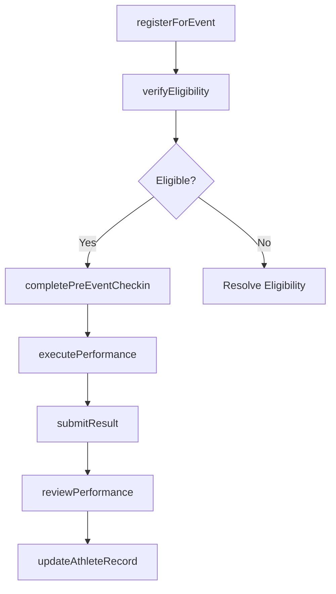
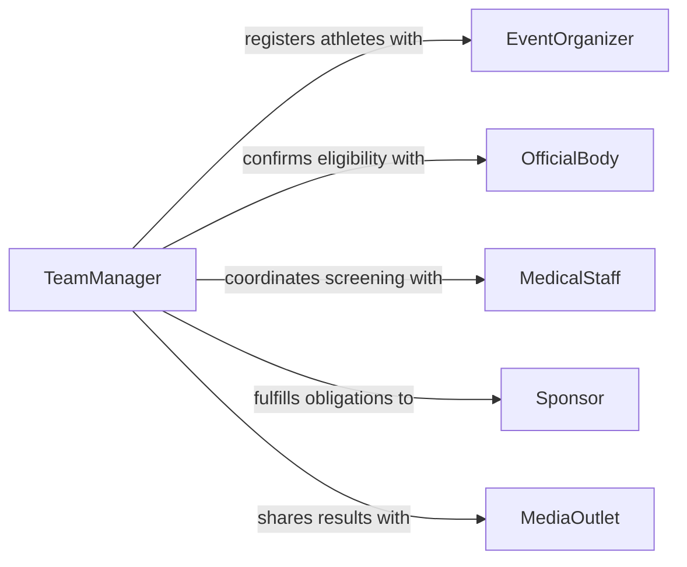

# Participate Athletic Events

> Business-as-Code definition for participating in athletic events. Models the complete competition lifecycle from registration and preparation through performance execution and results processing.

## Overview

Participating in athletic events encompasses registering for competitions, completing pre-event preparations, performing in the event, and processing results. This definition exposes actions for event registration, readiness checks, competition execution, and post-event review, along with events for tracking participation history and searches for competition records.

## Actors

| Actor | Description |
|-------|-------------|
| EventOrganizer | Hosts the competition and manages event logistics and rules |
| OfficialBody | Sanctions events, certifies results, and enforces eligibility rules |
| MedicalStaff | Provides pre-event screening and on-site medical support |
| Sponsor | Provides financial support and may impose participation requirements |
| MediaOutlet | Covers event results and athlete performances |

## Roles

| Role | Description |
|------|-------------|
| Athlete | Competes in the athletic event and executes performance |
| Coach | Prepares the athlete tactically and provides event-day guidance |
| TeamManager | Handles registration, logistics, and administrative coordination |
| AthleticTrainer | Manages warm-up routines and injury prevention on event day |

## Entities

| Entity | Description |
|--------|-------------|
| AthleticEvent | A scheduled competition with defined rules, categories, and venue |
| Registration | An enrollment record for an athlete in a specific event |
| CompetitionResult | The official outcome including placement, score, or time |
| EventSchedule | The timetable of heats, rounds, or matches within an event |
| EligibilityCertificate | Documentation confirming an athlete meets participation requirements |
| PerformanceRecord | Historical data of an athlete's results across events |

## Actions

| Action | Description |
|--------|-------------|
| registerForEvent | Submit an athlete's entry for a specific competition |
| verifyEligibility | Confirm the athlete meets all requirements for participation |
| completePreEventCheckin | Perform event-day check-in, weigh-in, or equipment inspection |
| executePerformance | Compete in the athletic event and deliver performance |
| submitResult | Record the official competition outcome for the athlete |
| reviewPerformance | Analyze post-event performance data against goals and benchmarks |
| updateAthleteRecord | Add competition results to the athlete's historical performance record |

## Events

| Event | Description |
|-------|-------------|
| eventRegistered | An athlete has been enrolled in a competition |
| eligibilityVerified | Athlete eligibility has been confirmed for the event |
| preEventCheckinCompleted | Event-day check-in procedures have been finished |
| performanceExecuted | The athlete has completed their competition performance |
| resultSubmitted | Official competition results have been recorded |
| performanceReviewed | Post-event analysis has been completed |
| athleteRecordUpdated | Competition results have been added to the athlete's history |

## Searches

| Search | Description |
|--------|-------------|
| findUpcomingEvents | List available events by sport, date, location, or level |
| getAthleteResults | Retrieve competition results for an athlete by event or season |
| getEventStandings | Query current standings or final results for a specific event |
| findRegistrationsByStatus | Locate event registrations by confirmation or eligibility status |

## Workflow



## Actor Relationships



## Usage

### Calling Actions

```typescript
import { participateAthleticEvents } from '@headlessly/participate-athletic-events'

const events = participateAthleticEvents()

// Register an athlete for a competition
const registration = await events.registerForEvent({
  athleteId: 'ATH-0042',
  eventId: 'EVT-TRACK-2026-REGIONALS',
  discipline: '400m-hurdles',
  category: 'senior-men'
})

// Verify eligibility
await events.verifyEligibility({
  registrationId: registration.id,
  medicalClearance: true,
  membershipCurrent: true
})

// Submit results after competition
await events.submitResult({
  registrationId: registration.id,
  time: '49.32',
  placement: 2,
  personalBest: false
})
```

### Event-Driven Automation

```typescript
// Auto-update athlete record after results are submitted
events.resultSubmitted(async ({ athleteId, eventId, time, placement }) => {
  await events.updateAthleteRecord({
    athleteId,
    eventId,
    result: { time, placement }
  })
})

// Notify coach for post-event review
events.performanceExecuted(async ({ athleteId, eventId, discipline }) => {
  await notify({
    to: 'coaching-staff',
    message: `${athleteId} completed ${discipline} at ${eventId}. Performance review pending.`
  })
})
```
