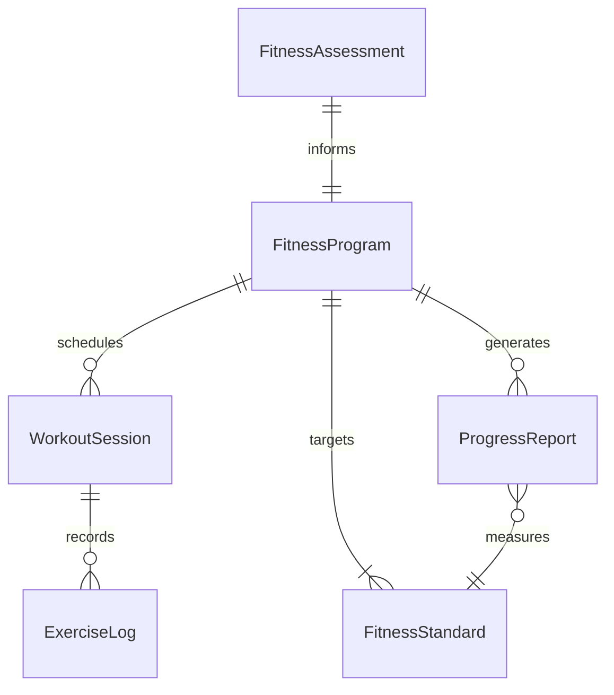
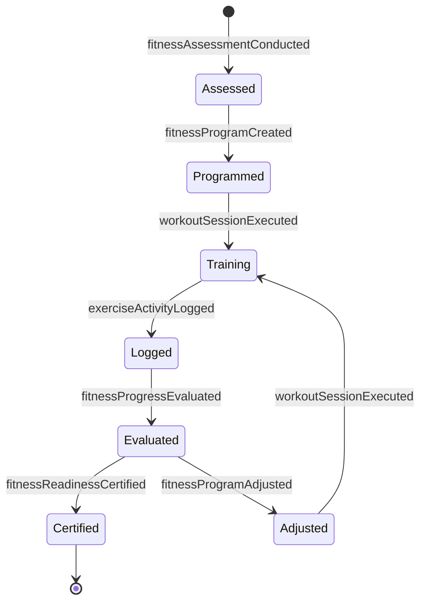
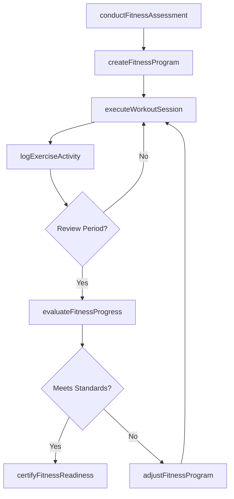
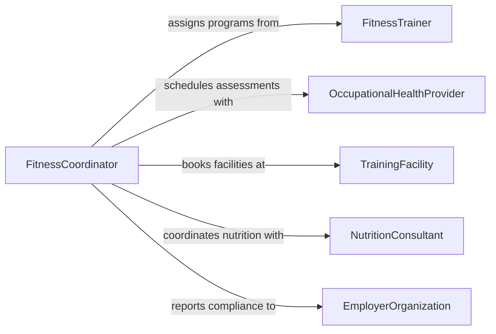

# Participate Physical Training Maintain Fitness

> Business-as-Code definition for participating in physical training to maintain fitness. Models fitness program design, workout execution, progress tracking, and fitness assessment across occupational and personal training contexts.

## Overview

Participating in physical training to maintain fitness involves following structured exercise programs to sustain or improve physical readiness for occupational demands, athletic performance, or personal health. This definition exposes actions for fitness assessment, program creation, workout logging, and progress evaluation, along with events for tracking compliance and searches for fitness records.

## Actors

| Actor | Description |
|-------|-------------|
| FitnessTrainer | Designs training programs and provides exercise instruction |
| OccupationalHealthProvider | Conducts fitness-for-duty evaluations and monitors physical readiness |
| TrainingFacility | Provides gym equipment, tracks, pools, or training spaces |
| NutritionConsultant | Advises on dietary strategies to support fitness objectives |
| EmployerOrganization | Sets physical fitness standards for occupational roles |

## Roles

| Role | Description |
|------|-------------|
| Trainee | Participates in physical training sessions and follows fitness programs |
| FitnessCoordinator | Schedules training sessions and monitors participation compliance |
| StrengthCoach | Leads resistance training and conditioning workouts |
| FitnessAssessor | Administers standardized fitness tests and records results |

## Entities

| Entity | Description |
|--------|-------------|
| FitnessProgram | A structured plan of exercises, schedules, and progression targets |
| WorkoutSession | A single instance of physical training with defined exercises |
| FitnessAssessment | A standardized evaluation of physical capabilities and readiness |
| ExerciseLog | A record of exercises performed, sets, reps, and duration |
| FitnessStandard | Required physical benchmarks for an occupational role or level |
| ProgressReport | A periodic summary of fitness improvement across measured categories |

## Actions

| Action | Description |
|--------|-------------|
| conductFitnessAssessment | Administer standardized tests to evaluate physical capabilities |
| createFitnessProgram | Design a training program with exercises, frequency, and progression |
| executeWorkoutSession | Complete a scheduled workout following the fitness program |
| logExerciseActivity | Record exercises performed, intensity, duration, and metrics |
| evaluateFitnessProgress | Analyze training data to measure improvement against standards |
| adjustFitnessProgram | Modify the training program based on progress or changing needs |
| certifyFitnessReadiness | Formally confirm an individual meets required fitness standards |

## Events

| Event | Description |
|-------|-------------|
| fitnessAssessmentConducted | A standardized fitness evaluation has been completed |
| fitnessProgramCreated | A new training program has been designed and assigned |
| workoutSessionExecuted | A scheduled workout has been completed |
| exerciseActivityLogged | Workout data has been recorded in the training log |
| fitnessProgressEvaluated | Progress analysis against fitness benchmarks has been completed |
| fitnessProgramAdjusted | The training program has been modified |
| fitnessReadinessCertified | An individual has been certified as meeting fitness standards |

## Searches

| Search | Description |
|--------|-------------|
| findWorkoutSessions | List workout sessions by trainee, date, or exercise type |
| getAssessmentResults | Retrieve fitness assessment scores by individual or test date |
| getProgressReports | Query fitness progress summaries over a specified period |
| findTraineesByCompliance | Locate individuals by training participation or compliance status |

## Entity Relationships



## State Diagram



## Workflow



## Actor Relationships



## Usage

### Calling Actions

```typescript
import { participatePhysicalTrainingMaintainFitness } from '@headlessly/participate-physical-training-maintain-fitness'

const training = participatePhysicalTrainingMaintainFitness()

// Conduct an initial fitness assessment
const assessment = await training.conductFitnessAssessment({
  traineeId: 'EMP-1045',
  tests: ['pushups', 'situps', 'mile-run', 'flexibility'],
  assessmentDate: '2026-01-15'
})

// Create a fitness program based on assessment
const program = await training.createFitnessProgram({
  traineeId: 'EMP-1045',
  goal: 'occupational-readiness',
  weeklySessionCount: 4,
  durationWeeks: 12,
  focusAreas: ['cardiovascular', 'upper-body-strength']
})

// Log a completed workout
await training.logExerciseActivity({
  traineeId: 'EMP-1045',
  programId: program.id,
  exercises: [
    { name: 'running', distanceMiles: 3, durationMinutes: 24 },
    { name: 'pushups', sets: 3, reps: 25 },
    { name: 'planks', sets: 3, durationSeconds: 60 }
  ]
})
```

### Event-Driven Automation

```typescript
// Auto-evaluate progress at program midpoint
training.workoutSessionExecuted(async ({ traineeId, programId, sessionNumber, totalSessions }) => {
  if (sessionNumber === Math.floor(totalSessions / 2)) {
    await training.evaluateFitnessProgress({
      traineeId,
      programId,
      periodLabel: 'midpoint'
    })
  }
})

// Alert coordinator when fitness standards are not met
training.fitnessProgressEvaluated(async ({ traineeId, meetsStandards, deficientAreas }) => {
  if (!meetsStandards) {
    await notify({
      to: 'fitness-coordinator',
      message: `${traineeId} below standards in: ${deficientAreas.join(', ')}. Program adjustment needed.`
    })
  }
})
```
