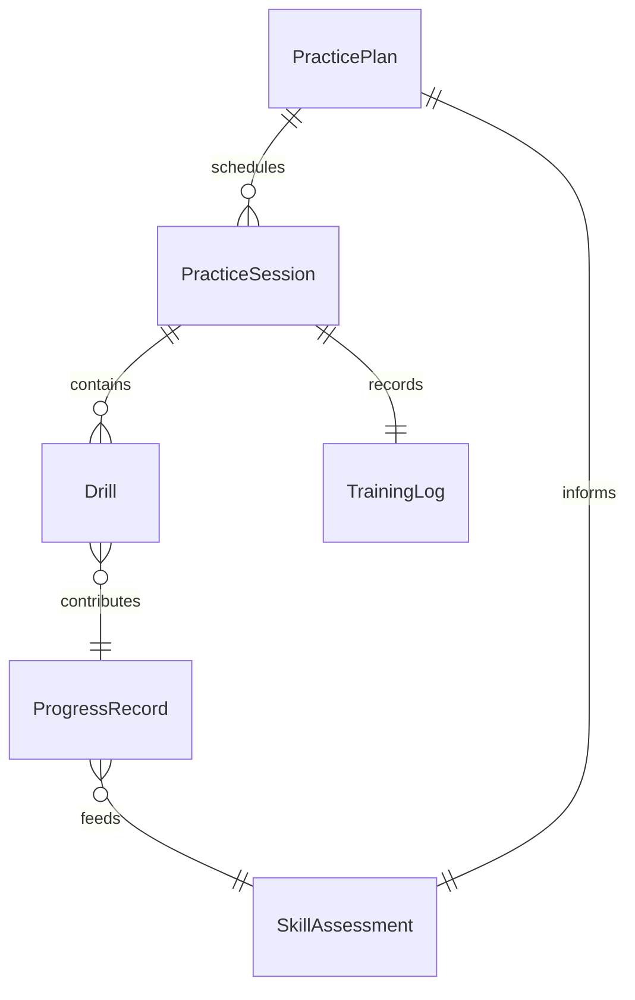
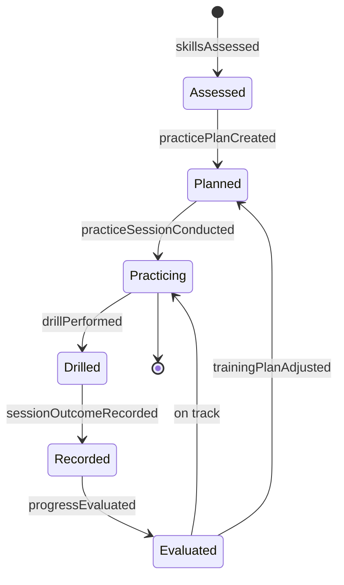
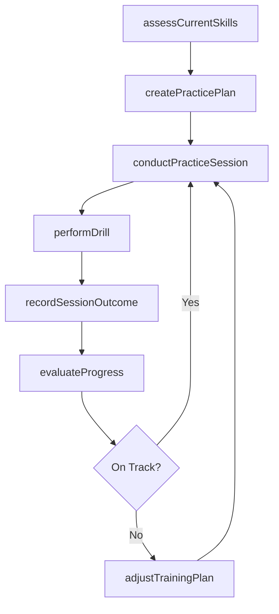
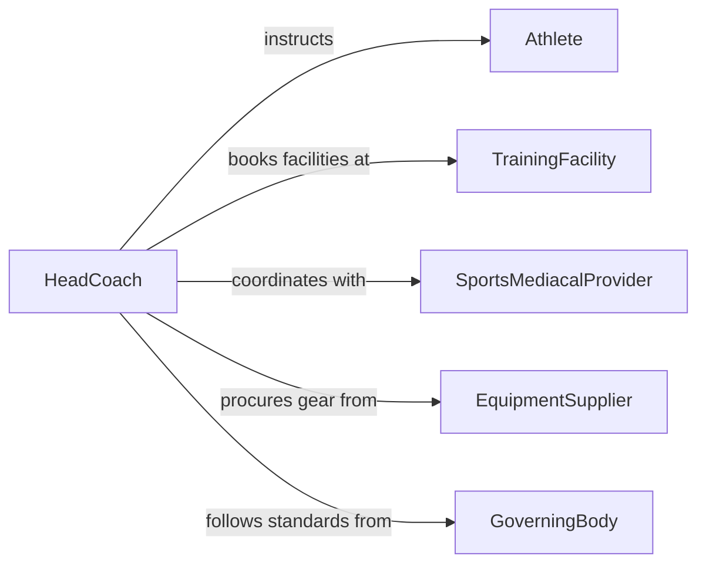

# Practice Athletic Artistic Skills

> Business-as-Code definition for practicing athletic or artistic skills. Models the structured training lifecycle including skill assessment, practice planning, drill execution, and performance tracking.

## Overview

Practicing athletic or artistic skills involves structured repetition, drills, and rehearsals designed to develop, refine, and maintain physical and artistic capabilities. This definition exposes actions for creating practice plans, logging sessions, tracking skill progression, and analyzing performance data to optimize training outcomes.

## Actors

| Actor | Description |
|-------|-------------|
| Coach | Designs training programs and provides technical instruction |
| TrainingFacility | Provides venues, courts, fields, or studios for practice sessions |
| SportsMediacalProvider | Assesses physical readiness and manages injury prevention |
| EquipmentSupplier | Supplies sport-specific gear, instruments, or artistic tools |
| GoverningBody | Sets rules, skill standards, and certification requirements |

## Roles

| Role | Description |
|------|-------------|
| Athlete | Executes practice routines and develops athletic or artistic skills |
| HeadCoach | Plans overall training strategy and monitors athlete development |
| StrengthAndConditioningCoach | Designs supplementary physical conditioning programs |
| PerformanceAnalyst | Reviews session data and identifies areas for improvement |

## Entities

| Entity | Description |
|--------|-------------|
| PracticePlan | A structured schedule of drills, exercises, and skills to work on |
| PracticeSession | A single instance of organized practice with defined objectives |
| Drill | A specific exercise targeting a particular skill or technique |
| SkillAssessment | An evaluation of current proficiency in a skill area |
| ProgressRecord | Documentation of improvement over time across skill metrics |
| TrainingLog | A chronological record of all practice activities and outcomes |

## Actions

| Action | Description |
|--------|-------------|
| assessCurrentSkills | Evaluate the athlete's proficiency level across relevant skill areas |
| createPracticePlan | Design a structured training plan with drills, duration, and goals |
| conductPracticeSession | Execute a scheduled practice session following the plan |
| performDrill | Complete a specific exercise or repetition targeting a skill |
| recordSessionOutcome | Log performance metrics and observations from a practice session |
| evaluateProgress | Analyze training data to measure skill improvement over time |
| adjustTrainingPlan | Modify the practice plan based on progress evaluation results |

## Events

| Event | Description |
|-------|-------------|
| skillsAssessed | Current skill levels have been evaluated and documented |
| practicePlanCreated | A new training plan has been designed and scheduled |
| practiceSessionConducted | A scheduled practice session has been completed |
| drillPerformed | A specific drill or exercise has been executed |
| sessionOutcomeRecorded | Practice session performance data has been logged |
| progressEvaluated | Skill improvement analysis has been completed |
| trainingPlanAdjusted | The practice plan has been modified based on evaluation |

## Searches

| Search | Description |
|--------|-------------|
| findPracticeSessions | List practice sessions by date, athlete, or skill focus area |
| getProgressRecords | Retrieve skill progression data for an athlete over a time period |
| getSkillAssessments | Query assessment results by athlete, skill area, or date |
| findDrillsBySkill | Locate drills targeting a specific skill or technique |

## Entity Relationships



## State Diagram



## Workflow



## Actor Relationships



## Usage

### Calling Actions

```typescript
import { practiceAthleticArtisticSkills } from '@headlessly/practice-athletic-artistic-skills'

const practice = practiceAthleticArtisticSkills()

// Assess current skill levels
const assessment = await practice.assessCurrentSkills({
  athleteId: 'ATH-0042',
  skillAreas: ['balance', 'technique', 'endurance', 'flexibility'],
  assessmentDate: '2026-02-01'
})

// Create a weekly practice plan
const plan = await practice.createPracticePlan({
  athleteId: 'ATH-0042',
  weekStartDate: '2026-02-03',
  sessions: [
    { day: 'monday', focus: 'technique', durationMinutes: 90 },
    { day: 'wednesday', focus: 'endurance', durationMinutes: 60 },
    { day: 'friday', focus: 'balance', durationMinutes: 75 }
  ]
})

// Record session outcome
await practice.recordSessionOutcome({
  sessionId: plan.sessions[0].id,
  drillsCompleted: 8,
  performanceNotes: 'Improved footwork consistency by 15%'
})
```

### Event-Driven Automation

```typescript
// Auto-evaluate progress after every fifth session
practice.sessionOutcomeRecorded(async ({ athleteId, sessionCount }) => {
  if (sessionCount % 5 === 0) {
    await practice.evaluateProgress({
      athleteId,
      periodWeeks: 2
    })
  }
})

// Alert coach when progress stalls
practice.progressEvaluated(async ({ athleteId, skillArea, trend }) => {
  if (trend === 'plateau') {
    await notify({
      to: 'head-coach',
      message: `${athleteId} showing plateau in ${skillArea}. Training plan adjustment recommended.`
    })
  }
})
```
