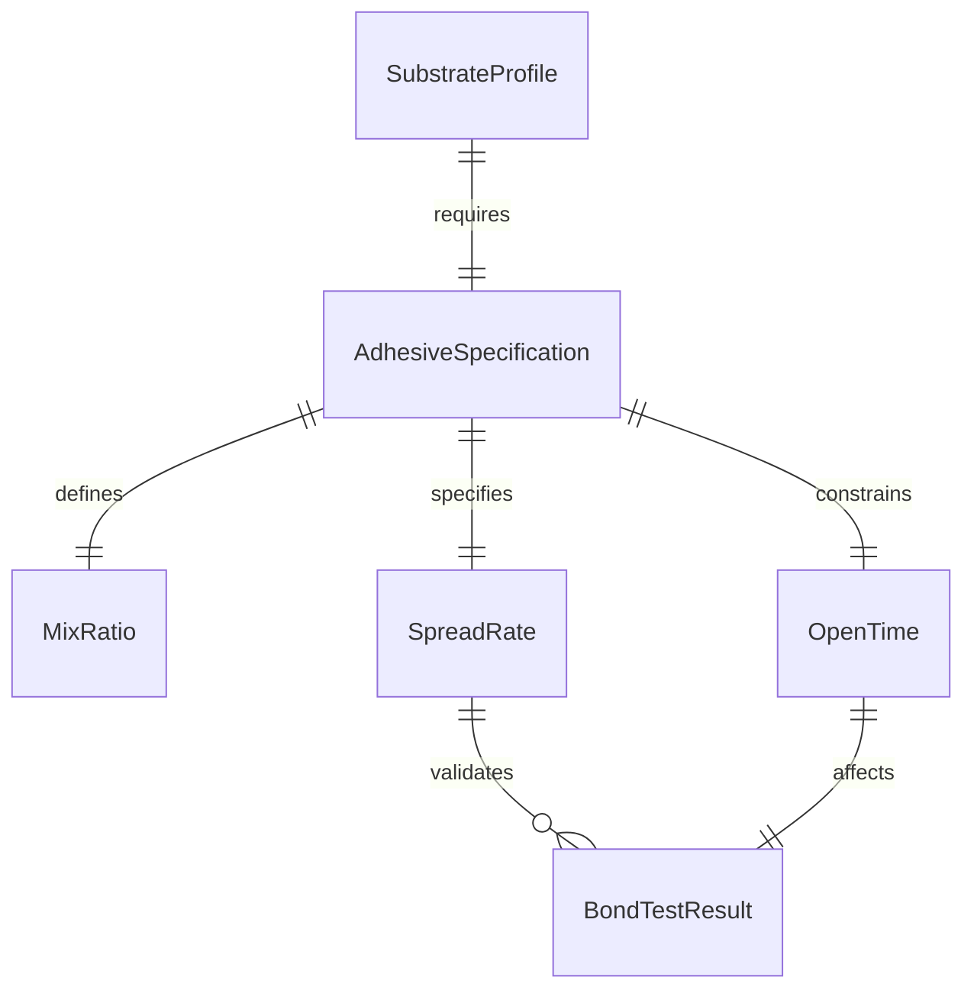
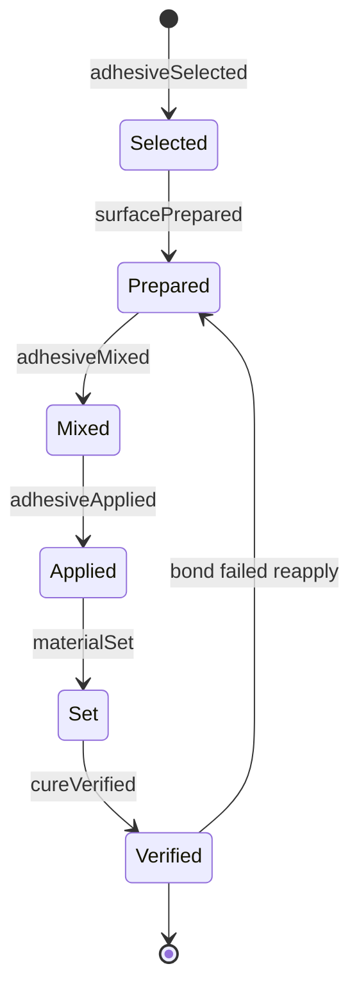
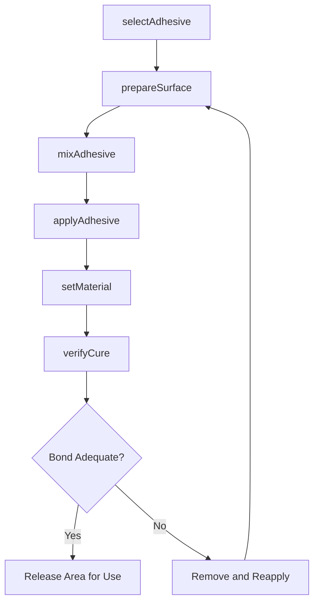
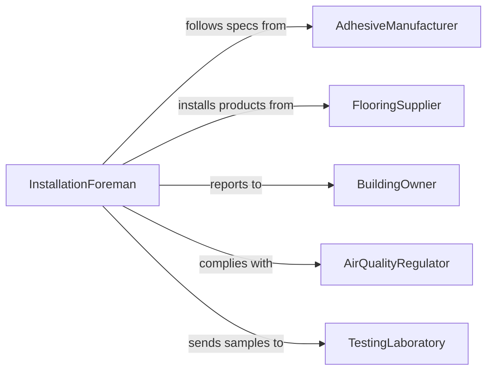

# Apply Adhesives to Construction Materials

> Business-as-Code definition for selecting, mixing, and applying adhesives, glues, mastics, and bonding agents to construction materials including flooring, tile, insulation, panels, and structural assemblies.

## Overview

Applying adhesives to construction materials involves selecting the correct adhesive type for the substrate and environmental conditions, preparing surfaces, mixing multi-component products, applying at the specified spread rate, and allowing proper cure time. This definition models adhesive selection, surface preparation, mixing, application, open time management, and bond verification for flooring installation, tile setting, panel attachment, and structural bonding operations.

## Actors

| Actor | Description |
|-------|-------------|
| AdhesiveManufacturer | Produces bonding products and specifies application procedures |
| FlooringSupplier | Provides flooring materials that require adhesive installation |
| BuildingOwner | Approves adhesive and installation methods for the project |
| AirQualityRegulator | Enforces VOC limits and ventilation requirements for adhesive use |
| TestingLaboratory | Performs bond strength and adhesion pull-off testing |

## Roles

| Role | Description |
|------|-------------|
| InstallationForeman | Directs adhesive application crews and monitors cure schedules |
| FlooringInstaller | Applies adhesives and sets flooring, tile, or panel materials |
| MixingTechnician | Prepares multi-component adhesives per manufacturer ratios |
| QualityInspector | Tests bond integrity and verifies coverage rates |

## Entities

| Entity | Description |
|--------|-------------|
| AdhesiveSpecification | Manufacturer data including spread rate, open time, and cure time |
| SubstrateProfile | Surface preparation requirements for proper adhesion |
| MixRatio | The proportions of components for multi-part adhesive systems |
| SpreadRate | The amount of adhesive applied per square foot or linear foot |
| OpenTime | The working window between adhesive application and material placement |
| BondTestResult | Pull-off or peel test measurement confirming adhesion strength |

## Actions

| Action | Description |
|--------|-------------|
| selectAdhesive | Choose the appropriate bonding product for the substrate and material |
| prepareSurface | Clean, prime, or profile the substrate for adhesive application |
| mixAdhesive | Combine multi-component adhesive products per the mix ratio |
| applyAdhesive | Spread or trowel adhesive onto the prepared surface |
| setMaterial | Place the construction material onto the adhesive within the open time |
| verifyCure | Confirm the adhesive has achieved full bond strength |

## Events

| Event | Description |
|-------|-------------|
| adhesiveSelected | Bonding product has been chosen for the application |
| surfacePrepared | Substrate has been cleaned and primed for adhesive |
| adhesiveMixed | Multi-component product has been combined at the correct ratio |
| adhesiveApplied | Bonding agent has been spread onto the surface |
| materialSet | Construction material has been placed into the adhesive |
| cureVerified | Bond strength has been confirmed through testing |

## Searches

| Search | Description |
|--------|-------------|
| findAdhesiveSpecs | Retrieve product data sheets by adhesive type or substrate |
| getApplicationHistory | Pull adhesive usage records by project or installer |
| getCureSchedule | Check expected cure completion times for active applications |
| getBondTestResults | Locate adhesion test records by project or area |

## Entity Relationships



## State Diagram



## Workflow



## Actor Relationships



## Usage

### Calling Actions

```typescript
import { applyAdhesivesConstructionMaterials } from '@headlessly/apply-adhesives-construction-materials'

const adhesives = applyAdhesivesConstructionMaterials()

// Select adhesive for vinyl plank flooring over concrete
await adhesives.selectAdhesive({
  projectId: 'LOBBY-FLOORING-2026',
  substrate: 'concrete-slab',
  material: 'luxury-vinyl-plank',
  conditions: { moisture: 'below-grade', temperature: 68 },
  product: 'moisture-cure-urethane'
})

// Prepare and apply
await adhesives.prepareSurface({
  projectId: 'LOBBY-FLOORING-2026',
  area: 'main-lobby',
  method: 'diamond-grind',
  primer: 'epoxy-moisture-barrier'
})

await adhesives.applyAdhesive({
  projectId: 'LOBBY-FLOORING-2026',
  area: 'main-lobby',
  spreadRate: { sqFtPerGallon: 100 },
  trowelSize: '1/16-x-1/16-x-1/16-square-notch',
  coverage: { sqFeet: 1200 }
})

await adhesives.setMaterial({
  projectId: 'LOBBY-FLOORING-2026',
  material: 'luxury-vinyl-plank',
  area: 'main-lobby',
  openTimeRemaining: { minutes: 25 }
})
```

### Event-Driven Automation

```typescript
// Alert crew when open time is running low
adhesives.adhesiveApplied(async ({ projectId, area, openTimeMinutes }) => {
  await scheduleTask({
    action: 'openTimeWarning',
    delay: `${openTimeMinutes - 5}m`,
    message: `5 minutes remaining to set material in ${area} on project ${projectId}`
  })
})

// Schedule bond test after cure period
adhesives.materialSet(async ({ projectId, area, cureHours }) => {
  await scheduleTask({
    action: 'bondTest',
    delay: `${cureHours}h`,
    onDue: () => adhesives.verifyCure({ projectId, area })
  })
})
```
