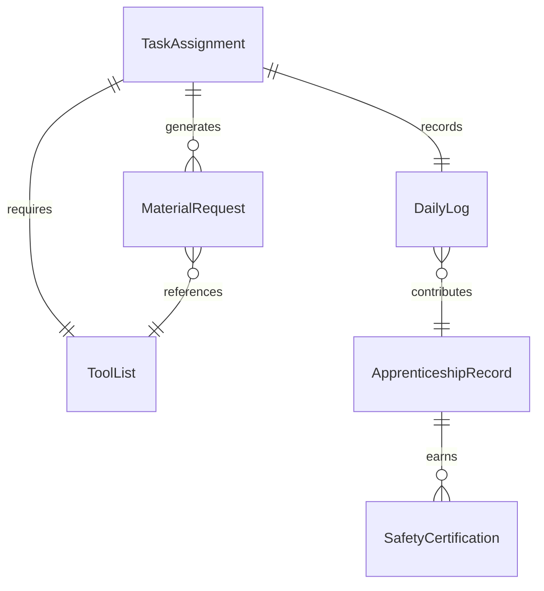
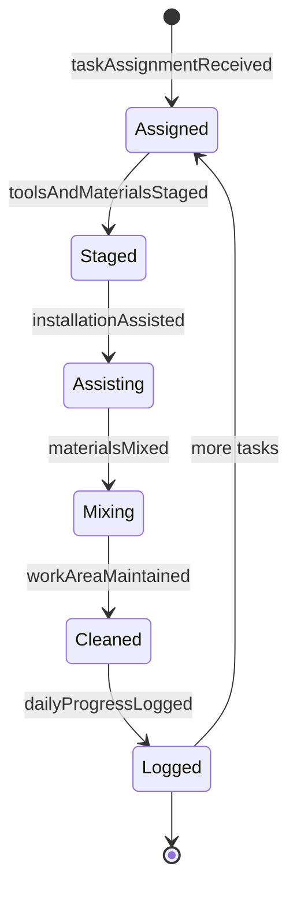
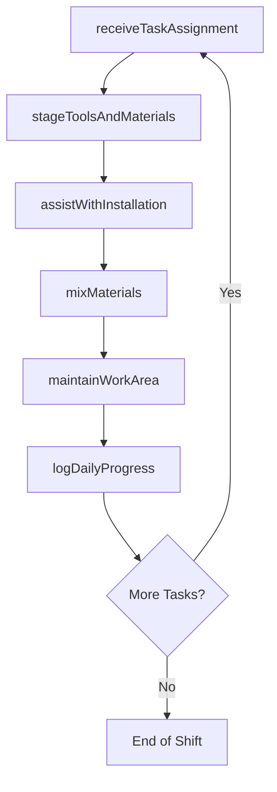
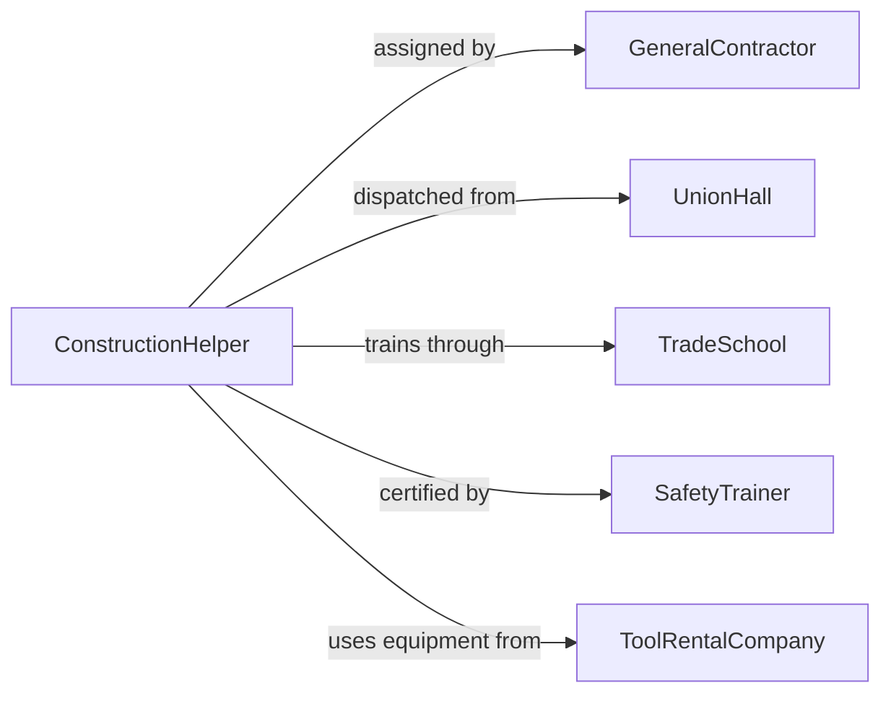

# Assist Skilled Construction or Extraction Personnel

> Business-as-Code definition for providing labor support to skilled tradespeople and extraction workers by carrying materials, holding components, operating simple equipment, and maintaining a clean and safe work area.

## Overview

Assisting skilled construction and extraction personnel involves performing support tasks that enable journeymen, operators, and specialists to focus on their craft. This includes fetching tools and materials, holding workpieces in position, mixing mortar or grout, operating basic equipment, and cleaning up after each phase of work. This definition models task delegation, tool and material staging, hands-on assistance, progress tracking, and workforce development coordination for construction helper and laborer roles.

## Actors

| Actor | Description |
|-------|-------------|
| GeneralContractor | Manages the overall project and assigns helper labor to trades |
| UnionHall | Dispatches laborers and helpers to job sites under collective agreements |
| TradeSchool | Provides apprenticeship and pre-apprenticeship training programs |
| SafetyTrainer | Delivers OSHA 10/30 and task-specific safety certifications |
| ToolRentalCompany | Supplies basic equipment and hand tools for helper tasks |

## Roles

| Role | Description |
|------|-------------|
| ConstructionHelper | Performs support tasks under the direction of skilled tradespeople |
| TradeForeman | Assigns helpers to specific tasks and evaluates their performance |
| Journeyman | The skilled tradesperson who directs the helper's work activities |
| SiteLaborer | Provides general site support including cleanup and material staging |

## Entities

| Entity | Description |
|--------|-------------|
| TaskAssignment | A specific support task delegated to a helper by the journeyman |
| ToolList | The set of tools and equipment needed for the assigned task |
| MaterialRequest | A request to retrieve specific materials from the staging area |
| DailyLog | A record of tasks completed, hours worked, and skills practiced |
| ApprenticeshipRecord | Documentation of on-the-job training hours and competencies gained |
| SafetyCertification | A credential confirming completion of required safety training |

## Actions

| Action | Description |
|--------|-------------|
| receiveTaskAssignment | Accept a support task from the journeyman or foreman |
| stageToolsAndMaterials | Retrieve and position tools and materials at the work area |
| assistWithInstallation | Hold components, feed materials, or operate simple equipment |
| mixMaterials | Prepare mortar, grout, or other construction mixes as directed |
| maintainWorkArea | Clean debris, organize tools, and keep the area safe and accessible |
| logDailyProgress | Record tasks completed and skills practiced for training documentation |

## Events

| Event | Description |
|-------|-------------|
| taskAssignmentReceived | Support task has been accepted from the skilled worker |
| toolsAndMaterialsStaged | Required tools and materials are positioned at the work area |
| installationAssisted | Physical support has been provided during the installation |
| materialsMixed | Construction mix has been prepared per the journeyman's direction |
| workAreaMaintained | Debris has been cleared and the area is organized |
| dailyProgressLogged | Completed tasks and training hours have been recorded |

## Searches

| Search | Description |
|--------|-------------|
| findActiveAssignments | List current helper task assignments by trade or site area |
| getHelperAvailability | Check which helpers are available for assignment |
| getTrainingHours | Retrieve apprenticeship hours logged by helper or trade |
| getDailyLogs | Pull daily progress records by helper, date, or project |

## Entity Relationships



## State Diagram



## Workflow



## Actor Relationships



## Usage

### Calling Actions

```typescript
import { assistSkilledConstructionExtractionPersonnel } from '@headlessly/assist-skilled-construction-extraction-personnel'

const helper = assistSkilledConstructionExtractionPersonnel()

// Receive task assignment from a mason
await helper.receiveTaskAssignment({
  projectId: 'BRICK-FACADE-BLDG-12',
  journeymanId: 'MASON-RODRIGUEZ-03',
  task: 'stage-brick-and-mortar',
  area: 'east-wall-scaffold-level-2'
})

// Stage materials and assist
await helper.stageToolsAndMaterials({
  projectId: 'BRICK-FACADE-BLDG-12',
  tools: ['brick-tongs', 'mortar-hod', 'level'],
  materials: [
    { type: 'face-brick', quantity: 200, unit: 'each' },
    { type: 'mortar-bags', quantity: 6, unit: 'bags' }
  ]
})

await helper.mixMaterials({
  projectId: 'BRICK-FACADE-BLDG-12',
  recipe: 'type-S-mortar',
  quantity: { bags: 2 },
  waterRatio: 'per-bag-instructions'
})

await helper.assistWithInstallation({
  projectId: 'BRICK-FACADE-BLDG-12',
  task: 'feed-brick-to-mason',
  duration: { hours: 3 }
})

await helper.logDailyProgress({
  helperId: 'LABORER-CHEN-11',
  date: '2026-02-05',
  tasksCompleted: ['material-staging', 'mortar-mixing', 'brick-feeding'],
  apprenticeshipHours: 8
})
```

### Event-Driven Automation

```typescript
// Auto-log apprenticeship hours when daily progress is recorded
helper.dailyProgressLogged(async ({ helperId, apprenticeshipHours }) => {
  if (apprenticeshipHours > 0) {
    await notify({
      to: 'training-coordinator',
      message: `Helper ${helperId} logged ${apprenticeshipHours} OJT hours - update apprenticeship record`
    })
  }
})

// Alert foreman when materials run low at the work area
helper.toolsAndMaterialsStaged(async ({ projectId, materials }) => {
  const lowStock = materials.filter(m => m.remaining < m.quantity * 0.2)
  if (lowStock.length > 0) {
    await notify({
      to: 'trade-foreman',
      message: `Project ${projectId} running low on: ${lowStock.map(m => m.type).join(', ')}`
    })
  }
})
```
