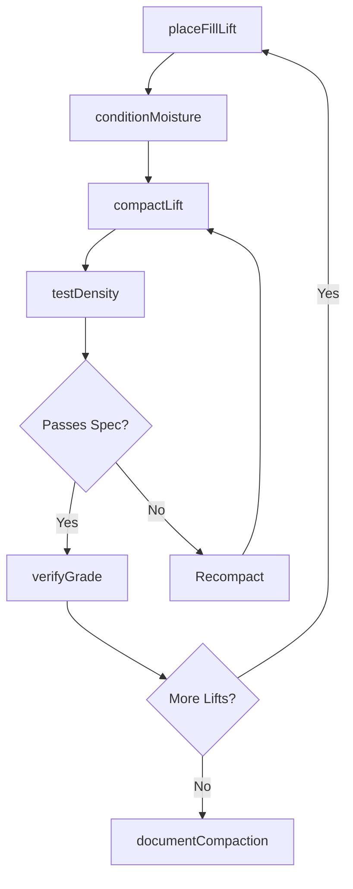
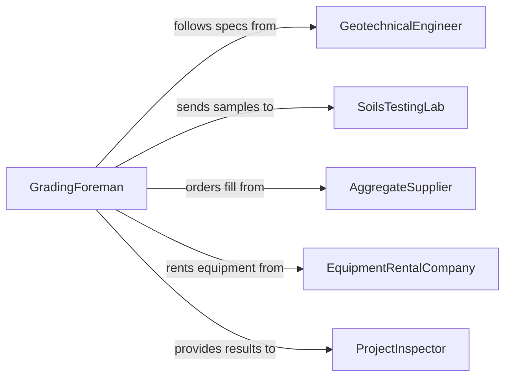

# Compact Materials to Create Level Bases

> Business-as-Code definition for compacting soil, aggregate, and fill materials using rollers, plate compactors, and rammers to create stable, level bases for foundations, roads, slabs, and paving operations.

## Overview

Compacting materials to create level bases involves placing fill in controlled lifts, running compaction equipment over each layer, and testing density to confirm the material meets engineering specifications. This definition models fill placement, lift thickness control, compaction equipment operation, moisture conditioning, density testing, and grade verification for road subgrade, building pad, parking lot, and pipeline bedding applications.

## Actors

| Actor | Description |
|-------|-------------|
| GeotechnicalEngineer | Specifies compaction requirements, lift thicknesses, and density targets |
| SoilsTestingLab | Performs Proctor tests, nuclear density gauging, and moisture analysis |
| AggregateSupplier | Delivers crushed stone, gravel, and select fill materials |
| EquipmentRentalCompany | Provides vibratory rollers, plate compactors, and jumping jacks |
| ProjectInspector | Verifies compaction meets specification before next construction phase |

## Roles

| Role | Description |
|------|-------------|
| GradingForeman | Directs fill placement and compaction sequences |
| CompactionOperator | Runs vibratory rollers, plate compactors, and trench rammers |
| SurveyTechnician | Sets grade stakes and verifies finished elevations |
| SoilsTechnician | Performs field density and moisture testing on compacted lifts |

## Entities

| Entity | Description |
|--------|-------------|
| CompactionSpecification | Engineering requirements for density, moisture, and lift thickness |
| FillLift | A single layer of material placed and compacted to specification |
| ProctorTest | A laboratory test establishing maximum dry density and optimum moisture |
| DensityTestResult | A field measurement of compacted material density as a percentage of Proctor |
| GradeStake | A survey marker indicating the target elevation for the finished base |
| MoistureConditionReport | Documentation of material moisture content relative to optimum |

## Actions

| Action | Description |
|--------|-------------|
| placeFillLift | Spread a layer of material at the specified thickness |
| conditionMoisture | Add water or allow drying to bring material to optimum moisture |
| compactLift | Run compaction equipment over the fill layer to achieve density |
| testDensity | Perform nuclear gauge or sand cone testing on the compacted lift |
| verifyGrade | Check finished elevation against survey stakes |
| documentCompaction | Record lift numbers, density results, and moisture readings |

## Events

| Event | Description |
|-------|-------------|
| fillLiftPlaced | A layer of material has been spread at the specified thickness |
| moistureConditioned | Material moisture has been adjusted to the optimum range |
| liftCompacted | Compaction equipment has been run over the fill layer |
| densityTested | Field density measurement has been performed |
| gradeVerified | Finished elevation confirmed within tolerance of the design |
| compactionDocumented | Lift data, density results, and moisture readings have been recorded |

## Searches

| Search | Description |
|--------|-------------|
| findActivePads | List compaction areas currently under construction |
| getDensityResults | Retrieve density test data by project, area, or lift number |
| getMoistureHistory | Pull moisture conditioning records by date or location |
| getGradeChecks | Locate elevation verification records by survey point |

## Workflow



## Actor Relationships



## Usage

### Calling Actions

```typescript
import { compactMaterialsCreateLevelBases } from '@headlessly/compact-materials-create-level-bases'

const compaction = compactMaterialsCreateLevelBases()

// Place first lift for a building pad
await compaction.placeFillLift({
  projectId: 'WAREHOUSE-PAD-EAST',
  area: 'building-footprint',
  material: 'crushed-limestone-base',
  thickness: { inches: 8 },
  liftNumber: 1
})

// Condition moisture and compact
await compaction.conditionMoisture({
  projectId: 'WAREHOUSE-PAD-EAST',
  liftNumber: 1,
  currentMoisture: { percent: 8 },
  optimumMoisture: { percent: 11 },
  action: 'add-water'
})

await compaction.compactLift({
  projectId: 'WAREHOUSE-PAD-EAST',
  liftNumber: 1,
  equipment: 'vibratory-roller-CAT-CS56B',
  passes: 6
})

// Test and verify
const density = await compaction.testDensity({
  projectId: 'WAREHOUSE-PAD-EAST',
  liftNumber: 1,
  method: 'nuclear-gauge',
  locations: ['NE-corner', 'center', 'SW-corner']
})

await compaction.verifyGrade({
  projectId: 'WAREHOUSE-PAD-EAST',
  liftNumber: 1,
  targetElevation: { feet: 102.5 },
  tolerance: { inches: 0.5 }
})
```

### Event-Driven Automation

```typescript
// Auto-test density after each lift is compacted
compaction.liftCompacted(async ({ projectId, liftNumber }) => {
  await compaction.testDensity({
    projectId,
    liftNumber,
    method: 'nuclear-gauge'
  })
})

// Alert engineer on failed density tests
compaction.densityTested(async ({ projectId, liftNumber, percentProctor, target }) => {
  if (percentProctor < target) {
    await notify({
      to: 'geotechnical-engineer',
      message: `Project ${projectId} lift ${liftNumber} at ${percentProctor}% Proctor vs ${target}% required - recompaction needed`
    })
  }
})
```
