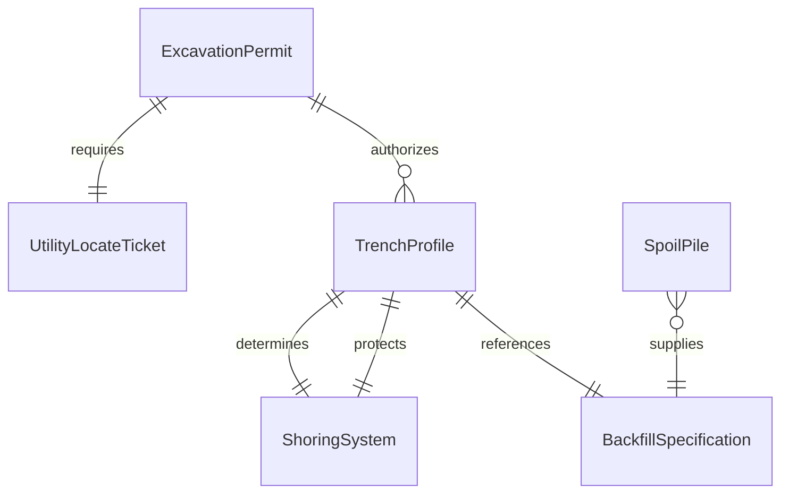
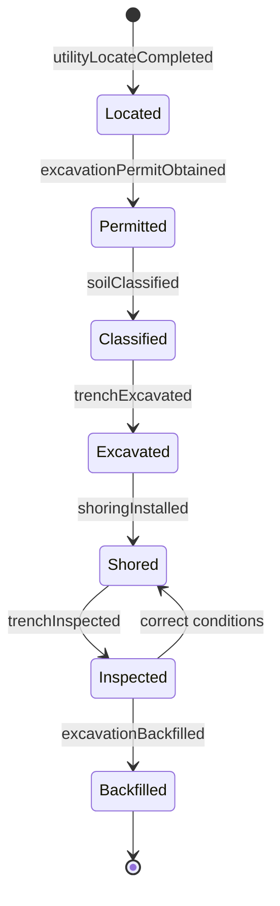
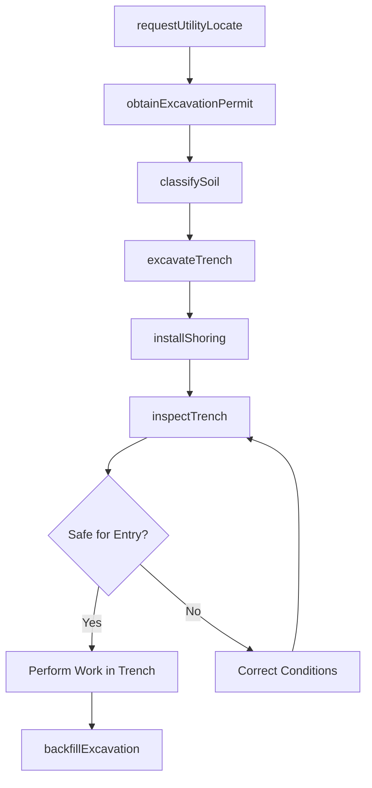
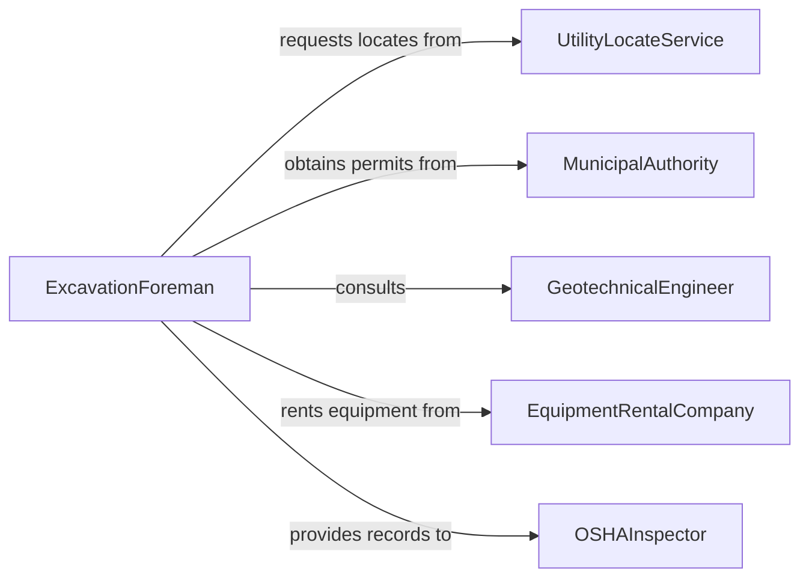

# Dig Holes or Trenches

> Business-as-Code definition for excavating holes, trenches, and ditches for utility installation, foundation work, drainage systems, and underground infrastructure using manual and mechanical methods.

## Overview

Digging holes and trenches involves locating underground utilities, selecting excavation methods and equipment, removing soil to specified depths and widths, and shoring or sloping trench walls to prevent collapse. This definition models utility locate verification, excavation permitting, dig sequences, soil classification, trench protection, spoil management, and backfill operations for construction, utility, and municipal infrastructure projects.

## Actors

| Actor | Description |
|-------|-------------|
| UtilityLocateService | Marks underground utility locations before excavation (811 one-call) |
| MunicipalAuthority | Issues excavation permits and enforces right-of-way requirements |
| GeotechnicalEngineer | Classifies soil types and recommends shoring or sloping methods |
| EquipmentRentalCompany | Provides excavators, backhoes, and trench boxes |
| OSHAInspector | Enforces trench safety standards including cave-in protection |

## Roles

| Role | Description |
|------|-------------|
| ExcavationForeman | Plans dig sequences and directs excavation crews |
| EquipmentOperator | Runs excavators, backhoes, and trenchers |
| Laborer | Performs hand digging, grades trench bottoms, and installs shoring |
| CompetentPerson | Inspects trench conditions and authorizes worker entry per OSHA |

## Entities

| Entity | Description |
|--------|-------------|
| ExcavationPermit | Authorization from the municipality to dig in the right-of-way |
| UtilityLocateTicket | A record of marked underground utility positions |
| TrenchProfile | Dimensions including depth, width, slope, and soil type |
| ShoringSystem | Trench boxes, hydraulic shores, or timber bracing preventing cave-in |
| SpoilPile | Excavated soil stored for backfill or removal |
| BackfillSpecification | Engineering requirements for compacted fill material |

## Actions

| Action | Description |
|--------|-------------|
| requestUtilityLocate | Submit a locate request to the one-call center before digging |
| obtainExcavationPermit | Secure municipal approval for the planned excavation |
| classifySoil | Evaluate soil type to determine appropriate trench protection |
| excavateTrench | Dig the hole or trench to the specified dimensions |
| installShoring | Place trench boxes or bracing to protect workers from cave-in |
| inspectTrench | Verify trench conditions meet OSHA safety requirements |
| backfillExcavation | Fill and compact the trench after utility or foundation work |

## Events

| Event | Description |
|-------|-------------|
| utilityLocateCompleted | Underground utilities have been marked at the site |
| excavationPermitObtained | Municipal authorization has been secured |
| soilClassified | Soil type and trench protection requirements have been determined |
| trenchExcavated | Hole or trench has been dug to specification |
| shoringInstalled | Cave-in protection has been placed and inspected |
| trenchInspected | Safety conditions have been verified by the competent person |
| excavationBackfilled | Trench has been filled and compacted to specification |

## Searches

| Search | Description |
|--------|-------------|
| findActiveLocateTickets | List utility locate requests by site or expiration date |
| getExcavationPermits | Retrieve permits by project, location, or status |
| getTrenchInspections | Pull safety inspection records by date or site |
| getBackfillTestResults | Locate compaction test results for completed trenches |

## Entity Relationships



## State Diagram



## Workflow



## Actor Relationships



## Usage

### Calling Actions

```typescript
import { digHolesTrenches } from '@headlessly/dig-holes-trenches'

const excavation = digHolesTrenches()

// Request utility locate for a water main trench
await excavation.requestUtilityLocate({
  siteId: 'MAIN-ST-BLOCK-400',
  address: '412 Main Street',
  markTypes: ['gas', 'electric', 'telecom', 'water', 'sewer']
})

// Classify soil and excavate
await excavation.classifySoil({
  siteId: 'MAIN-ST-BLOCK-400',
  borings: ['B-1', 'B-2'],
  classification: 'Type-C'
})

await excavation.excavateTrench({
  siteId: 'MAIN-ST-BLOCK-400',
  dimensions: { depth: 8, width: 4, length: 120, unit: 'feet' },
  equipment: 'backhoe-JD-310L'
})

// Install shoring and inspect
await excavation.installShoring({
  siteId: 'MAIN-ST-BLOCK-400',
  system: 'aluminum-trench-box',
  boxId: 'TB-8x20-01'
})

await excavation.inspectTrench({
  siteId: 'MAIN-ST-BLOCK-400',
  competentPerson: 'CP-JONES-04',
  conditions: ['soil-stable', 'water-controlled', 'shoring-seated']
})
```

### Event-Driven Automation

```typescript
// Auto-install shoring when trench exceeds 5 feet
excavation.trenchExcavated(async ({ siteId, depth }) => {
  if (depth >= 5) {
    await excavation.installShoring({ siteId, system: 'trench-box' })
  }
})

// Alert safety when inspection fails
excavation.trenchInspected(async ({ siteId, safe, issues }) => {
  if (!safe) {
    await notify({
      to: 'safety-officer',
      message: `Trench at ${siteId} failed inspection: ${issues.join(', ')} - no entry until corrected`
    })
  }
})
```
