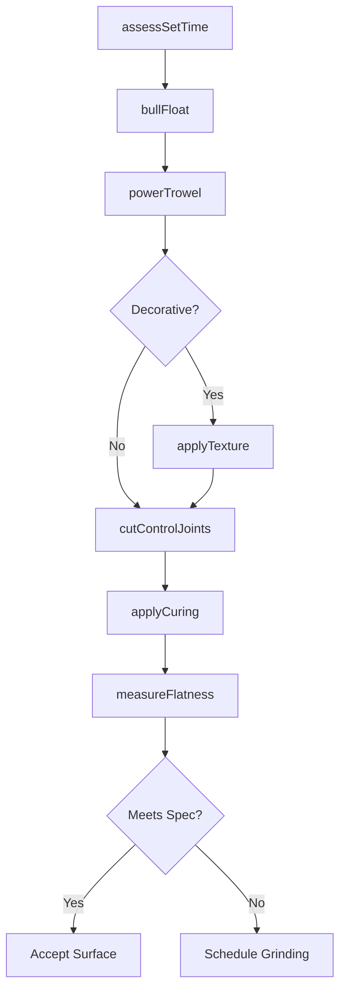
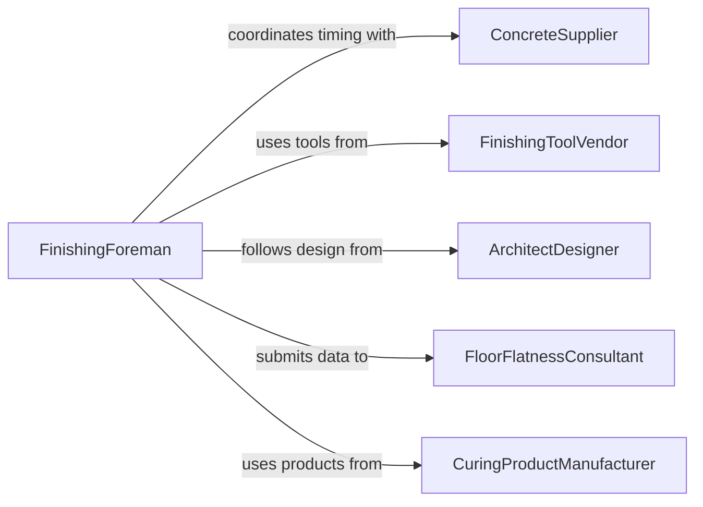

# Finish Concrete Surfaces

> Business-as-Code definition for floating, troweling, brooming, stamping, and curing concrete surfaces to achieve the specified texture, flatness, and durability for floors, sidewalks, driveways, and structural slabs.

## Overview

Finishing concrete surfaces involves timing operations to the concrete's set progression, applying bull floats and fresnos to close the surface, power troweling to achieve the desired smoothness or hardness, applying decorative textures or broom finishes, cutting control joints, and applying curing compounds. This definition models timing assessment, floating, troweling passes, texture application, joint cutting, and curing for commercial floors, residential flatwork, and decorative concrete applications.

## Actors

| Actor | Description |
|-------|-------------|
| ConcreteSupplier | Provides the mix design and set-time guidance for finishing windows |
| FinishingToolVendor | Supplies trowels, floats, stamps, and power finishing equipment |
| ArchitectDesigner | Specifies finish type, color, and decorative patterns |
| FloorFlatnessConsultant | Measures and certifies floor flatness and levelness values |
| CuringProductManufacturer | Provides curing compounds, blankets, and moisture retention products |

## Roles

| Role | Description |
|------|-------------|
| FinishingForeman | Directs the finishing sequence and timing based on concrete set |
| ConcreteFinisher | Performs hand and power troweling, floating, and texturing |
| JointCutter | Cuts control joints using early-entry or wet-cut saws |
| CuringApplicator | Sprays or places curing products on finished surfaces |

## Entities

| Entity | Description |
|--------|-------------|
| FinishSpecification | Requirements for surface texture, flatness, and appearance |
| SetTimeWindow | The period during which concrete is workable for finishing operations |
| TrowelPass | A single application of the trowel across the concrete surface |
| ControlJoint | A saw-cut groove placed to control cracking location |
| CuringMethod | The technique used to maintain moisture during strength gain |
| FlatnessReport | Measured FF/FL values documenting floor flatness and levelness |

## Actions

| Action | Description |
|--------|-------------|
| assessSetTime | Monitor concrete firmness to determine when finishing can begin |
| bullFloat | Pass a large float over the surface to flatten and close the top |
| powerTrowel | Run a rotary trowel machine to achieve the specified smoothness |
| applyTexture | Broom, stamp, or expose aggregate to create the desired finish |
| cutControlJoints | Saw grooves at specified spacing to control crack propagation |
| applyCuring | Spray curing compound or place wet-cure blankets on the surface |
| measureFlatness | Test floor flatness and levelness using profiling equipment |

## Events

| Event | Description |
|-------|-------------|
| setTimeAssessed | Concrete firmness has been evaluated for finishing readiness |
| surfaceBullFloated | Initial floating pass has closed the surface |
| surfacePowerTroweled | Rotary troweling has achieved the specified smoothness |
| textureApplied | Broom, stamp, or aggregate exposure finish has been completed |
| controlJointsCut | Saw-cut grooves have been placed at specified intervals |
| curingApplied | Curing compound or blankets have been placed on the surface |
| flatnessMeasured | FF/FL values have been recorded and reported |

## Searches

| Search | Description |
|--------|-------------|
| findActivePours | List concrete placements currently in the finishing stage |
| getFinishSpecs | Retrieve finish requirements by project or area |
| getFlatnessData | Pull FF/FL measurements by slab section or date |
| getJointLayouts | Locate control joint cutting plans by project |

## Workflow



## Actor Relationships



## Usage

### Calling Actions

```typescript
import { finishConcreteSurfaces } from '@headlessly/finish-concrete-surfaces'

const finishing = finishConcreteSurfaces()

// Assess set time for a warehouse floor pour
await finishing.assessSetTime({
  projectId: 'WAREHOUSE-FLOOR-A',
  section: 'bay-1',
  pourTime: '2026-02-05T06:00',
  ambientTemp: { fahrenheit: 55 },
  mixDesign: '4000psi-fiber-reinforced'
})

// Float and trowel
await finishing.bullFloat({
  projectId: 'WAREHOUSE-FLOOR-A',
  section: 'bay-1',
  tool: 'magnesium-bull-float-48in'
})

await finishing.powerTrowel({
  projectId: 'WAREHOUSE-FLOOR-A',
  section: 'bay-1',
  machine: 'ride-on-trowel-96in',
  passes: 3,
  bladePitch: { initial: 'flat', final: 'high-pitch' }
})

// Cut joints and cure
await finishing.cutControlJoints({
  projectId: 'WAREHOUSE-FLOOR-A',
  section: 'bay-1',
  spacing: { feet: 15 },
  method: 'early-entry-soff-cut',
  depth: { inches: 1.5 }
})

await finishing.applyCuring({
  projectId: 'WAREHOUSE-FLOOR-A',
  section: 'bay-1',
  method: 'spray-membrane',
  product: 'solvent-based-curing-compound',
  coverage: { sqFtPerGallon: 200 }
})

// Measure flatness
await finishing.measureFlatness({
  projectId: 'WAREHOUSE-FLOOR-A',
  section: 'bay-1',
  target: { ff: 50, fl: 35 }
})
```

### Event-Driven Automation

```typescript
// Auto-begin bull floating when set time is right
finishing.setTimeAssessed(async ({ projectId, section, ready }) => {
  if (ready) {
    await finishing.bullFloat({ projectId, section })
  }
})

// Alert on flatness failures requiring corrective grinding
finishing.flatnessMeasured(async ({ projectId, section, ff, fl, target }) => {
  if (ff < target.ff || fl < target.fl) {
    await notify({
      to: 'finishing-foreman',
      message: `${section} on ${projectId} FF:${ff}/FL:${fl} below target FF:${target.ff}/FL:${target.fl} - grinding required`
    })
  }
})
```
