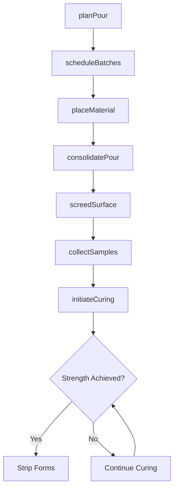
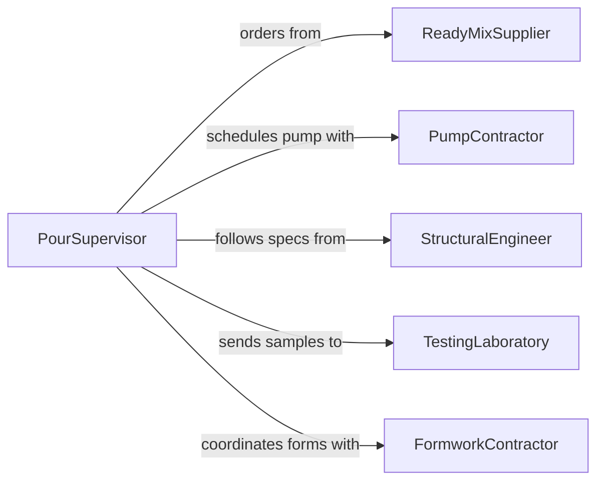

# Pour Materials into or on Designated Areas

> Business-as-Code definition for placing concrete, grout, epoxy, asphalt, and other pourable materials into forms, foundations, slabs, and designated areas on construction and industrial sites.

## Overview

Pouring materials into designated areas involves coordinating material delivery timing with placement crews, directing the flow of concrete or other mixtures into forms and prepared areas, vibrating or consolidating to eliminate voids, and screeding to achieve the correct level. This definition models pour planning, batch scheduling, placement sequencing, consolidation, and quality testing for concrete flatwork, foundations, grout beds, and specialty pour applications.

## Actors

| Actor | Description |
|-------|-------------|
| ReadyMixSupplier | Delivers concrete or grout from the batch plant to the job site |
| PumpContractor | Provides concrete pump trucks and boom pumps for placement |
| StructuralEngineer | Specifies mix designs, placement methods, and curing requirements |
| TestingLaboratory | Performs slump tests, air content, and cylinder strength testing |
| FormworkContractor | Builds and sets the forms that contain the poured material |

## Roles

| Role | Description |
|------|-------------|
| PourSupervisor | Coordinates the timing, sequence, and crew assignments for the pour |
| ConcreteFinisher | Directs material into forms and performs initial leveling |
| VibratorOperator | Consolidates poured material to eliminate air pockets and voids |
| QualityTechnician | Collects samples and performs field tests during the pour |

## Entities

| Entity | Description |
|--------|-------------|
| PourPlan | A document specifying sequence, volumes, and timing for the placement |
| MixDesign | Engineering specifications for material proportions and properties |
| BatchTicket | A delivery record showing mix proportions, volume, and timestamps |
| SlumpTest | A field measurement of concrete workability and consistency |
| CylinderSample | A test specimen cast during the pour for compressive strength testing |
| CuringSchedule | Time and temperature requirements for material strength development |

## Actions

| Action | Description |
|--------|-------------|
| planPour | Define the placement sequence, volumes, and crew requirements |
| scheduleBatches | Coordinate delivery timing with the ready-mix supplier |
| placeMaterial | Direct the flow of material into forms or designated areas |
| consolidatePour | Vibrate or rod the material to eliminate voids and air pockets |
| screedSurface | Strike off excess material to achieve the specified level |
| collectSamples | Cast test cylinders and perform field quality tests |
| initiateCuring | Apply curing compound or wet cure methods after placement |

## Events

| Event | Description |
|-------|-------------|
| pourPlanned | Placement sequence and volumes have been determined |
| batchesScheduled | Delivery timing has been confirmed with the supplier |
| materialPlaced | Concrete or grout has been directed into the designated area |
| pourConsolidated | Material has been vibrated to remove voids |
| surfaceScreeded | Material has been leveled to the specified grade |
| samplesCollected | Test specimens and field data have been obtained |
| curingInitiated | Curing methods have been applied to the placed material |

## Searches

| Search | Description |
|--------|-------------|
| findScheduledPours | List upcoming placements by project, date, or volume |
| getBatchTickets | Retrieve delivery records by pour date or mix design |
| getTestResults | Pull slump, air, and strength data by pour or project |
| getCuringStatus | Check curing progress for recently placed materials |

## Workflow



## Actor Relationships



## Usage

### Calling Actions

```typescript
import { pourMaterialsIntoDesignatedAreas } from '@headlessly/pour-materials-into-designated-areas'

const pouring = pourMaterialsIntoDesignatedAreas()

// Plan a foundation pour
const plan = await pouring.planPour({
  projectId: 'WAREHOUSE-FOUNDATION-B',
  area: 'mat-slab',
  volume: { cubicYards: 180 },
  mixDesign: '4000psi-3/4-aggregate',
  sequence: ['north-half', 'south-half']
})

// Schedule batches and place
await pouring.scheduleBatches({
  planId: plan.id,
  supplierId: 'CENTRAL-READY-MIX',
  truckInterval: { minutes: 10 },
  pumpRequired: true
})

await pouring.placeMaterial({
  planId: plan.id,
  section: 'north-half',
  method: 'boom-pump',
  volume: { cubicYards: 90 }
})

await pouring.consolidatePour({
  planId: plan.id,
  section: 'north-half',
  method: 'internal-vibrator',
  pattern: 'systematic-overlap'
})

// Sample and cure
await pouring.collectSamples({
  planId: plan.id,
  tests: ['slump', 'air-content', 'temperature'],
  cylinders: 6
})

await pouring.initiateCuring({
  planId: plan.id,
  method: 'curing-compound',
  product: 'water-based-membrane'
})
```

### Event-Driven Automation

```typescript
// Auto-schedule next batch when truck is placed
pouring.materialPlaced(async ({ planId, section }) => {
  await pouring.scheduleBatches({ planId, section, refill: true })
})

// Alert engineer on failed slump tests
pouring.samplesCollected(async ({ planId, slump, target }) => {
  if (Math.abs(slump - target) > 1) {
    await notify({
      to: 'structural-engineer',
      message: `Pour ${planId} slump at ${slump}" vs target ${target}" - review required`
    })
  }
})
```
