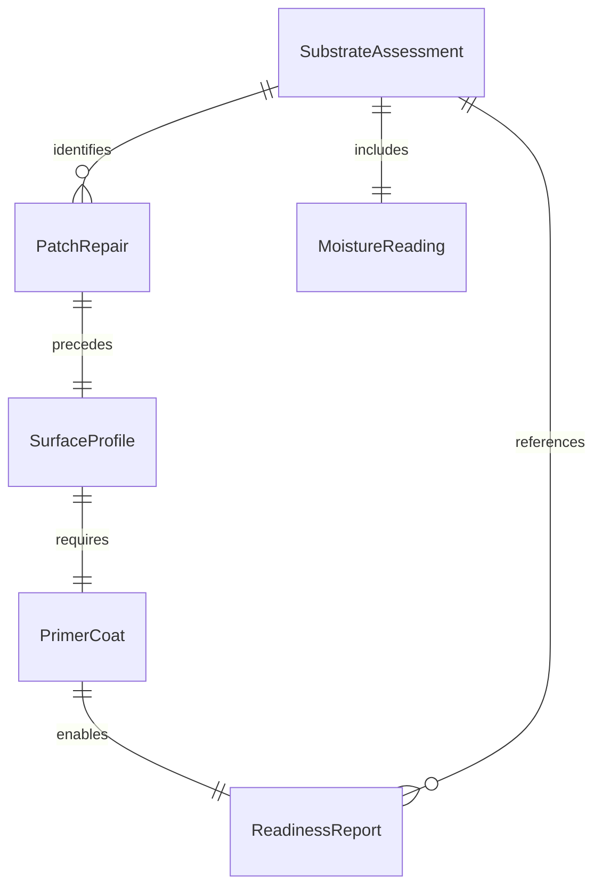
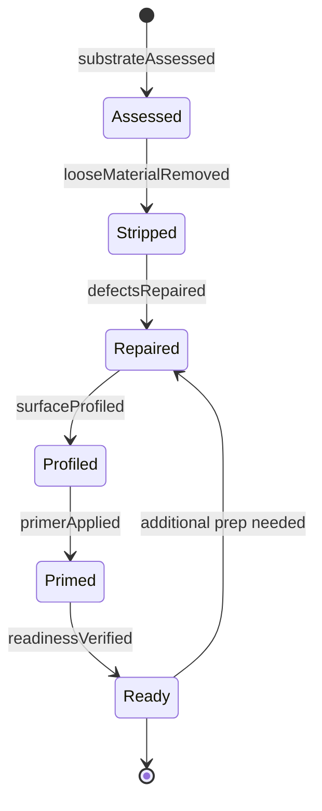
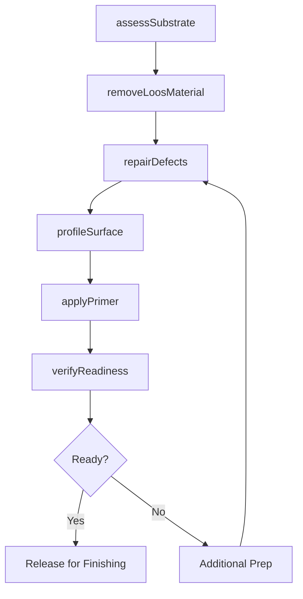
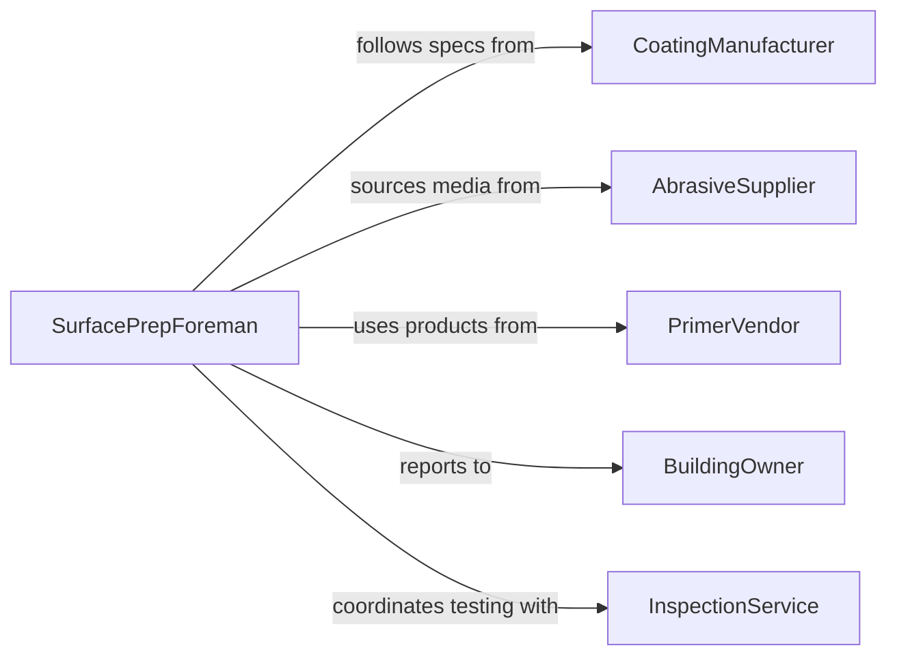

# Prepare Surfaces for Finishing

> Business-as-Code definition for cleaning, sanding, priming, patching, and conditioning surfaces of walls, floors, ceilings, and structural elements before applying paint, coatings, or finish materials.

## Overview

Preparing surfaces for finishing involves assessing substrate condition, removing loose material and contaminants, repairing defects, applying primers or sealers, and verifying readiness for the finish coat or overlay. This definition models surface inspection, defect repair, abrasion profiling, primer application, and readiness verification for painting, coating, flooring, and decorative finishing trades.

## Actors

| Actor | Description |
|-------|-------------|
| CoatingManufacturer | Specifies surface preparation requirements for their products |
| AbrasiveSupplier | Provides sandpaper, grinding discs, and blasting media |
| PrimerVendor | Supplies primers, sealers, and bonding agents |
| BuildingOwner | Approves finish selections and surface preparation scope |
| InspectionService | Verifies surface preparation meets specification before coating |

## Roles

| Role | Description |
|------|-------------|
| SurfacePrepForeman | Directs preparation crews and verifies work quality |
| Painter | Applies primers, patches, and prepares surfaces for finish coats |
| Sandblaster | Operates abrasive blasting equipment for heavy surface profiling |
| QualityInspector | Tests surface cleanliness, profile depth, and moisture levels |

## Entities

| Entity | Description |
|--------|-------------|
| SubstrateAssessment | An evaluation of the existing surface condition and defects |
| SurfaceProfile | The measured roughness or anchor pattern required for coating adhesion |
| PatchRepair | A filled and smoothed area correcting cracks, holes, or damage |
| PrimerCoat | An initial layer applied to seal and prepare the substrate |
| MoistureReading | A measurement of substrate moisture content affecting adhesion |
| ReadinessReport | Verification that the surface meets all preparation specifications |

## Actions

| Action | Description |
|--------|-------------|
| assessSubstrate | Evaluate the existing surface for defects, contamination, and moisture |
| removeLoosMaterial | Strip peeling paint, flaking plaster, or deteriorated coatings |
| repairDefects | Patch cracks, fill holes, and smooth imperfections |
| profileSurface | Sand, grind, or blast to achieve the required surface roughness |
| applyPrimer | Coat the prepared surface with primer or sealer |
| verifyReadiness | Confirm the surface meets specification for the finish application |

## Events

| Event | Description |
|-------|-------------|
| substrateAssessed | Surface condition and defects have been documented |
| looseMaterialRemoved | Peeling or deteriorated material has been stripped |
| defectsRepaired | Cracks and imperfections have been patched and smoothed |
| surfaceProfiled | Required roughness or anchor pattern has been achieved |
| primerApplied | Primer or sealer coat has been applied |
| readinessVerified | Surface confirmed ready for finish application |

## Searches

| Search | Description |
|--------|-------------|
| findPendingPrep | List surfaces awaiting preparation by area or trade |
| getProfileMeasurements | Retrieve surface roughness readings by location |
| getMoistureReadings | Pull substrate moisture data by area and date |
| getReadinessReports | Locate verified preparation reports by project or zone |

## Entity Relationships



## State Diagram



## Workflow



## Actor Relationships



## Usage

### Calling Actions

```typescript
import { prepareSurfacesFinishing } from '@headlessly/prepare-surfaces-finishing'

const surfacePrep = prepareSurfacesFinishing()

// Assess exterior stucco walls before repainting
const assessment = await surfacePrep.assessSubstrate({
  projectId: 'OFFICE-REPAINT-2026',
  area: 'north-elevation',
  substrate: 'stucco',
  checks: ['adhesion-test', 'moisture-meter', 'visual-defects']
})

// Remove and repair
await surfacePrep.removeLoosMaterial({
  projectId: 'OFFICE-REPAINT-2026',
  area: 'north-elevation',
  method: 'power-wash-3000psi'
})

await surfacePrep.repairDefects({
  projectId: 'OFFICE-REPAINT-2026',
  repairs: [
    { type: 'hairline-cracks', method: 'elastomeric-caulk', linearFeet: 45 },
    { type: 'spalled-stucco', method: 'patch-and-float', sqFeet: 12 }
  ]
})

// Prime and verify
await surfacePrep.applyPrimer({
  projectId: 'OFFICE-REPAINT-2026',
  area: 'north-elevation',
  primer: 'acrylic-masonry-primer',
  coverage: { sqFeet: 2400 }
})

await surfacePrep.verifyReadiness({
  projectId: 'OFFICE-REPAINT-2026',
  area: 'north-elevation'
})
```

### Event-Driven Automation

```typescript
// Auto-schedule primer after profiling is complete
surfacePrep.surfaceProfiled(async ({ projectId, area }) => {
  await surfacePrep.applyPrimer({ projectId, area })
})

// Notify painting crew when surface is ready
surfacePrep.readinessVerified(async ({ projectId, area }) => {
  await notify({
    to: 'painting-foreman',
    message: `${area} on project ${projectId} prepared and ready for finish coat`
  })
})
```
