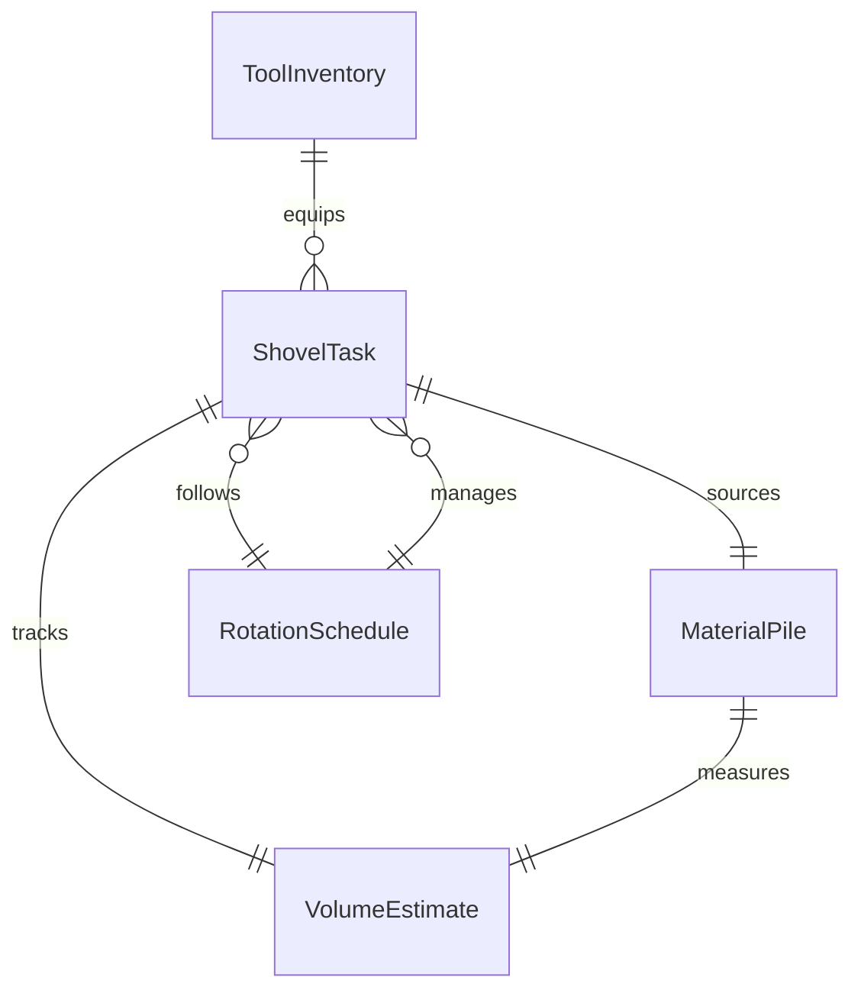
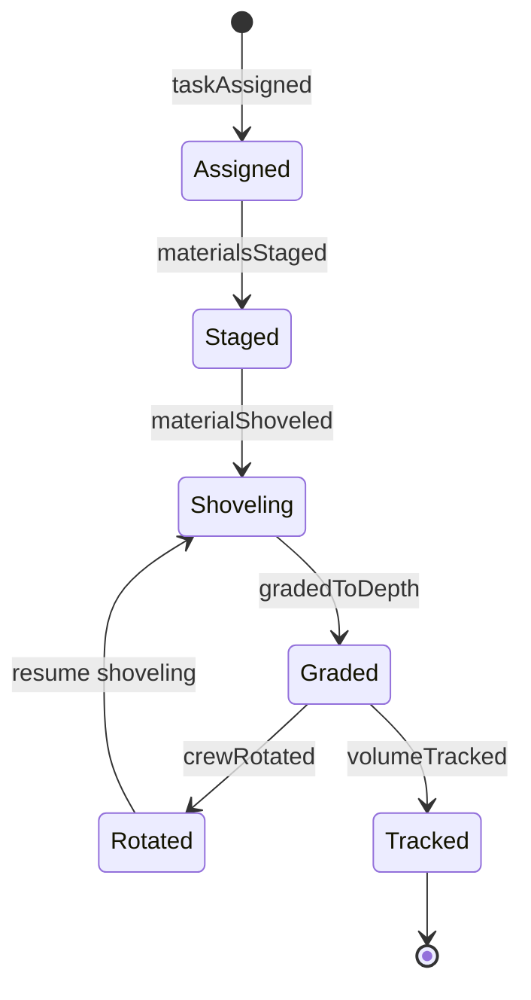
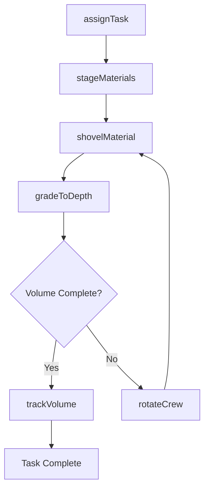
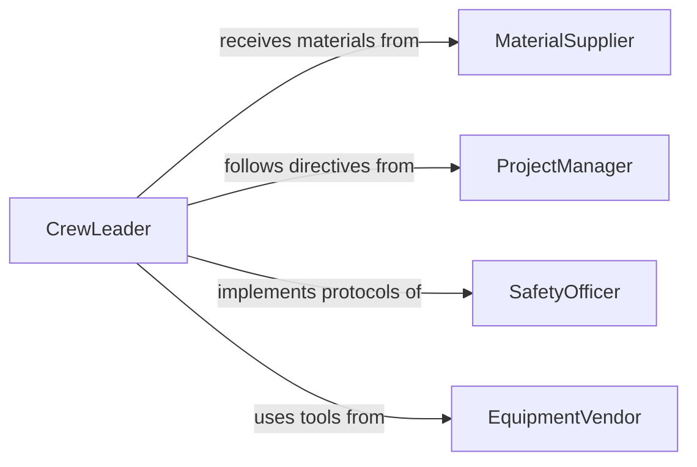

# Shovel Materials

> Business-as-Code definition for manually shoveling soil, sand, gravel, concrete, grain, coal, and other bulk materials for construction, agricultural, industrial, and maintenance operations.

## Overview

Shoveling materials involves selecting the appropriate shovel type for the material, transferring bulk goods from one location to another, grading or spreading material to specified depths, and managing the physical demands of repetitive manual labor. This definition models task assignment, material staging, shoveling operations, volume tracking, and crew rotation for trenching backfill, snow clearing, grain handling, and general construction labor.

## Actors

| Actor | Description |
|-------|-------------|
| MaterialSupplier | Delivers bulk materials to the work site |
| ProjectManager | Specifies where materials need to be moved and to what depth |
| SafetyOfficer | Monitors ergonomic practices and enforces work-rest cycles |
| EquipmentVendor | Provides hand tools, wheelbarrows, and protective equipment |

## Roles

| Role | Description |
|------|-------------|
| CrewLeader | Assigns shoveling tasks and manages crew rotation schedules |
| Laborer | Performs manual shoveling operations |
| Timekeeper | Tracks labor hours and material volumes moved |
| SafetyMonitor | Observes working conditions and enforces hydration and rest breaks |

## Entities

| Entity | Description |
|--------|-------------|
| ShovelTask | A work assignment specifying material, location, and target volume |
| MaterialPile | A stockpile of bulk material awaiting manual transfer |
| VolumeEstimate | An approximation of cubic yards or tons moved by the crew |
| RotationSchedule | A plan alternating workers to prevent fatigue injuries |
| ToolInventory | A list of shovels, wheelbarrows, and rakes available for the task |

## Actions

| Action | Description |
|--------|-------------|
| assignTask | Direct a crew member to a specific shoveling assignment |
| stageMaterials | Position bulk material piles near the work area |
| shovelMaterial | Manually transfer material from the pile to the target location |
| gradeToDepth | Spread shoveled material to the specified thickness or elevation |
| rotateCrew | Swap workers to prevent fatigue and repetitive strain |
| trackVolume | Estimate and record the amount of material moved |

## Events

| Event | Description |
|-------|-------------|
| taskAssigned | Shoveling assignment has been given to a crew member |
| materialsStaged | Bulk material has been positioned near the work area |
| materialShoveled | Material has been transferred to the target location |
| gradedToDepth | Material has been spread to the specified thickness |
| crewRotated | Workers have been swapped for fatigue management |
| volumeTracked | Amount of material moved has been recorded |

## Searches

| Search | Description |
|--------|-------------|
| findActiveTasks | List shoveling assignments by site, crew, or status |
| getVolumeHistory | Retrieve material volumes moved by date or task |
| getCrewRotations | Pull rotation logs by date or crew member |
| findPendingGrading | Locate areas where shoveled material needs final grading |

## Entity Relationships



## State Diagram



## Workflow



## Actor Relationships



## Usage

### Calling Actions

```typescript
import { shovelMaterials } from '@headlessly/shovel-materials'

const shoveling = shovelMaterials()

// Assign backfill task at a utility trench
await shoveling.assignTask({
  siteId: 'WATER-MAIN-ELM-ST',
  task: 'backfill-trench',
  crewMember: 'LAB-GARCIA-07',
  material: 'select-fill',
  targetVolume: { cubicYards: 8 }
})

// Stage and shovel
await shoveling.stageMaterials({
  siteId: 'WATER-MAIN-ELM-ST',
  materialPile: 'FILL-PILE-NORTH',
  distanceToTrench: { feet: 15 }
})

await shoveling.shovelMaterial({
  siteId: 'WATER-MAIN-ELM-ST',
  from: 'FILL-PILE-NORTH',
  to: 'TRENCH-SECTION-3',
  method: 'hand-shovel-and-wheelbarrow'
})

await shoveling.gradeToDepth({
  siteId: 'WATER-MAIN-ELM-ST',
  section: 'TRENCH-SECTION-3',
  targetDepth: { inches: 6 },
  liftNumber: 1
})

await shoveling.trackVolume({
  siteId: 'WATER-MAIN-ELM-ST',
  cubicYards: 3,
  laborHours: 2
})
```

### Event-Driven Automation

```typescript
// Auto-rotate crew after extended shoveling
shoveling.materialShoveled(async ({ crewMember, duration }) => {
  if (duration > 45) {
    await shoveling.rotateCrew({ crewMember, reason: 'fatigue-prevention' })
  }
})

// Alert foreman when target volume is reached
shoveling.volumeTracked(async ({ siteId, totalCubicYards, targetCubicYards }) => {
  if (totalCubicYards >= targetCubicYards) {
    await notify({
      to: 'excavation-foreman',
      message: `Site ${siteId} backfill target of ${targetCubicYards} CY reached`
    })
  }
})
```
