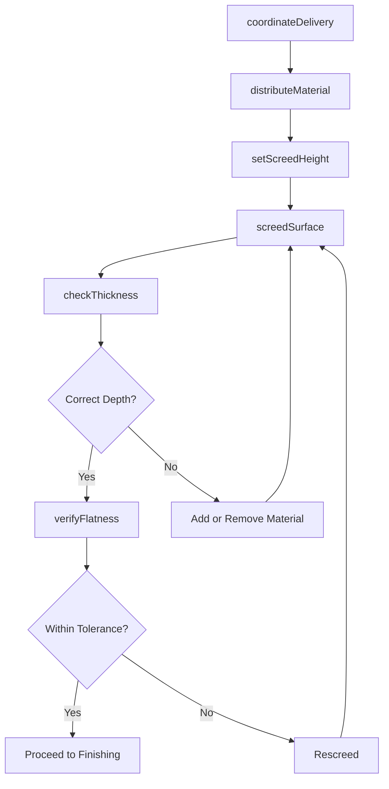

# Spread Concrete or Other Aggregate Mixtures

> Business-as-Code definition for distributing concrete, asphalt, grout, and other cementitious or aggregate mixtures across forms, slabs, roadways, and surfaces using manual and mechanical methods.

## Overview

Spreading concrete and aggregate mixtures involves directing the flow of material from delivery vehicles or pumps into forms or onto prepared surfaces, distributing it evenly using rakes, shovels, screeds, and pavers, and achieving the specified thickness and grade before the material begins to set. This definition models material delivery coordination, spreading crew operations, thickness control, screed passes, and initial leveling for flatwork, road paving, overlay, and repair applications.

## Actors

| Actor | Description |
|-------|-------------|
| ReadyMixSupplier | Delivers concrete from the batch plant to the project site |
| AsphaltPlant | Produces and delivers hot-mix or warm-mix asphalt |
| PavingContractor | Provides mechanical pavers and spreading crews |
| ProjectEngineer | Specifies mix designs, lift thicknesses, and surface tolerances |
| DOTInspector | Verifies material quality and spreading compliance on public projects |

## Roles

| Role | Description |
|------|-------------|
| SpreadingForeman | Coordinates delivery timing with placement crews |
| RakeOperator | Manually distributes and levels material in confined areas |
| ScreedOperator | Runs vibratory or roller screeds to level the surface |
| PaverOperator | Operates mechanical paving equipment for road and parking applications |

## Entities

| Entity | Description |
|--------|-------------|
| SpreadingPlan | A document specifying areas, thicknesses, and sequencing |
| LiftThickness | The depth of material to be placed in a single pass |
| ScreedSetting | Height and vibration settings for the leveling equipment |
| BatchTicket | Delivery documentation showing mix proportions and volumes |
| ThicknessCheck | A field measurement verifying material depth |
| SurfaceTolerance | The allowable deviation from a flat or graded plane |

## Actions

| Action | Description |
|--------|-------------|
| coordinateDelivery | Time material arrivals to match spreading crew capacity |
| distributeMaterial | Rake, shovel, or auger material across the target area |
| setScreedHeight | Adjust screed rails or controls to the specified thickness |
| screedSurface | Pass the leveling device across the spread material |
| checkThickness | Measure material depth at multiple points across the area |
| verifyFlatness | Test the surface with a straightedge for tolerance compliance |

## Events

| Event | Description |
|-------|-------------|
| deliveryCoordinated | Material arrival timing has been aligned with crew readiness |
| materialDistributed | Mix has been raked or augered across the target area |
| screedHeightSet | Leveling equipment has been adjusted to specification |
| surfaceScreeded | Material has been leveled by the screed device |
| thicknessChecked | Material depth measurements have been taken |
| flatnessVerified | Surface has been tested and confirmed within tolerance |

## Searches

| Search | Description |
|--------|-------------|
| findActiveSpreadingOps | List current spreading operations by site or crew |
| getBatchDeliveries | Retrieve delivery records by date, mix design, or project |
| getThicknessData | Pull depth measurements by area or spreading pass |
| getFlatnessReports | Locate surface tolerance test results by project |

## Entity Relationships


## State Diagram


## Workflow



## Actor Relationships


## Usage

### Calling Actions

```typescript
import { spreadConcreteAggregateMixtures } from '@headlessly/spread-concrete-aggregate-mixtures'

const spreading = spreadConcreteAggregateMixtures()

// Coordinate concrete delivery for a warehouse slab
await spreading.coordinateDelivery({
  projectId: 'WAREHOUSE-SLAB-B',
  supplierId: 'CENTRAL-READY-MIX',
  volume: { cubicYards: 120 },
  truckInterval: { minutes: 12 }
})

// Distribute and screed
await spreading.distributeMaterial({
  projectId: 'WAREHOUSE-SLAB-B',
  section: 'pour-strip-1',
  method: 'pump-and-rake',
  area: { sqFeet: 3000 }
})

await spreading.setScreedHeight({
  projectId: 'WAREHOUSE-SLAB-B',
  section: 'pour-strip-1',
  thickness: { inches: 6 },
  screedType: 'laser-guided-roller'
})

await spreading.screedSurface({
  projectId: 'WAREHOUSE-SLAB-B',
  section: 'pour-strip-1',
  passes: 2
})

// Check depth and flatness
await spreading.checkThickness({
  projectId: 'WAREHOUSE-SLAB-B',
  section: 'pour-strip-1',
  probeLocations: 8
})

await spreading.verifyFlatness({
  projectId: 'WAREHOUSE-SLAB-B',
  section: 'pour-strip-1',
  tolerance: 'FF50-FL35',
  method: '10ft-straightedge'
})
```

### Event-Driven Automation

```typescript
// Auto-coordinate next truck when material is distributed
spreading.materialDistributed(async ({ projectId, section }) => {
  await spreading.coordinateDelivery({ projectId, section, refill: true })
})

// Alert engineer on flatness failures
spreading.flatnessVerified(async ({ projectId, section, withinTolerance }) => {
  if (!withinTolerance) {
    await notify({
      to: 'project-engineer',
      message: `Section ${section} on ${projectId} exceeds flatness tolerance - grinding may be required`
    })
  }
})
```
