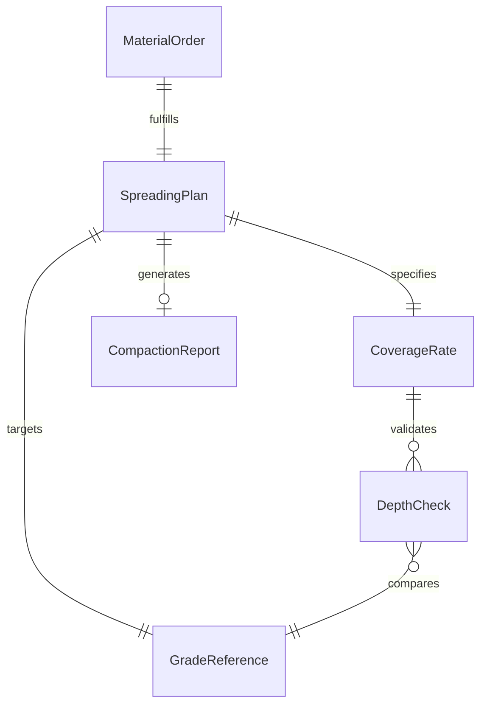
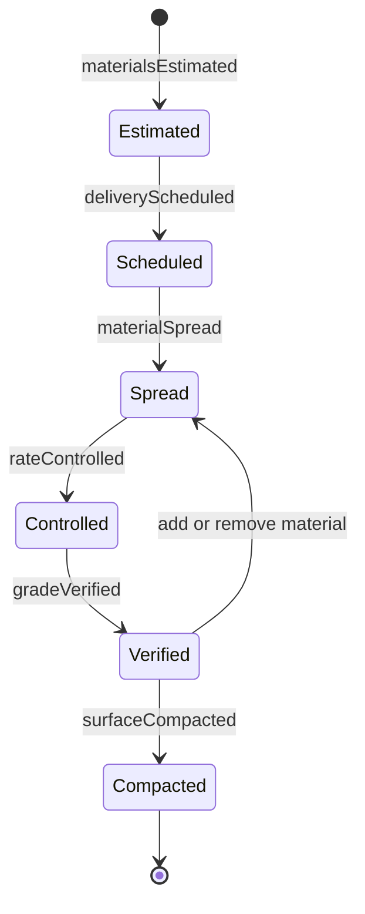
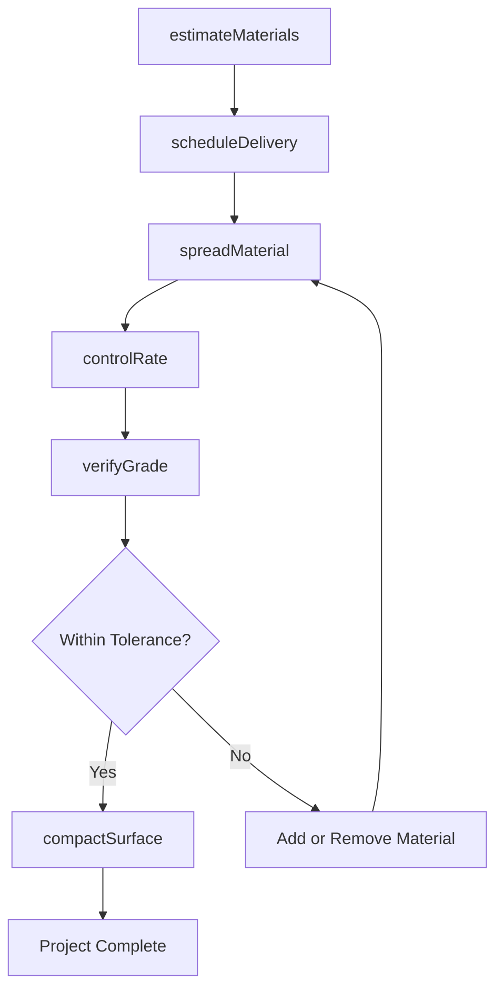
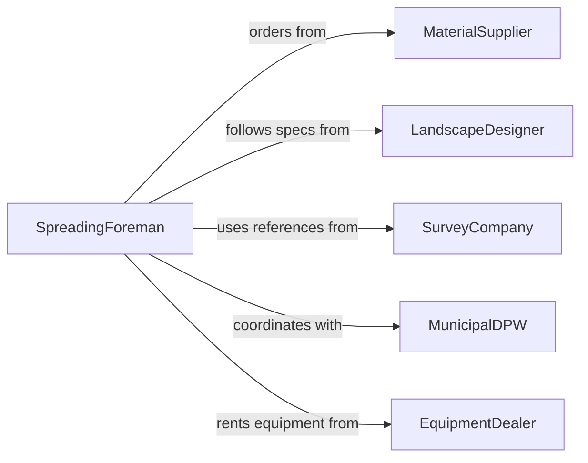

# Spread Sand, Dirt, or Other Loose Materials onto Surfaces

> Business-as-Code definition for distributing sand, topsoil, gravel, mulch, and other loose granular materials across surfaces for grading, landscaping, de-icing, and construction base preparation.

## Overview

Spreading loose materials involves calculating required material volumes, coordinating deliveries, distributing material using manual or mechanical methods, and verifying final grade or thickness. This definition models material estimation, delivery scheduling, spreading equipment selection, application rate control, grade verification, and compaction follow-up for landscaping, road maintenance, winter operations, and site grading projects.

## Actors

| Actor | Description |
|-------|-------------|
| MaterialSupplier | Delivers sand, topsoil, gravel, and mulch in bulk quantities |
| LandscapeDesigner | Specifies material types, depths, and grading requirements |
| SurveyCompany | Provides grade stakes and elevation references for material placement |
| MunicipalDPW | Coordinates road spreading operations for winter maintenance |
| EquipmentDealer | Supplies spreaders, graders, and compact equipment |

## Roles

| Role | Description |
|------|-------------|
| SpreadingForeman | Directs material distribution and verifies coverage |
| EquipmentOperator | Runs motor graders, skid steers, or mechanical spreaders |
| Laborer | Rakes and hand-spreads material in areas inaccessible to equipment |
| GradeTechnician | Checks elevations and confirms material depth meets specification |

## Entities

| Entity | Description |
|--------|-------------|
| MaterialOrder | A purchase specifying type, quantity, and delivery schedule |
| SpreadingPlan | A document defining coverage area, depth, and application method |
| GradeReference | Survey stakes or laser levels indicating target elevations |
| CoverageRate | The specified thickness or tons-per-area for material application |
| DepthCheck | A field measurement verifying material has been spread to specification |
| CompactionReport | Documentation of compaction testing after material placement |

## Actions

| Action | Description |
|--------|-------------|
| estimateMaterials | Calculate the volume of loose material needed for the area |
| scheduleDelivery | Coordinate material delivery timing and staging locations |
| spreadMaterial | Distribute loose material across the designated surface |
| controlRate | Adjust equipment settings to achieve the specified coverage rate |
| verifyGrade | Check elevations and depth against the spreading plan |
| compactSurface | Run compaction equipment over spread material if required |

## Events

| Event | Description |
|-------|-------------|
| materialsEstimated | Required volumes have been calculated for the project |
| deliveryScheduled | Material delivery timing and staging have been confirmed |
| materialSpread | Loose material has been distributed across the surface |
| rateControlled | Application thickness has been adjusted to specification |
| gradeVerified | Elevations and depth confirmed within tolerance |
| surfaceCompacted | Spread material has been compacted to density requirements |

## Searches

| Search | Description |
|--------|-------------|
| findSpreadingJobs | List spreading tasks by site, material type, or date |
| getMaterialUsage | Retrieve quantities of material spread by project or area |
| getGradeChecks | Pull elevation verification records by site and date |
| getCompactionResults | Locate density test results for compacted spread areas |

## Entity Relationships



## State Diagram



## Workflow



## Actor Relationships



## Usage

### Calling Actions

```typescript
import { spreadSandDirtLooseMaterials } from '@headlessly/spread-sand-dirt-loose-materials'

const spreading = spreadSandDirtLooseMaterials()

// Estimate topsoil for a landscaping project
const estimate = await spreading.estimateMaterials({
  projectId: 'PARK-RENOVATION-NORTH',
  area: { sqFeet: 15000 },
  material: 'screened-topsoil',
  depth: { inches: 4 }
})

// Schedule delivery and spread
await spreading.scheduleDelivery({
  projectId: 'PARK-RENOVATION-NORTH',
  material: 'screened-topsoil',
  quantity: estimate.cubicYards,
  deliveryDate: '2026-03-15',
  stagingArea: 'parking-lot-east'
})

await spreading.spreadMaterial({
  projectId: 'PARK-RENOVATION-NORTH',
  material: 'screened-topsoil',
  method: 'skid-steer-bucket',
  area: 'planting-beds-A-through-D'
})

await spreading.verifyGrade({
  projectId: 'PARK-RENOVATION-NORTH',
  area: 'planting-beds-A-through-D',
  targetDepth: { inches: 4 },
  tolerance: { inches: 0.5 }
})
```

### Event-Driven Automation

```typescript
// Auto-compact after gravel is spread for road base
spreading.materialSpread(async ({ projectId, material }) => {
  if (material.includes('gravel') || material.includes('aggregate')) {
    await spreading.compactSurface({ projectId, passes: 4 })
  }
})

// Alert supervisor when grade is out of tolerance
spreading.gradeVerified(async ({ projectId, area, withinTolerance }) => {
  if (!withinTolerance) {
    await notify({
      to: 'spreading-foreman',
      message: `${area} on project ${projectId} out of grade tolerance - correction needed`
    })
  }
})
```
