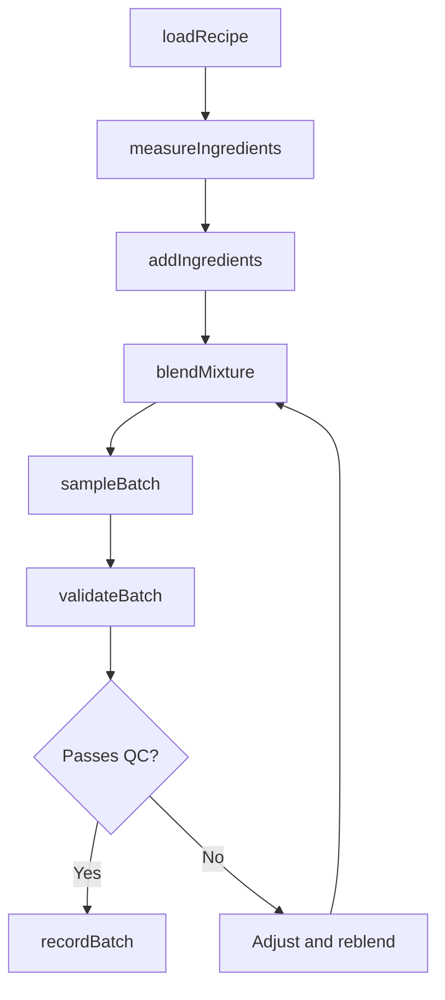
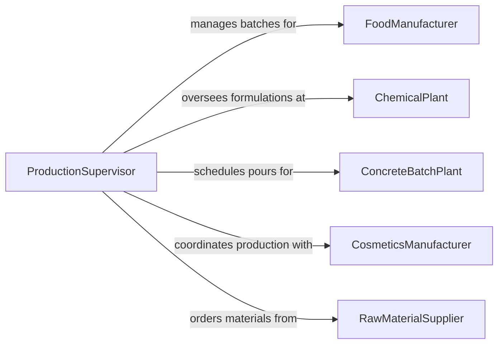

# Mix Ingredients

> Business-as-Code definition for ingredient mixing operations. Models the measuring, combining, and blending of raw materials into intermediate or finished products across food production, chemical manufacturing, and construction applications.

## Overview

Mixing ingredients involves measuring raw materials, combining them in specified sequences, and blending to achieve the desired consistency, composition, or chemical properties. This activity spans commercial kitchens, bakeries, paint factories, concrete batch plants, cosmetic manufacturing, and industrial chemical processing. Accurate measurement, proper mixing times, and adherence to formulation specifications are critical to product quality, safety, and regulatory compliance.

## Actors

| Actor | Description |
|-------|-------------|
| FoodManufacturer | Production facility mixing ingredients for food and beverage products |
| ChemicalPlant | Industrial facility combining raw materials for chemical products |
| ConcreteBatchPlant | Facility mixing aggregate, cement, and water for construction use |
| CosmeticsManufacturer | Producer blending ingredients for personal care and beauty products |
| RawMaterialSupplier | Vendor providing bulk ingredients and raw materials for mixing |

## Roles

| Role | Description |
|------|-------------|
| BatchOperator | Operates mixing equipment and follows batch formulations |
| FormulaChemist | Develops and validates mixing formulations and specifications |
| QualityInspector | Tests mixed batches for compliance with quality standards |
| ProductionSupervisor | Oversees mixing operations, schedules batches, and manages personnel |

## Entities

| Entity | Description |
|--------|-------------|
| Recipe | A documented formula specifying ingredients, quantities, and mixing steps |
| Ingredient | A raw material or component added to the mixture |
| Batch | A single production run of a mixed product |
| MixingEquipment | Blenders, mixers, agitators, or other machinery used to combine ingredients |
| QualitySample | A portion taken from the batch for testing and analysis |
| BatchRecord | Complete documentation of the mixing process for traceability |

## Actions

| Action | Description |
|--------|-------------|
| loadRecipe | Retrieve and validate the formulation for the product to be mixed |
| measureIngredients | Weigh or meter each ingredient according to the recipe specifications |
| addIngredients | Introduce ingredients into the mixing vessel in the prescribed sequence |
| blendMixture | Operate mixing equipment at specified speed and duration to combine ingredients |
| sampleBatch | Extract a quality sample from the mixed batch for testing |
| validateBatch | Confirm the batch meets quality specifications based on sample analysis |
| recordBatch | Document all batch details including ingredients, times, and test results |

## Events

| Event | Description |
|-------|-------------|
| recipeLoaded | The formulation has been retrieved and validated for production |
| ingredientsMeasured | All ingredients have been weighed and staged for mixing |
| ingredientsAdded | Ingredients have been introduced into the mixing vessel |
| mixtureBlended | The batch has been mixed to the specified consistency |
| batchSampled | A quality sample has been extracted for testing |
| batchValidated | The batch has passed quality checks and is approved |
| batchRecorded | All production details have been documented in the batch record |

## Searches

| Search | Description |
|--------|-------------|
| findRecipes | List available recipes by product name, category, or ingredient |
| getBatchHistory | Retrieve past batch records for a specific recipe or date range |
| getIngredientStock | Check current inventory levels for raw materials |
| getQualityResults | Look up test results for a specific batch or sample |

## Workflow



## Actor Relationships



## Usage

### Calling Actions

```typescript
import { mixIngredients } from '@headlessly/mix-ingredients'

const mixer = mixIngredients()

// Load a bread dough recipe
const recipe = await mixer.loadRecipe({
  productName: 'Artisan Sourdough',
  recipeId: 'RCP-BREAD-042',
  batchSize: 50,
  unit: 'kg'
})

// Measure ingredients
await mixer.measureIngredients({
  recipeId: recipe.id,
  ingredients: [
    { name: 'bread-flour', quantity: 30, unit: 'kg' },
    { name: 'water', quantity: 19.5, unit: 'kg' },
    { name: 'sourdough-starter', quantity: 7.5, unit: 'kg' },
    { name: 'sea-salt', quantity: 0.6, unit: 'kg' }
  ]
})

// Add ingredients and blend
await mixer.addIngredients({
  recipeId: recipe.id,
  sequence: ['bread-flour', 'water', 'sourdough-starter', 'sea-salt'],
  vessel: 'spiral-mixer-02'
})

const batch = await mixer.blendMixture({
  recipeId: recipe.id,
  equipment: 'spiral-mixer-02',
  speed: 'low',
  durationMinutes: 4,
  secondPhase: { speed: 'medium', durationMinutes: 8 }
})

// Sample and validate
await mixer.sampleBatch({
  batchId: batch.id,
  sampleType: 'dough-consistency',
  takenBy: 'baker-jthompson'
})

await mixer.validateBatch({
  batchId: batch.id,
  checks: ['hydration-level', 'gluten-development', 'temperature'],
  approvedBy: 'supervisor-mchen'
})
```

### Event-Driven Automation

```typescript
// Trigger next production step when batch is validated
mixer.batchValidated(async ({ batchId, recipeId, productName }) => {
  await startNextPhase({
    batchId,
    phase: 'bulk-fermentation',
    product: productName,
    startedAt: new Date().toISOString()
  })
})

// Alert when ingredient stock drops below reorder point
mixer.ingredientsMeasured(async ({ ingredients }) => {
  for (const ing of ingredients) {
    const stock = await mixer.getIngredientStock({ name: ing.name })
    if (stock.remaining < stock.reorderPoint) {
      await notify({
        to: 'procurement',
        message: `Reorder needed: ${ing.name} at ${stock.remaining} ${stock.unit}`
      })
    }
  }
})
```
