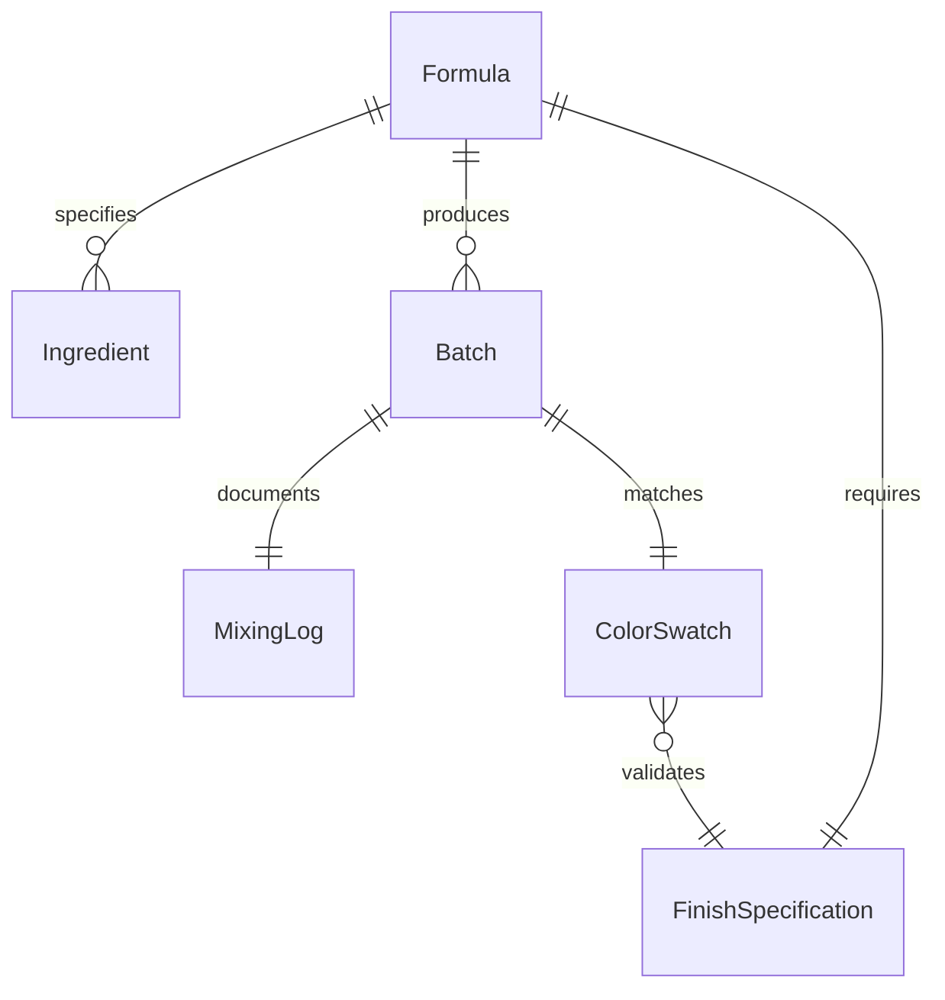
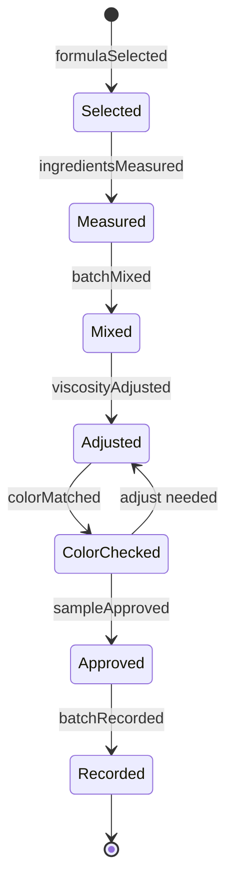
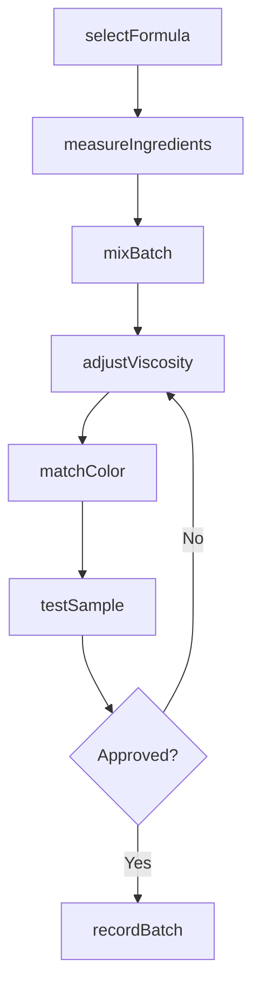
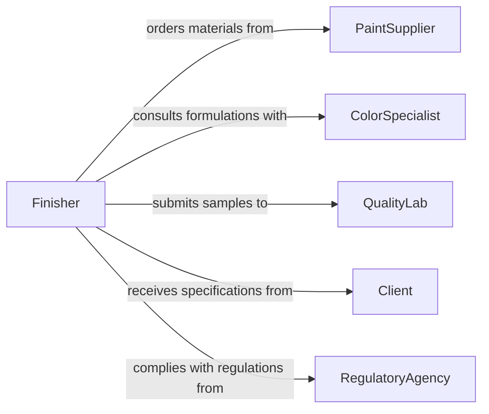

# Mix Ingredients Create Specific Finishes

> Business-as-Code definition for mixing raw ingredients to produce coatings, paints, stains, and other finishing materials. Models the formulation process from recipe selection through batch preparation and quality verification.

## Overview

Mixing ingredients to create specific finishes encompasses the selection, measurement, and combination of pigments, binders, solvents, and additives to produce coatings and surface treatments. This definition covers formulation lookup, batch preparation, color matching, viscosity adjustment, and quality testing across painting, manufacturing, and construction trades.

## Actors

| Actor | Description |
|-------|-------------|
| PaintSupplier | Provides raw pigments, resins, and solvents |
| CoatingManufacturer | Supplies proprietary base products and tinting systems |
| Client | Specifies desired finish appearance and performance requirements |
| QualityLab | Performs independent testing of finish samples |
| RegulatoryAgency | Enforces VOC limits and hazardous material handling rules |

## Roles

| Role | Description |
|------|-------------|
| Finisher | Mixes and applies finish materials on the job site |
| ColorSpecialist | Matches colors and develops custom formulations |
| BatchOperator | Operates mixing equipment for production-scale batches |
| QualityInspector | Tests viscosity, adhesion, and color accuracy of finished mixes |

## Entities

| Entity | Description |
|--------|-------------|
| Formula | A recipe specifying ingredient types, ratios, and mixing instructions |
| Ingredient | A raw material such as pigment, solvent, resin, or hardener |
| Batch | A discrete quantity of mixed finish material |
| ColorSwatch | A reference sample used to verify color accuracy |
| MixingLog | A record of ingredients, quantities, and conditions for a batch |
| FinishSpecification | Client-defined requirements for sheen, texture, durability, and color |

## Actions

| Action | Description |
|--------|-------------|
| selectFormula | Choose the appropriate formulation for the desired finish |
| measureIngredients | Weigh or measure each component per the formula |
| mixBatch | Combine measured ingredients using specified mixing technique |
| adjustViscosity | Add thinner or thickener to reach target consistency |
| matchColor | Compare mixed batch against reference swatch and adjust tint |
| testSample | Apply a sample to test substrate and evaluate finish quality |
| recordBatch | Log all ingredients, ratios, and conditions for traceability |

## Events

| Event | Description |
|-------|-------------|
| formulaSelected | A formulation has been chosen for the job |
| ingredientsMeasured | All components have been weighed and staged |
| batchMixed | Ingredients have been combined into a finished batch |
| viscosityAdjusted | Batch consistency has been tuned to specification |
| colorMatched | Batch color has been verified against the reference swatch |
| sampleApproved | Test application meets finish specification requirements |
| batchRecorded | Mixing log has been completed for the batch |

## Searches

| Search | Description |
|--------|-------------|
| findFormulas | Look up formulations by finish type, color family, or substrate |
| getIngredientStock | Check available quantities of raw materials |
| getBatchHistory | Retrieve past mixing logs for a formula or project |
| getColorSwatches | Find reference swatches matching a target color |

## Entity Relationships



## State Diagram



## Workflow



## Actor Relationships



## Usage

### Calling Actions

```typescript
import { mixIngredientsCreateSpecificFinishes } from '@headlessly/mix-ingredients-create-specific-finishes'

const finishing = mixIngredientsCreateSpecificFinishes()

// Select a formula for exterior satin polyurethane
const formula = await finishing.selectFormula({
  finishType: 'polyurethane',
  sheen: 'satin',
  substrate: 'exterior-wood'
})

// Measure ingredients per formula
const measured = await finishing.measureIngredients({
  formulaId: formula.id,
  batchSize: { amount: 5, unit: 'gallons' }
})

// Mix the batch and test
const batch = await finishing.mixBatch({
  formulaId: formula.id,
  ingredients: measured.components
})

await finishing.testSample({
  batchId: batch.id,
  substrate: 'test-panel',
  colorReference: 'SW-7006'
})
```

### Event-Driven Automation

```typescript
// Alert when color match fails
finishing.sampleApproved(async ({ batchId, result }) => {
  if (!result.passed) {
    await notify({
      to: 'color-specialist',
      message: `Batch ${batchId} failed color match - deltaE: ${result.deltaE}`
    })
  }
})

// Auto-reorder ingredients when stock is low
finishing.ingredientsMeasured(async ({ ingredients }) => {
  for (const item of ingredients) {
    if (item.remainingStock < item.reorderThreshold) {
      await purchaseOrder.create({
        ingredient: item.name,
        quantity: item.reorderQuantity,
        supplier: item.preferredSupplier
      })
    }
  }
})
```
