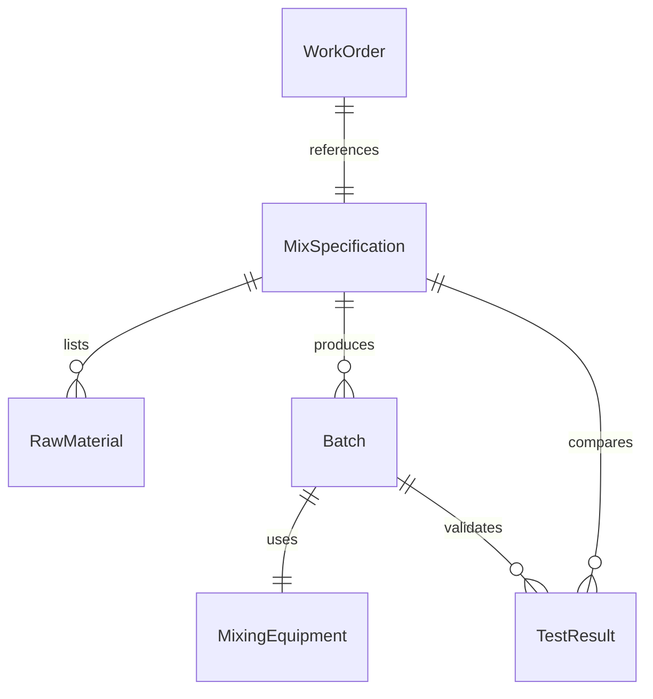
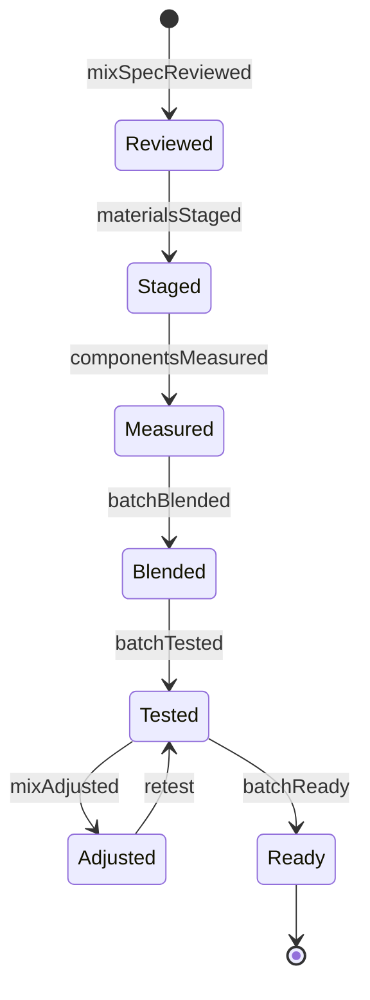
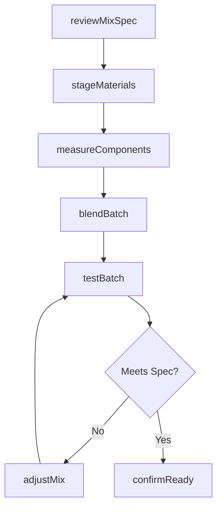
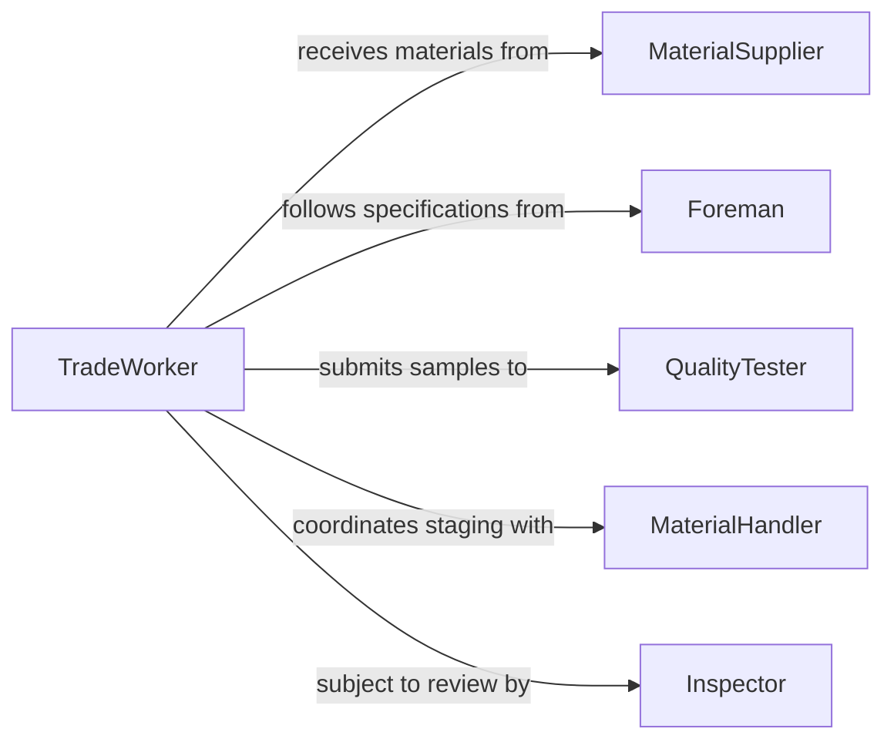

# Mix Substances Compounds Needed Work

> Business-as-Code definition for mixing general-purpose substances and compounds required across trade and industrial work activities. Models the batch preparation lifecycle from work order intake through material blending and readiness confirmation.

## Overview

Mixing substances or compounds needed for work activities covers a broad range of preparation tasks across construction, manufacturing, maintenance, and repair trades. This includes blending concrete, mortar, grout, adhesives, sealants, and other compounds to job-site specifications. The definition standardizes the process of interpreting mix requirements, sourcing materials, preparing batches, and confirming readiness for use.

## Actors

| Actor | Description |
|-------|-------------|
| MaterialSupplier | Provides raw materials such as cement, aggregite, resins, and fillers |
| GeneralContractor | Specifies material requirements and job-site delivery schedules |
| Inspector | Verifies that prepared compounds meet specification and code requirements |
| EquipmentRental | Supplies mixing equipment such as mortar mixers and batch plants |
| ProjectOwner | Defines quality standards and performance criteria for the project |

## Roles

| Role | Description |
|------|-------------|
| TradeWorker | Prepares and applies mixed compounds on the job site |
| Foreman | Supervises mixing operations and confirms batch quality |
| MaterialHandler | Stages and transports raw materials to the mixing area |
| QualityTester | Performs slump tests, adhesion checks, and other field verifications |

## Entities

| Entity | Description |
|--------|-------------|
| MixSpecification | Prescribed ratios, ingredients, and procedures for a compound |
| RawMaterial | An individual input component such as aggregate, binder, or addite |
| Batch | A prepared quantity of mixed compound ready for application |
| WorkOrder | A request specifying the type and quantity of compound needed |
| TestResult | Measured properties of a prepared batch such as consistency or strength |
| MixingEquipment | Tools and machinery used to combine materials |

## Actions

| Action | Description |
|--------|-------------|
| reviewMixSpec | Retrieve and interpret the mix specification for the work order |
| stageMaterials | Gather and position raw materials at the mixing station |
| measureComponents | Weigh or proportion each ingredient per the specification |
| blendBatch | Combine components using appropriate mixing equipment and technique |
| testBatch | Perform field tests to verify the batch meets specification |
| adjustMix | Modify ratios or add components to bring the batch into compliance |
| confirmReady | Mark the batch as approved and available for application |

## Events

| Event | Description |
|-------|-------------|
| mixSpecReviewed | Mix specification has been retrieved and confirmed for the work order |
| materialsStaged | All raw materials are positioned at the mixing station |
| componentsMeasured | Ingredients have been proportioned per the specification |
| batchBlended | Components have been combined into a prepared batch |
| batchTested | Field quality tests have been completed on the batch |
| mixAdjusted | Batch composition has been modified to meet specification |
| batchReady | Batch has been approved and released for application |

## Searches

| Search | Description |
|--------|-------------|
| findMixSpecs | Look up mix specifications by compound type, strength, or application |
| getMaterialStock | Check inventory levels for raw materials at a job site or warehouse |
| getBatchHistory | Retrieve preparation records for past batches on a project |
| getTestResults | Find quality test outcomes for a specific batch |

## Entity Relationships



## State Diagram



## Workflow



## Actor Relationships



## Usage

### Calling Actions

```typescript
import { mixSubstancesCompoundsNeededWork } from '@headlessly/mix-substances-compounds-needed-work'

const mixing = mixSubstancesCompoundsNeededWork()

// Review the mix specification for a concrete pour
const spec = await mixing.reviewMixSpec({
  workOrderId: 'WO-2026-0412',
  compoundType: 'concrete',
  strengthClass: '4000-psi'
})

// Measure and blend the batch
const measured = await mixing.measureComponents({
  specId: spec.id,
  batchSize: { amount: 2, unit: 'cubic-yards' }
})

const batch = await mixing.blendBatch({
  specId: spec.id,
  components: measured.proportions,
  mixDuration: { minutes: 5 }
})

// Test and confirm
const test = await mixing.testBatch({
  batchId: batch.id,
  tests: ['slump', 'air-content', 'temperature']
})
```

### Event-Driven Automation

```typescript
// Alert foreman when batch fails field test
mixing.batchTested(async ({ batchId, passed, failures }) => {
  if (!passed) {
    await notify({
      to: 'foreman',
      message: `Batch ${batchId} failed: ${failures.join(', ')}`
    })
  }
})

// Auto-reorder materials when job-site stock is low
mixing.materialsStaged(async ({ materials, jobSiteId }) => {
  for (const material of materials) {
    if (material.remainingOnSite < material.minimumStock) {
      await deliveryRequest.create({
        material: material.name,
        quantity: material.reorderQuantity,
        jobSiteId
      })
    }
  }
})
```
