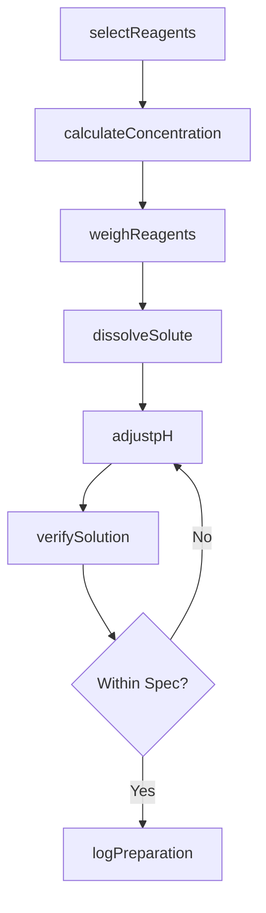
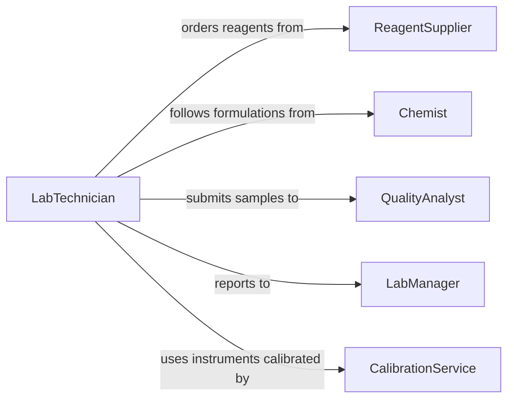

# Mix Substances Create Chemical Solutions

> Business-as-Code definition for combining chemical substances to produce solutions used in laboratory, industrial, and manufacturing settings. Models the process from reagent selection through solution preparation and concentration verification.

## Overview

Mixing substances to create chemical solutions involves selecting reagents, calculating molarities and concentrations, dissolving solutes in solvents, and verifying the resulting solution meets analytical or process specifications. This definition covers laboratory buffer preparation, industrial cleaning solutions, photographic developers, electroplating baths, and other chemical solution workflows.

## Actors

| Actor | Description |
|-------|-------------|
| ReagentSupplier | Provides analytical-grade chemicals and solvents |
| InstrumentVendor | Supplies balances, pH meters, and titration equipment |
| RegulatoryAgency | Enforces chemical safety, labeling, and waste disposal standards |
| ResearchPrincipal | Defines solution specifications for experiments or processes |
| CalibrationService | Certifies accuracy of measuring instruments |

## Roles

| Role | Description |
|------|-------------|
| LabTechnician | Weighs reagents, mixes solutions, and performs quality checks |
| Chemist | Designs formulations and validates solution chemistry |
| QualityAnalyst | Tests prepared solutions for concentration and purity |
| LabManager | Oversees inventory, safety compliance, and standard operating procedures |

## Entities

| Entity | Description |
|--------|-------------|
| Reagent | A chemical substance used as an input to the solution |
| Solvent | The liquid medium in which solutes are dissolved |
| Solution | The prepared mixture at a specified concentration |
| Formulation | A documented recipe with reagents, quantities, and procedures |
| ConcentrationSpec | Target molarity, percentage, or parts-per-million for the solution |
| PreparationLog | A traceable record of reagents, measurements, and conditions |
| Certificate | Documentation of reagent purity and lot information |

## Actions

| Action | Description |
|--------|-------------|
| selectReagents | Identify and retrieve required chemicals from inventory |
| calculateConcentration | Determine mass or volume of each reagent for target concentration |
| weighReagents | Measure precise quantities using calibrated balances |
| dissolveSolute | Add reagents to solvent and mix until fully dissolved |
| adjustpH | Add acid or base to bring solution to target pH |
| verifySolution | Test concentration, pH, or conductivity against specification |
| logPreparation | Record all reagents, lot numbers, and preparation conditions |

## Events

| Event | Description |
|-------|-------------|
| reagentsSelected | Required chemicals have been identified and retrieved |
| concentrationCalculated | Reagent quantities have been computed for the target spec |
| reagentsWeighed | All components have been measured to required precision |
| solutesDissolved | Reagents are fully dissolved in the solvent |
| pHAdjusted | Solution pH has been brought within target range |
| solutionVerified | Quality testing confirms the solution meets specification |
| preparationLogged | Preparation record has been completed with full traceability |

## Searches

| Search | Description |
|--------|-------------|
| findFormulations | Look up solution recipes by type, concentration, or application |
| getReagentInventory | Check stock levels, lot numbers, and expiration dates |
| getPreparationLogs | Retrieve past preparation records for a given formulation |
| getCertificates | Find purity certificates for reagent lots |

## Workflow



## Actor Relationships



## Usage

### Calling Actions

```typescript
import { mixSubstancesCreateChemicalSolutions } from '@headlessly/mix-substances-create-chemical-solutions'

const solutions = mixSubstancesCreateChemicalSolutions()

// Calculate reagent amounts for a 1M NaCl solution
const calculation = await solutions.calculateConcentration({
  solute: 'sodium-chloride',
  targetMolarity: 1.0,
  targetVolume: { amount: 500, unit: 'mL' }
})

// Weigh and dissolve
const weighed = await solutions.weighReagents({
  reagents: [{ name: 'sodium-chloride', targetMass: calculation.soluteMass }]
})

const solution = await solutions.dissolveSolute({
  reagents: weighed.measured,
  solvent: 'deionized-water',
  volume: { amount: 500, unit: 'mL' }
})

// Verify and log
await solutions.verifySolution({
  solutionId: solution.id,
  tests: [{ parameter: 'conductivity', acceptableRange: { min: 85, max: 95, unit: 'mS/cm' } }]
})
```

### Event-Driven Automation

```typescript
// Alert chemist when solution fails verification
solutions.solutionVerified(async ({ solutionId, passed, deviations }) => {
  if (!passed) {
    await notify({
      to: 'chemist',
      message: `Solution ${solutionId} out of spec: ${deviations.join(', ')}`
    })
  }
})

// Auto-reorder reagents approaching expiration
solutions.reagentsSelected(async ({ reagents }) => {
  for (const reagent of reagents) {
    if (reagent.daysUntilExpiry < 30) {
      await purchaseOrder.create({
        chemical: reagent.name,
        grade: reagent.grade,
        supplier: reagent.preferredSupplier
      })
    }
  }
})
```
