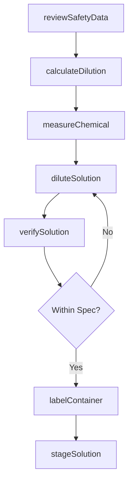
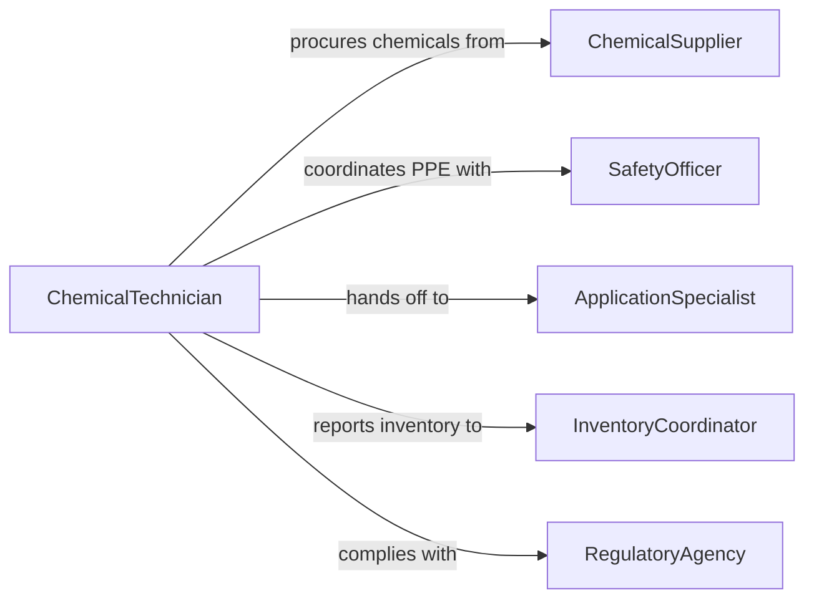

# Prepare Chemicals Work Application

> Business-as-Code definition for preparing chemical substances for workplace application. Models the complete process from chemical selection and dilution through safety verification and application readiness.

## Overview

Preparing chemicals for work application involves selecting, measuring, diluting, and staging chemical agents for use in industrial, agricultural, cleaning, or treatment processes. This definition covers hazard assessment, concentration calculation, mixing procedures, and compliance documentation required before chemicals can be safely applied in the field.

## Actors

| Actor | Description |
|-------|-------------|
| ChemicalSupplier | Provides raw chemicals, concentrates, and safety data sheets |
| EquipmentVendor | Supplies mixing vessels, dispensers, and application equipment |
| RegulatoryAgency | Enforces chemical handling, storage, and disposal regulations |
| Client | Specifies treatment requirements and application targets |
| WasteHauler | Collects and disposes of chemical waste and empty containers |

## Roles

| Role | Description |
|------|-------------|
| ChemicalTechnician | Prepares and handles chemicals for application |
| SafetyOfficer | Ensures compliance with hazard communication and PPE requirements |
| ApplicationSpecialist | Applies prepared chemicals to target surfaces or systems |
| InventoryCoordinator | Tracks chemical stock levels and expiration dates |

## Entities

| Entity | Description |
|--------|-------------|
| Chemical | A raw substance or concentrate to be prepared |
| SafetyDataSheet | Manufacturer-provided hazard and handling documentation |
| PreparedSolution | A chemical diluted or mixed to application-ready concentration |
| DilutionSpec | Target concentration, volume, and mixing instructions |
| PPERequirement | Personal protective equipment mandated for handling |
| ApplicationOrder | A work request specifying chemical treatment needs |
| ComplianceRecord | Documentation of safe handling practices for regulatory audits |

## Actions

| Action | Description |
|--------|-------------|
| reviewSafetyData | Consult SDS for hazards, PPE, and handling procedures |
| calculateDilution | Determine volumes and ratios for target concentration |
| measureChemical | Dispense precise quantities of concentrate |
| diluteSolution | Add solvent or water to reach application-ready concentration |
| verifySolution | Test pH, concentration, or other parameters against specification |
| labelContainer | Apply hazard labels and identification to prepared containers |
| stageSolution | Position prepared chemicals at the application site |

## Events

| Event | Description |
|-------|-------------|
| safetyDataReviewed | SDS review completed and PPE requirements confirmed |
| dilutionCalculated | Required volumes and ratios have been determined |
| chemicalMeasured | Concentrate has been dispensed to the specified amount |
| solutionDiluted | Chemical has been brought to application-ready concentration |
| solutionVerified | Quality parameters confirmed within acceptable range |
| containerLabeled | Prepared container has been properly identified and marked |
| solutionStaged | Chemicals are positioned and ready for application |

## Searches

| Search | Description |
|--------|-------------|
| findChemicals | Look up chemicals by name, CAS number, or application type |
| getSafetySheets | Retrieve SDS documents for a specific chemical |
| getInventoryLevels | Check stock and expiration dates for chemicals on hand |
| getPreparationHistory | Review past preparation records for a given chemical or job |

## Workflow



## Actor Relationships



## Usage

### Calling Actions

```typescript
import { prepareChemicalsWorkApplication } from '@headlessly/prepare-chemicals-work-application'

const chemicals = prepareChemicalsWorkApplication()

// Review safety data before handling
const safety = await chemicals.reviewSafetyData({
  chemicalId: 'sodium-hypochlorite-12pct',
  casNumber: '7681-52-9'
})

// Calculate dilution for pool treatment
const dilution = await chemicals.calculateDilution({
  chemicalId: 'sodium-hypochlorite-12pct',
  targetConcentration: { ppm: 3 },
  targetVolume: { amount: 50, unit: 'gallons' }
})

// Prepare and verify the solution
const solution = await chemicals.diluteSolution({
  chemicalId: dilution.chemicalId,
  concentrateVolume: dilution.concentrateVolume,
  solventVolume: dilution.solventVolume
})

await chemicals.verifySolution({
  solutionId: solution.id,
  testParameter: 'free-chlorine',
  acceptableRange: { min: 2.5, max: 3.5, unit: 'ppm' }
})
```

### Event-Driven Automation

```typescript
// Notify safety officer when high-hazard chemical is prepared
chemicals.chemicalMeasured(async ({ chemicalId, hazardClass }) => {
  if (hazardClass >= 3) {
    await notify({
      to: 'safety-officer',
      message: `High-hazard chemical ${chemicalId} is being prepared`
    })
  }
})

// Auto-generate compliance record on completion
chemicals.solutionStaged(async ({ solutionId, chemicalId, preparedBy }) => {
  await complianceRecord.create({
    solutionId,
    chemicalId,
    preparedBy,
    timestamp: new Date().toISOString(),
    status: 'ready-for-application'
  })
})
```
