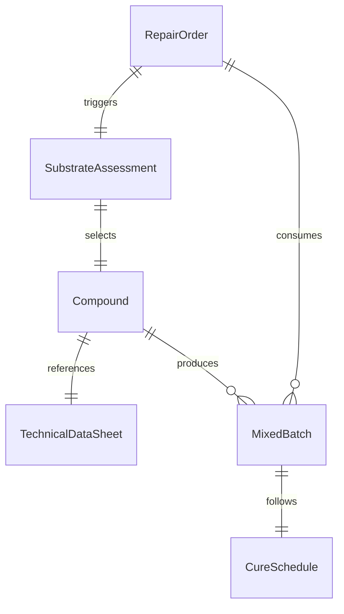
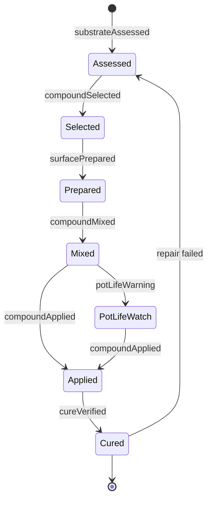
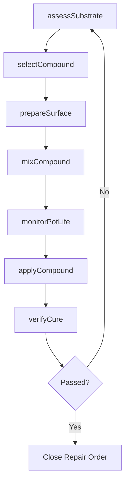
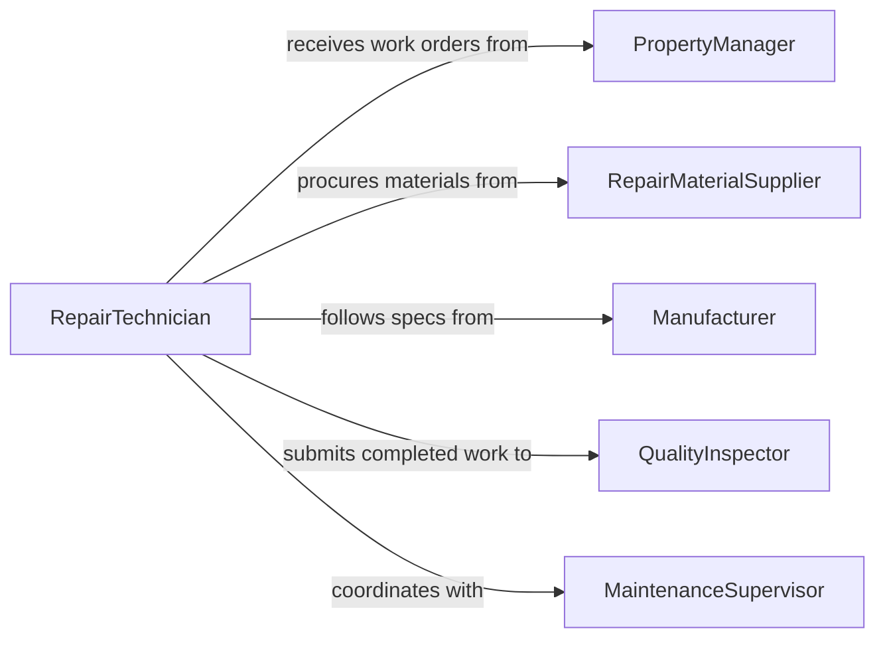

# Prepare Compounds Solutions Be Used

> Business-as-Code definition for preparing repair compounds and solutions such as epoxies, fillers, patching materials, and bonding agents. Models the process from damage assessment through compound preparation and cure verification.

## Overview

Preparing compounds or solutions for repair work involves selecting the appropriate filler, adhesive, epoxy, or patching material based on the substrate and damage type, then mixing components to manufacturer specifications. This definition covers surface preparation assessment, two-part compound mixing, pot life management, and cure verification across building maintenance, automotive repair, and industrial maintenance contexts.

## Actors

| Actor | Description |
|-------|-------------|
| RepairMaterialSupplier | Provides epoxies, fillers, patching compounds, and adhesives |
| PropertyManager | Requests repairs and approves completed work |
| BuildingInspector | Verifies repair quality and code compliance |
| EquipmentSupplier | Provides mixing tools, applicators, and curing equipment |
| Manufacturer | Publishes technical data sheets with mixing ratios and cure times |

## Roles

| Role | Description |
|------|-------------|
| RepairTechnician | Assesses damage, prepares compounds, and applies repairs |
| MaintenanceSupervisor | Assigns repair work orders and inspects completed jobs |
| MaterialSpecialist | Selects appropriate compounds based on substrate and conditions |
| QualityInspector | Verifies adhesion, hardness, and finish of cured repairs |

## Entities

| Entity | Description |
|--------|-------------|
| RepairOrder | A work request describing the damage location and type |
| Compound | A repair material such as epoxy, filler, or patching mix |
| TechnicalDataSheet | Manufacturer instructions for mixing, application, and curing |
| MixedBatch | A prepared quantity of compound ready for application |
| CureSchedule | Time and temperature requirements for the compound to reach full strength |
| SubstrateAssessment | Evaluation of the surface condition and compatibility with repair materials |

## Actions

| Action | Description |
|--------|-------------|
| assessSubstrate | Evaluate the damaged area to determine compound requirements |
| selectCompound | Choose the appropriate repair material for the substrate and conditions |
| prepareSurface | Clean, sand, or prime the repair area for adhesion |
| mixCompound | Combine components per technical data sheet ratios |
| monitorPotLife | Track working time remaining before the mixed compound sets |
| applyCompound | Place prepared material into the repair area |
| verifyCure | Test hardness or adhesion after the cure period has elapsed |

## Events

| Event | Description |
|-------|-------------|
| substrateAssessed | Damage area has been evaluated and compound requirements determined |
| compoundSelected | Appropriate repair material has been chosen |
| surfacePrepared | Repair area has been cleaned and primed for application |
| compoundMixed | Components have been combined and mixing is complete |
| potLifeWarning | Working time is approaching expiration for the mixed batch |
| compoundApplied | Repair material has been placed in the damaged area |
| cureVerified | Post-cure testing confirms the repair meets strength requirements |

## Searches

| Search | Description |
|--------|-------------|
| findCompounds | Look up repair materials by substrate type, cure time, or strength |
| getDataSheets | Retrieve manufacturer technical data sheets for a compound |
| getRepairHistory | Review past repairs on a specific asset or location |
| getInventory | Check stock levels and shelf life for repair materials |

## Entity Relationships



## State Diagram



## Workflow



## Actor Relationships



## Usage

### Calling Actions

```typescript
import { prepareCompoundsSolutionsBeUsed } from '@headlessly/prepare-compounds-solutions-be-used'

const repairs = prepareCompoundsSolutionsBeUsed()

// Assess damaged concrete floor
const assessment = await repairs.assessSubstrate({
  repairOrderId: 'RO-2026-0087',
  substrate: 'concrete',
  damageType: 'spall',
  dimensions: { length: 12, width: 8, depth: 1.5, unit: 'inches' }
})

// Select and mix the epoxy patching compound
const compound = await repairs.selectCompound({
  substrate: assessment.substrate,
  conditions: { temperature: 72, humidity: 45 },
  requiredStrength: '5000-psi'
})

const batch = await repairs.mixCompound({
  compoundId: compound.id,
  ratioA: compound.partA,
  ratioB: compound.partB,
  volume: assessment.requiredVolume
})

// Apply and verify cure
await repairs.applyCompound({ batchId: batch.id, repairOrderId: 'RO-2026-0087' })
```

### Event-Driven Automation

```typescript
// Alert technician when pot life is expiring
repairs.potLifeWarning(async ({ batchId, minutesRemaining }) => {
  await notify({
    to: 'repair-technician',
    message: `Batch ${batchId} has ${minutesRemaining} minutes of working time left`
  })
})

// Schedule cure verification based on compound data sheet
repairs.compoundApplied(async ({ batchId, compoundId, cureHours }) => {
  await scheduler.schedule({
    action: 'verifyCure',
    batchId,
    executeAt: new Date(Date.now() + cureHours * 3600000).toISOString()
  })
})
```
