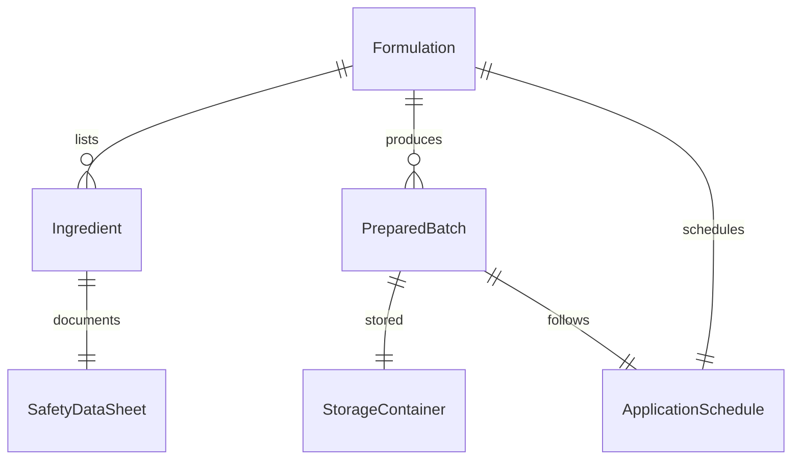
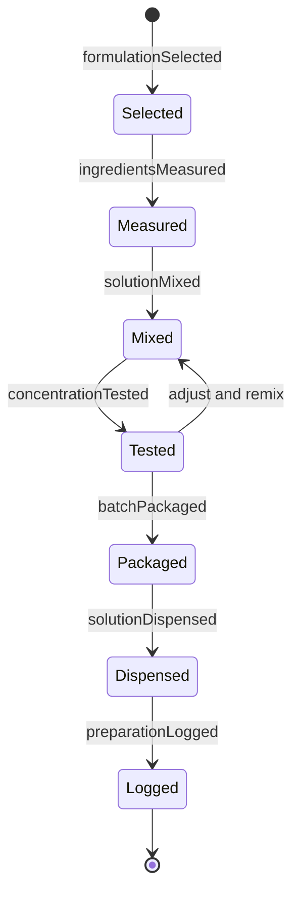
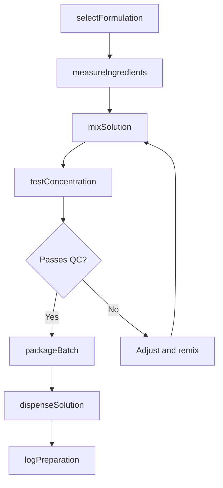
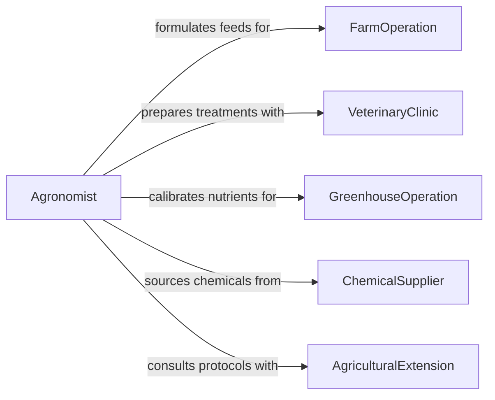

# Prepare Materials Solutions Animal Plant

> Business-as-Code definition for preparing agricultural and veterinary materials and solutions. Models the formulation, mixing, and dispensing of feeds, fertilizers, pesticides, and veterinary treatments for animal and plant care.

## Overview

Preparing materials and solutions for animal or plant use involves measuring, mixing, and formulating feeds, nutrient solutions, pesticides, herbicides, veterinary medications, and soil amendments according to specified recipes or prescriptions. This activity supports farming, ranching, greenhouse operations, veterinary clinics, and botanical research. Accurate formulation ensures proper dosage for animal health, optimal nutrient delivery for plant growth, and compliance with agricultural safety regulations.

## Actors

| Actor | Description |
|-------|-------------|
| FarmOperation | Agricultural business requiring feed, fertilizer, or pesticide preparations |
| VeterinaryClinic | Animal care facility needing formulated medications and treatments |
| GreenhouseOperation | Controlled-environment growing facility requiring nutrient solutions |
| ChemicalSupplier | Provider of raw agricultural chemicals, concentrates, and additives |
| AgriculturalExtension | Advisory service providing formulation guidance and safety protocols |

## Roles

| Role | Description |
|------|-------------|
| FeedMixer | Measures and blends animal feed ingredients according to nutritional specifications |
| Agronomist | Specifies fertilizer and pesticide formulations for crop programs |
| VeterinaryTechnician | Prepares medications and treatment solutions for animal care |
| GreenhouseTechnician | Mixes and calibrates nutrient solutions for hydroponic or soil-based growing |

## Entities

| Entity | Description |
|--------|-------------|
| Formulation | A recipe specifying ingredients, quantities, and mixing instructions |
| Ingredient | A raw material or chemical used in the preparation process |
| PreparedBatch | A completed mixture ready for application or dispensing |
| ApplicationSchedule | A timetable defining when and where prepared solutions should be applied |
| SafetyDataSheet | Documentation of chemical hazards and safe handling requirements |
| StorageContainer | Vessel used to hold prepared materials before use |

## Actions

| Action | Description |
|--------|-------------|
| selectFormulation | Choose the appropriate recipe based on species, crop, or condition |
| measureIngredients | Weigh or meter raw materials according to the formulation specifications |
| mixSolution | Combine ingredients in the correct sequence and proportions |
| testConcentration | Verify the prepared solution meets target pH, nutrient levels, or dosage |
| packageBatch | Transfer the prepared material into labeled storage containers |
| dispenseSolution | Issue the prepared material for immediate application or distribution |
| logPreparation | Record batch details including formulation, quantities, and test results |

## Events

| Event | Description |
|-------|-------------|
| formulationSelected | A recipe has been chosen for the preparation |
| ingredientsMeasured | All raw materials have been weighed and staged for mixing |
| solutionMixed | The ingredients have been combined into a prepared batch |
| concentrationTested | Quality checks on the prepared solution have been completed |
| batchPackaged | The prepared material has been transferred to storage containers |
| solutionDispensed | The prepared material has been issued for application |
| preparationLogged | Batch preparation details have been recorded in the system |

## Searches

| Search | Description |
|--------|-------------|
| findFormulations | List available formulations by species, crop type, or purpose |
| getBatchHistory | Retrieve preparation records for a specific formulation or date range |
| getIngredientInventory | Check current stock levels of raw materials and chemicals |
| getApplicationSchedules | Look up upcoming application schedules for prepared solutions |

## Entity Relationships



## State Diagram



## Workflow



## Actor Relationships



## Usage

### Calling Actions

```typescript
import { prepareMaterialsSolutionsAnimalPlant } from '@headlessly/prepare-materials-solutions-animal-plant'

const prep = prepareMaterialsSolutionsAnimalPlant()

// Select a feed formulation for dairy cattle
const formulation = await prep.selectFormulation({
  purpose: 'dairy-cattle-lactation',
  species: 'bovine',
  targetNutrients: { protein: 16, fiber: 18, calcium: 0.9 }
})

// Measure and mix
await prep.measureIngredients({
  formulationId: formulation.id,
  batchSize: 2000,
  unit: 'kg',
  ingredients: [
    { name: 'corn-silage', quantity: 1100 },
    { name: 'soybean-meal', quantity: 400 },
    { name: 'alfalfa-hay', quantity: 350 },
    { name: 'mineral-premix', quantity: 150 }
  ]
})

const batch = await prep.mixSolution({
  formulationId: formulation.id,
  mixerEquipment: 'TMR-Mixer-02',
  mixDurationMinutes: 12
})

// Test and package
await prep.testConcentration({
  batchId: batch.id,
  tests: ['protein-content', 'moisture-level', 'mineral-balance']
})

await prep.packageBatch({
  batchId: batch.id,
  containerType: 'feed-bin',
  labelInfo: { formulation: formulation.id, prepDate: '2026-02-05', expiresIn: '7d' }
})
```

### Event-Driven Automation

```typescript
// Alert when ingredient inventory runs low
prep.ingredientsMeasured(async ({ ingredients }) => {
  for (const ing of ingredients) {
    const stock = await prep.getIngredientInventory({ name: ing.name })
    if (stock.remainingQuantity < stock.reorderPoint) {
      await notify({
        to: 'procurement',
        message: `Low stock: ${ing.name} at ${stock.remainingQuantity} ${stock.unit} - reorder needed`
      })
    }
  }
})

// Auto-schedule application when batch is packaged
prep.batchPackaged(async ({ batchId, formulationId }) => {
  await scheduleApplication({
    batchId,
    formulationId,
    scheduledFor: nextFeedingTime(),
    assignedTo: 'feed-crew'
  })
})
```
