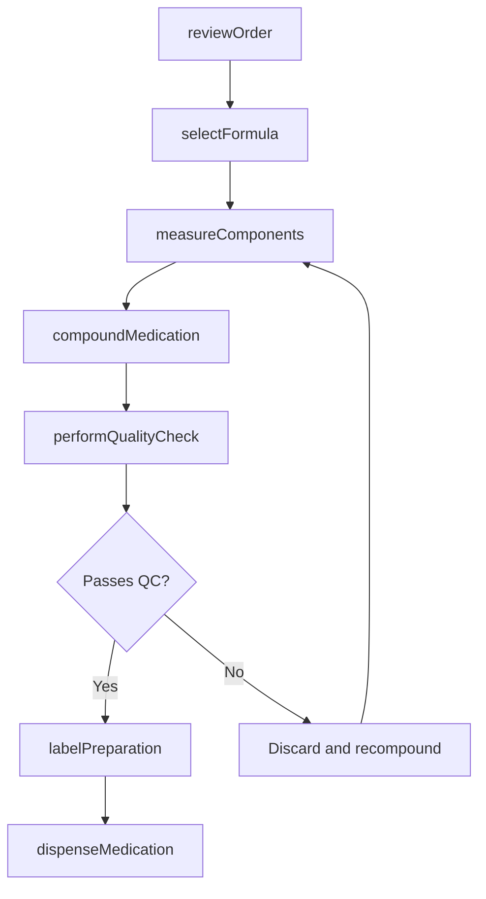
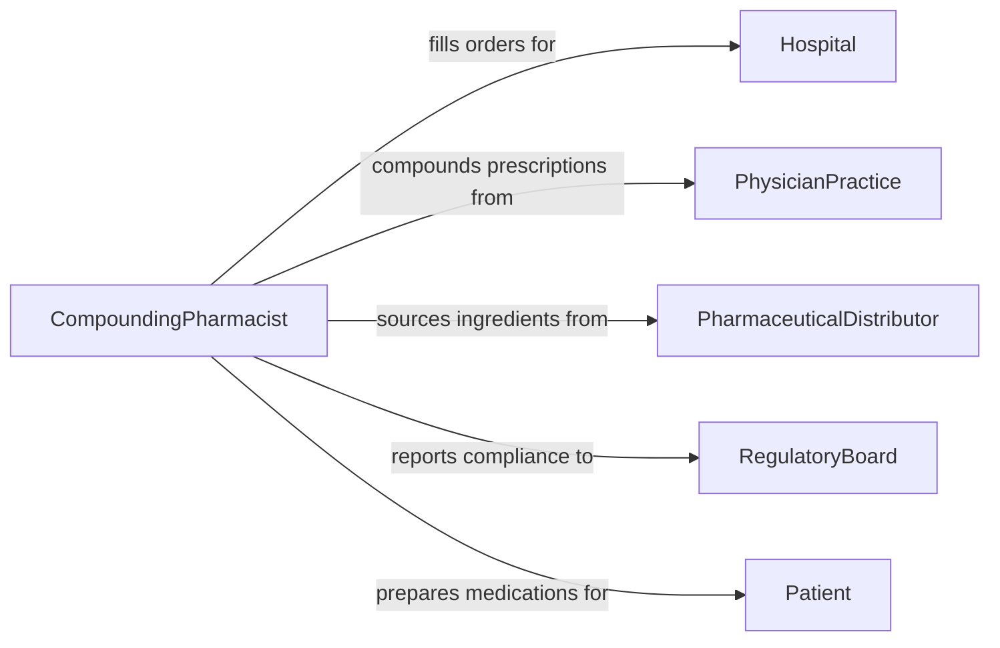

# Prepare Medications Medical Solutions

> Business-as-Code definition for medication and medical solution preparation. Models the compounding, reconstitution, and dispensing of pharmaceutical formulations and intravenous solutions in clinical and pharmacy settings.

## Overview

Preparing medications and medical solutions involves compounding prescriptions, reconstituting lyophilized drugs, mixing intravenous admixtures, and formulating topical or oral preparations according to physician orders and pharmacopeial standards. This activity takes place in hospital pharmacies, compounding pharmacies, infusion centers, and clinical laboratories. Strict adherence to sterile technique, accurate dosage calculation, and regulatory compliance are essential to patient safety and therapeutic effectiveness.

## Actors

| Actor | Description |
|-------|-------------|
| Hospital | Healthcare facility ordering compounded medications and IV solutions |
| PhysicianPractice | Prescriber issuing medication orders requiring preparation |
| PharmaceuticalDistributor | Supplier of active pharmaceutical ingredients and base solutions |
| RegulatoryBoard | State pharmacy board or FDA division overseeing compounding practices |
| Patient | Individual receiving the prepared medication or solution |

## Roles

| Role | Description |
|------|-------------|
| CompoundingPharmacist | Formulates and verifies compounded medications per prescription orders |
| PharmacyTechnician | Measures, mixes, and labels medications under pharmacist supervision |
| QualityAssuranceSpecialist | Tests prepared medications for potency, sterility, and stability |
| DispensingPharmacist | Reviews final preparations and authorizes release for patient use |

## Entities

| Entity | Description |
|--------|-------------|
| PrescriptionOrder | A physician directive specifying the medication, dose, and route |
| CompoundFormula | A documented recipe for preparing a specific medication or solution |
| ActiveIngredient | The pharmaceutical substance providing the therapeutic effect |
| PreparedMedication | The finished compounded product ready for dispensing |
| SterileHood | Laminar airflow workstation used for aseptic compounding |
| BeyondUseDate | The expiration date assigned to a compounded preparation |

## Actions

| Action | Description |
|--------|-------------|
| reviewOrder | Verify the prescription order for accuracy, interactions, and dosing |
| selectFormula | Choose the compounding formula matching the prescribed medication |
| measureComponents | Weigh or meter active ingredients and excipients per the formula |
| compoundMedication | Mix components using aseptic or non-sterile technique as appropriate |
| performQualityCheck | Test the preparation for correct potency, pH, and sterility |
| labelPreparation | Apply a label with drug name, strength, beyond-use date, and storage instructions |
| dispenseMedication | Release the verified preparation for delivery to the patient or nursing unit |

## Events

| Event | Description |
|-------|-------------|
| orderReviewed | The prescription order has been verified and approved for compounding |
| formulaSelected | The compounding formula has been identified for the preparation |
| componentsMeasured | All active ingredients and excipients have been weighed and staged |
| medicationCompounded | The medication has been mixed and is awaiting quality verification |
| qualityCheckPassed | The preparation has met all potency and sterility standards |
| preparationLabeled | The finished product has been labeled with required information |
| medicationDispensed | The verified medication has been released for patient use |

## Searches

| Search | Description |
|--------|-------------|
| findPrescriptionOrders | List pending orders by patient, prescriber, or medication type |
| getCompoundFormulas | Retrieve available compounding formulas by drug name or classification |
| getBatchRecords | Look up preparation records for a specific formula or date range |
| getExpiringPreparations | Find compounded medications approaching their beyond-use date |

## Workflow



## Actor Relationships



## Usage

### Calling Actions

```typescript
import { prepareMedicationsMedicalSolutions } from '@headlessly/prepare-medications-medical-solutions'

const pharmacy = prepareMedicationsMedicalSolutions()

// Review an incoming prescription order
const order = await pharmacy.reviewOrder({
  prescriptionId: 'RX-2026-44821',
  patient: 'DOE-JANE-MRN-88412',
  medication: 'Vancomycin 1g IV',
  route: 'intravenous',
  frequency: 'q12h',
  prescriber: 'Dr. A. Patel'
})

// Select formula and measure components
const formula = await pharmacy.selectFormula({
  drugName: 'Vancomycin',
  strength: '1g',
  diluent: 'Normal Saline 250mL',
  method: 'sterile-compounding'
})

await pharmacy.measureComponents({
  formulaId: formula.id,
  components: [
    { name: 'Vancomycin HCl Powder', quantity: 1, unit: 'g' },
    { name: 'Sterile Water for Injection', quantity: 20, unit: 'mL' },
    { name: '0.9% Sodium Chloride', quantity: 250, unit: 'mL' }
  ]
})

// Compound and verify
const preparation = await pharmacy.compoundMedication({
  formulaId: formula.id,
  orderId: order.id,
  sterileHood: 'ISO-5-Hood-03',
  compoundedBy: 'tech-rjohnson'
})

await pharmacy.performQualityCheck({
  preparationId: preparation.id,
  tests: ['visual-inspection', 'particulate-check', 'label-verification'],
  verifiedBy: 'pharmacist-skhan'
})

// Label and dispense
await pharmacy.dispenseMedication({
  preparationId: preparation.id,
  destination: 'ICU - Bed 14',
  beyondUseDate: '2026-02-06T08:00:00Z'
})
```

### Event-Driven Automation

```typescript
// Alert nursing unit when medication is ready
pharmacy.medicationDispensed(async ({ preparationId, destination, medication }) => {
  await notify({
    to: destination,
    message: `${medication} preparation ${preparationId} ready for pickup`
  })
})

// Flag preparations nearing beyond-use date
pharmacy.preparationLabeled(async ({ preparationId, beyondUseDate }) => {
  const hoursRemaining = (new Date(beyondUseDate).getTime() - Date.now()) / 3600000
  if (hoursRemaining < 4) {
    await notify({
      to: 'pharmacy-lead',
      message: `Preparation ${preparationId} expires in ${Math.round(hoursRemaining)} hours`
    })
  }
})
```
