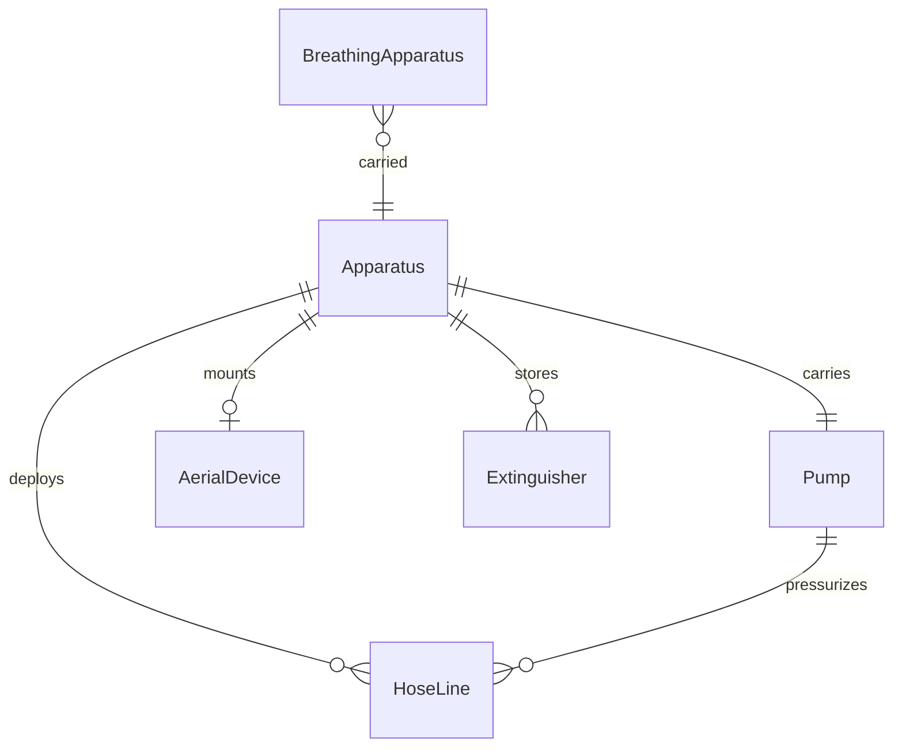
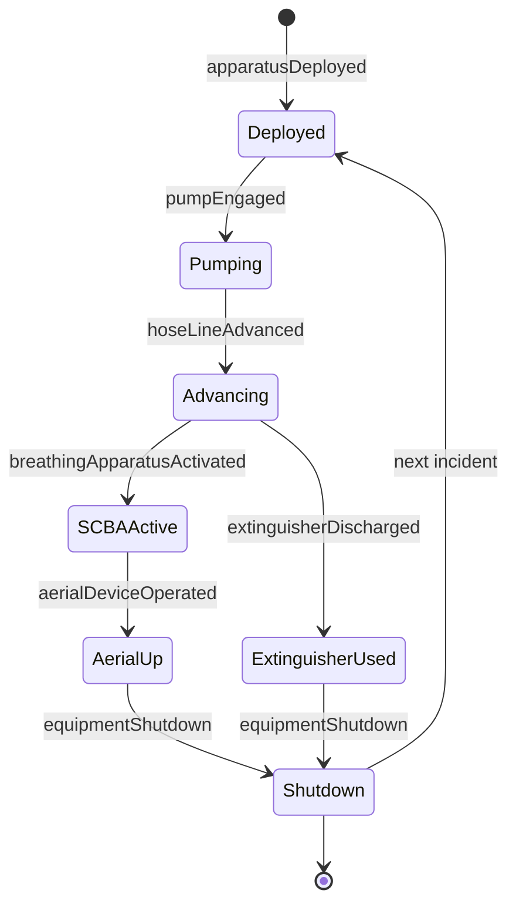
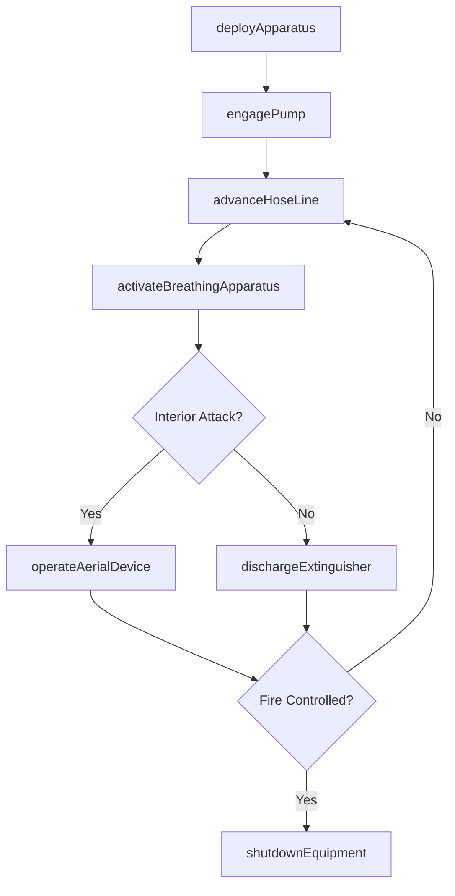
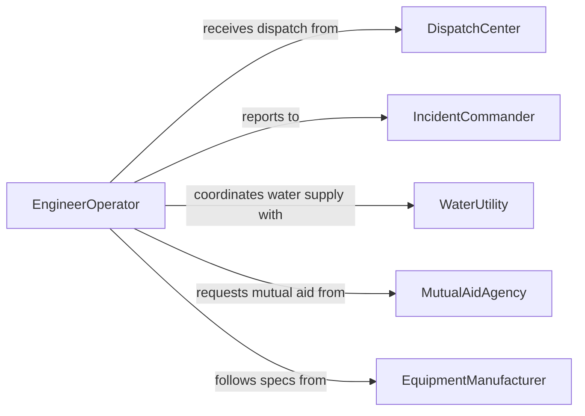

# Operate Firefighting Equipment

> Business-as-Code definition for firefighting equipment operations. Models the complete lifecycle of equipment deployment, operation, and maintenance during fire suppression and emergency response activities.

## Overview

Operating firefighting equipment encompasses the selection, deployment, and use of specialized apparatus such as pumps, hoses, aerial ladders, extinguishers, and breathing apparatus during emergency incidents. This definition exposes actions for equipment activation and operation, events for tracking deployment status, and searches for equipment readiness and incident history.

## Actors

| Actor | Description |
|-------|-------------|
| IncidentCommander | Directs overall emergency scene operations and resource deployment |
| DispatchCenter | Dispatches units and relays incident information |
| MutualAidAgency | Neighboring fire department providing additional apparatus or personnel |
| WaterUtility | Supplies hydrant pressure and water infrastructure data |
| EquipmentManufacturer | Provides technical specifications, parts, and warranty support |

## Roles

| Role | Description |
|------|-------------|
| Firefighter | Operates hoses, nozzles, extinguishers, and hand tools on scene |
| EngineerOperator | Drives apparatus and operates pumps, aerial devices, and hydraulic systems |
| CompanyOfficer | Supervises crew and directs equipment usage at the tactical level |
| SafetyOfficer | Monitors equipment conditions and enforces safe operating procedures |

## Entities

| Entity | Description |
|--------|-------------|
| Apparatus | A fire engine, ladder truck, or rescue vehicle carrying equipment |
| Pump | Mechanical device that pressurizes water for hose lines |
| HoseLine | Flexible conduit delivering water from a pump to the fire |
| BreathingApparatus | Self-contained breathing apparatus (SCBA) for respiratory protection |
| AerialDevice | Ladder or platform elevated from a truck for rescue or elevated operations |
| Extinguisher | Portable fire suppression device for initial attack |

## Actions

| Action | Description |
|--------|-------------|
| deployApparatus | Position fire apparatus at an incident scene |
| engagePump | Start and pressurize the pump panel for water supply |
| advanceHoseLine | Extend and charge a hose line toward the fire |
| operateAerialDevice | Raise, rotate, and extend an aerial ladder or platform |
| activateBreathingApparatus | Don and activate SCBA for interior operations |
| dischargeExtinguisher | Deploy a portable extinguisher on a small or incipient fire |
| shutdownEquipment | Secure all apparatus systems after incident operations conclude |

## Events

| Event | Description |
|-------|-------------|
| apparatusDeployed | Fire apparatus has been positioned at the incident scene |
| pumpEngaged | Pump is pressurized and delivering water |
| hoseLineAdvanced | A hose line has been charged and positioned for attack |
| aerialDeviceOperated | Aerial ladder or platform has been raised to operating position |
| breathingApparatusActivated | SCBA has been donned and air supply confirmed |
| extinguisherDischarged | Portable extinguisher has been used on a fire |
| equipmentShutdown | All apparatus systems have been secured post-incident |

## Searches

| Search | Description |
|--------|-------------|
| findAvailableApparatus | List apparatus by type, station, and operational readiness |
| getEquipmentStatus | Retrieve current operational status of specific equipment |
| getIncidentDeployments | Query equipment deployment history for a given incident |
| findMaintenanceDue | Locate equipment approaching scheduled inspection or service dates |

## Entity Relationships



## State Diagram



## Workflow



## Actor Relationships



## Usage

### Calling Actions

```typescript
import { operateFirefightingEquipment } from '@headlessly/operate-firefighting-equipment'

const equipment = operateFirefightingEquipment()

// Deploy apparatus to an incident scene
const deployment = await equipment.deployApparatus({
  apparatusId: 'engine-42',
  incidentId: 'INC-2026-0891',
  location: { address: '1200 Oak Street', hydrantId: 'HYD-3305' }
})

// Engage the pump and pressurize for attack
await equipment.engagePump({
  apparatusId: deployment.apparatusId,
  pressurePsi: 150,
  waterSource: 'hydrant'
})

// Advance a hose line to the fire
await equipment.advanceHoseLine({
  apparatusId: deployment.apparatusId,
  lineSize: '1.75in',
  nozzleType: 'combination'
})
```

### Event-Driven Automation

```typescript
// Notify safety officer when SCBA is activated
equipment.breathingApparatusActivated(async ({ firefighterId, airSupplyMinutes }) => {
  await startAirMonitoring({
    firefighterId,
    estimatedDuration: airSupplyMinutes,
    alertThreshold: 10
  })
})

// Log equipment usage after incident shutdown
equipment.equipmentShutdown(async ({ apparatusId, incidentId }) => {
  await schedulePostIncidentInspection({
    apparatusId,
    incidentId,
    inspectionType: 'post-use'
  })
})
```
