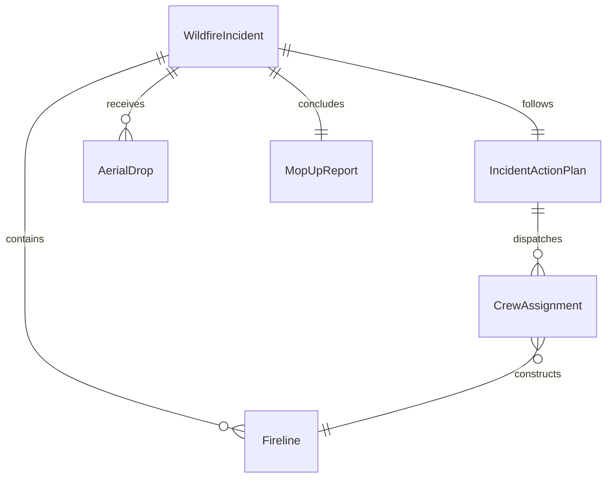
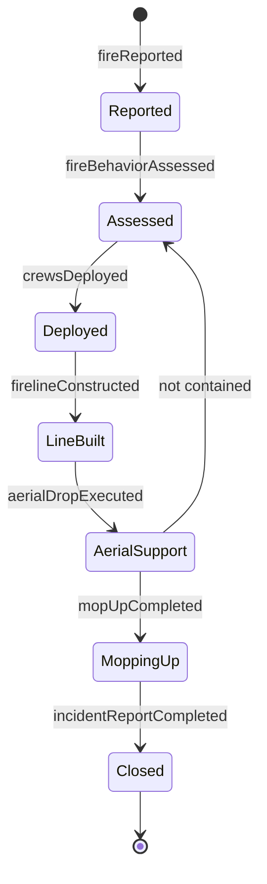
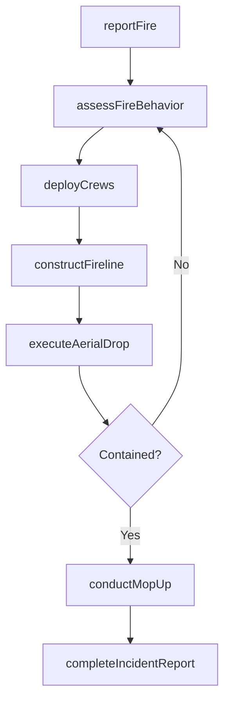
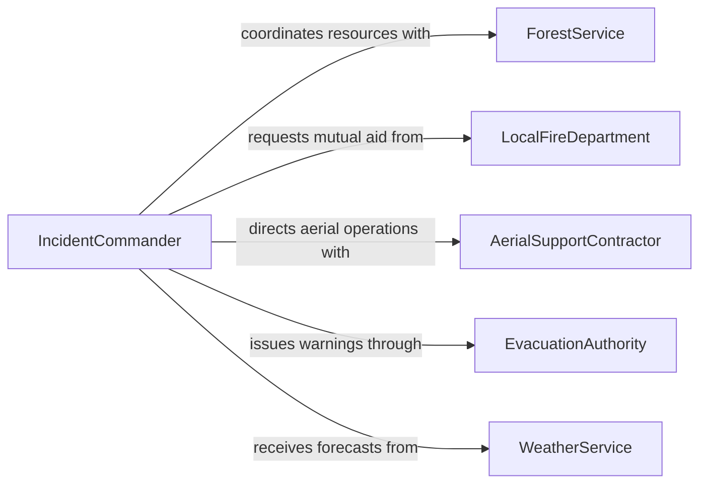

# Perform Forest Firefighting Activities

> Business-as-Code definition for performing forest firefighting activities. Models the fire detection, resource deployment, suppression operations, and post-fire assessment workflow.

## Overview

Forest firefighting involves detecting and assessing wildland fires, deploying personnel and equipment to containment lines, executing suppression tactics such as fireline construction and aerial drops, and conducting post-fire mop-up and damage assessment. This definition exposes actions for incident command operations, crew deployment, suppression execution, and fire status reporting across the wildfire lifecycle.

## Actors

| Actor | Description |
|-------|-------------|
| ForestService | The federal or state agency managing public forestlands |
| LocalFireDepartment | Provides initial attack resources for fires near communities |
| AerialSupportContractor | Operates air tankers and helicopters for water and retardant drops |
| EvacuationAuthority | Issues evacuation orders for threatened communities |
| WeatherService | Provides fire weather forecasts and red flag warnings |
| LandownerTimberCompany | Owns private forestland affected by or adjacent to the fire |

## Roles

| Role | Description |
|------|-------------|
| Hotshot | A member of an elite hand crew that builds firelines in rugged terrain |
| IncidentCommander | Directs all fire suppression operations and resource allocation |
| LookoutObserver | Monitors fire behavior and communicates hazards to crews |
| EngineOperator | Operates wildland fire engines for water delivery and structure protection |
| SawTeamLead | Leads chainsaw crews for clearing vegetation and constructing firelines |

## Entities

| Entity | Description |
|--------|-------------|
| WildfireIncident | A reported forest fire with location, size, and severity classification |
| Fireline | A cleared strip of land used to contain the fire perimeter |
| IncidentActionPlan | A documented strategy for suppression operations during an operational period |
| CrewAssignment | The deployment of a fire crew to a specific division or sector |
| AerialDrop | A water or retardant release from aircraft onto the fire |
| MopUpReport | Documentation of extinguished hot spots and remaining hazards after containment |

## Actions

| Action | Description |
|--------|-------------|
| reportFire | Log a new wildfire detection with location and estimated size |
| assessFireBehavior | Evaluate fire spread rate, terrain, and weather conditions |
| deployCrews | Assign and dispatch firefighting teams to designated sectors |
| constructFireline | Build hand-cut or dozer lines to contain fire spread |
| executeAerialDrop | Coordinate water or retardant drops from aircraft |
| conductMopUp | Extinguish remaining hot spots and smoldering materials |
| completeIncidentReport | Document final fire statistics, resources used, and damage assessment |

## Events

| Event | Description |
|-------|-------------|
| fireReported | A new wildfire has been detected and logged |
| fireBehaviorAssessed | Fire spread analysis and weather conditions have been evaluated |
| crewsDeployed | Firefighting teams have been dispatched to the incident |
| firelineConstructed | A containment line has been completed on a fire segment |
| aerialDropExecuted | An aerial water or retardant drop has been completed |
| mopUpCompleted | Hot spot extinguishment is finished in a sector |
| incidentReportCompleted | The final incident documentation has been filed |

## Searches

| Search | Description |
|--------|-------------|
| findActiveIncidents | List active wildfire incidents by region, size, or containment status |
| getCrewDeployments | Retrieve crew assignments and locations for an incident |
| getFireWeather | Fetch current and forecast fire weather conditions for a fire zone |
| findIncidentReports | Search completed incident reports by date, region, or cause |
| getAerialResources | Check availability of air tankers and helicopters for deployment |

## Entity Relationships



## State Diagram



## Workflow



## Actor Relationships



## Usage

### Calling Actions

```typescript
import { performForestFirefightingActivities } from '@headlessly/perform-forest-firefighting-activities'

const firefighting = performForestFirefightingActivities()

// Report a new wildfire
const incident = await firefighting.reportFire({
  location: { lat: 39.7392, lon: -105.9903 },
  estimatedAcres: 50,
  fuelType: 'mixed-conifer',
  discoveryMethod: 'lookout-tower',
  windSpeed: 25, // mph
  windDirection: 'SW'
})

// Assess fire behavior and deploy resources
const assessment = await firefighting.assessFireBehavior({
  incidentId: incident.id,
  terrain: 'steep-slope',
  humidity: 12 // percent
})

await firefighting.deployCrews({
  incidentId: incident.id,
  crews: [
    { crewId: 'HOTSHOT-TEAM-7', sector: 'Division-Alpha' },
    { crewId: 'ENGINE-CREW-12', sector: 'Division-Bravo' }
  ]
})

// Build fireline and request aerial support
await firefighting.constructFireline({ incidentId: incident.id, sector: 'Division-Alpha' })
await firefighting.executeAerialDrop({ incidentId: incident.id, aircraft: 'TANKER-42', dropZone: 'Ridge-North' })
```

### Event-Driven Automation

```typescript
// Trigger evacuation alerts when fire behavior escalates
firefighting.fireBehaviorAssessed(async ({ incidentId, spreadRate, nearestCommunity }) => {
  if (spreadRate > 300 && nearestCommunity.distanceMiles < 5) {
    await issueEvacuationWarning({
      community: nearestCommunity.name,
      incidentId,
      urgency: 'immediate'
    })
  }
})

// Auto-request aerial support when fireline construction is insufficient
firefighting.firelineConstructed(async ({ incidentId, containmentPercent }) => {
  if (containmentPercent < 20) {
    const aircraft = await firefighting.getAerialResources({ status: 'available' })
    if (aircraft.length > 0) {
      await firefighting.executeAerialDrop({
        incidentId,
        aircraft: aircraft[0].id,
        dropZone: 'active-front'
      })
    }
  }
})
```
