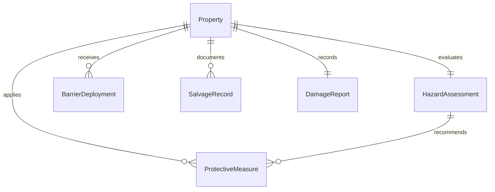
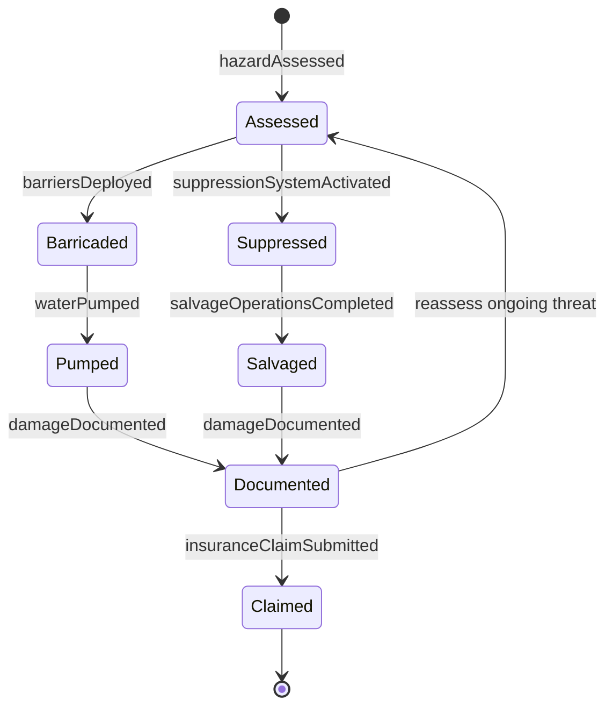
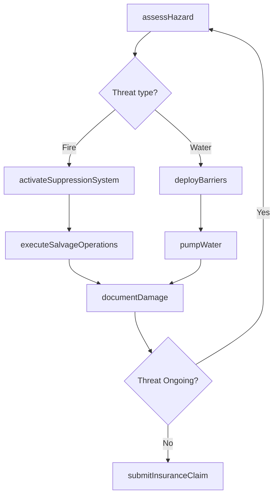
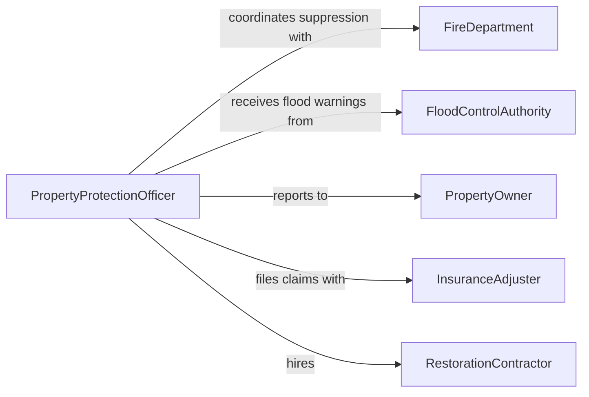

# Protect Property Fire Water Damage

> Business-as-Code definition for protecting property from fire or water damage. Models the risk assessment, preventive measures, active response, and damage documentation workflow.

## Overview

Protecting property from fire or water damage involves assessing structural and environmental risks, implementing preventive measures such as fireproofing and flood barriers, executing active protection during emergencies, and documenting damage for insurance and restoration purposes. This definition exposes actions for hazard assessment, barrier deployment, salvage operations, and post-incident reporting.

## Actors

| Actor | Description |
|-------|-------------|
| PropertyOwner | The individual or entity that owns the property at risk |
| FireDepartment | Responds to fire emergencies and provides suppression services |
| FloodControlAuthority | Manages levees, drainage, and flood warning systems |
| InsuranceAdjuster | Evaluates damage claims and authorizes coverage payments |
| RestorationContractor | Performs cleanup, drying, and repair of damaged property |
| BuildingInspector | Assesses structural integrity after fire or water events |

## Roles

| Role | Description |
|------|-------------|
| PropertyProtectionOfficer | Coordinates protective measures and emergency response |
| FirePreventionSpecialist | Implements fire suppression systems and fireproofing measures |
| FloodMitigationTechnician | Deploys sandbags, pumps, and barriers to control water intrusion |
| SalvageTeamLead | Directs the removal and protection of valuables during emergencies |
| DamageAssessor | Documents and evaluates property damage after an incident |

## Entities

| Entity | Description |
|--------|-------------|
| Property | The building, structure, or land being protected |
| HazardAssessment | An evaluation of fire and water damage risks for a property |
| ProtectiveMeasure | A specific action or installation to prevent or reduce damage |
| BarrierDeployment | Sandbags, pumps, or containment systems placed to block water |
| SalvageRecord | Documentation of items removed or covered to prevent damage |
| DamageReport | A detailed assessment of damage sustained from fire or water |

## Actions

| Action | Description |
|--------|-------------|
| assessHazard | Evaluate fire and water damage risks for a property |
| deployBarriers | Place sandbags, tarps, flood panels, or containment systems |
| activateSuppressionSystem | Engage sprinklers, fire extinguishers, or foam systems |
| executeSalvageOperations | Remove or cover high-value items to prevent damage |
| pumpWater | Remove standing water from the property using pumps |
| documentDamage | Record the extent and location of fire or water damage |
| submitInsuranceClaim | File a damage claim with supporting documentation |

## Events

| Event | Description |
|-------|-------------|
| hazardAssessed | Fire or water risk evaluation has been completed |
| barriersDeployed | Protective barriers have been placed around the property |
| suppressionSystemActivated | Fire suppression equipment has been engaged |
| salvageOperationsCompleted | High-value items have been secured or relocated |
| waterPumped | Standing water has been removed from the property |
| damageDocumented | The extent of damage has been recorded and photographed |
| insuranceClaimSubmitted | A damage claim has been filed with the insurance carrier |

## Searches

| Search | Description |
|--------|-------------|
| findAtRiskProperties | List properties with elevated fire or flood risk assessments |
| getProtectiveMeasures | Retrieve installed or deployed protective measures for a property |
| getDamageReports | Search damage reports by property, date, or incident type |
| findInsuranceClaims | Look up filed claims by property, status, or claim amount |

## Entity Relationships



## State Diagram



## Workflow



## Actor Relationships



## Usage

### Calling Actions

```typescript
import { protectPropertyFireWaterDamage } from '@headlessly/protect-property-fire-water-damage'

const protection = protectPropertyFireWaterDamage()

// Assess flood risk for a property
const assessment = await protection.assessHazard({
  propertyId: 'PROP-2024-0155',
  threatType: 'flooding',
  waterLevel: 4.2, // feet above normal
  proximityToWaterway: 0.3 // miles
})

// Deploy flood barriers
await protection.deployBarriers({
  propertyId: 'PROP-2024-0155',
  barrierType: 'sandbags-and-pumps',
  perimeterCoverage: ['north-entrance', 'basement-windows', 'loading-dock']
})

// Execute salvage operations for high-value items
await protection.executeSalvageOperations({
  propertyId: 'PROP-2024-0155',
  items: [
    { description: 'Server room equipment', location: 'Basement Level 1' },
    { description: 'Paper records archive', location: 'Ground Floor Storage' }
  ]
})

// Pump water after flooding subsides
await protection.pumpWater({ propertyId: 'PROP-2024-0155', areas: ['basement', 'parking-garage'] })
await protection.documentDamage({ propertyId: 'PROP-2024-0155' })
```

### Event-Driven Automation

```typescript
// Auto-deploy barriers when flood warning is received
protection.hazardAssessed(async ({ propertyId, threatType, riskLevel }) => {
  if (threatType === 'flooding' && riskLevel === 'high') {
    await protection.deployBarriers({
      propertyId,
      barrierType: 'sandbags-and-pumps',
      perimeterCoverage: ['all-ground-level-entries']
    })
  }
})

// File insurance claim automatically after damage documentation
protection.damageDocumented(async ({ propertyId, damageEstimate, photos }) => {
  if (damageEstimate > 5000) {
    await protection.submitInsuranceClaim({
      propertyId,
      estimatedLoss: damageEstimate,
      supportingDocuments: photos
    })
  }
})
```
