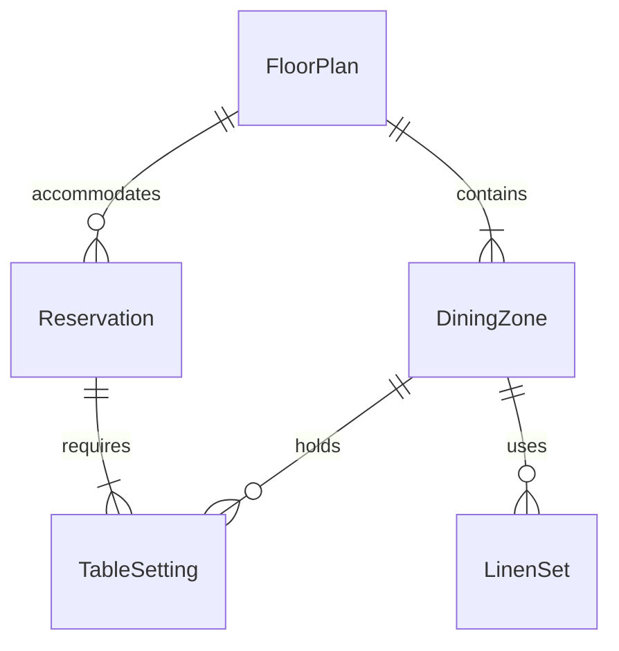
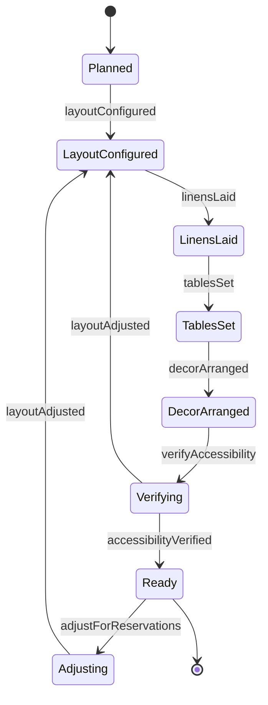
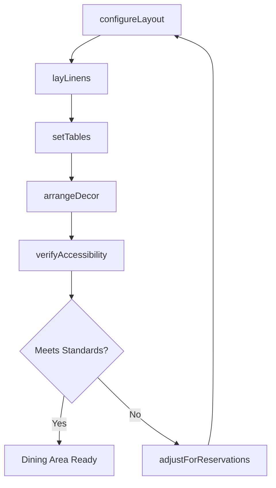
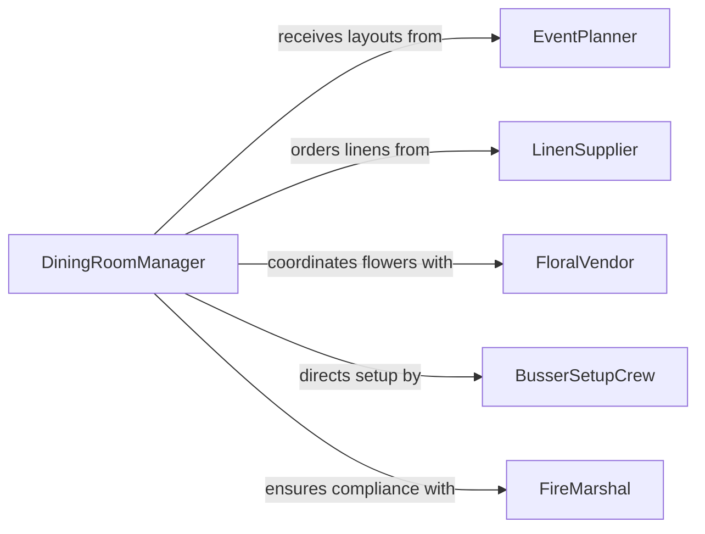

# Arrange Tables Dining Areas

> Business-as-Code definition for arranging tables and dining areas. Models the setup and configuration of dining rooms, banquet halls, and event spaces including table placement, place settings, linen distribution, and floral arrangements.

## Overview

Arranging tables and dining areas involves configuring the physical layout of dining spaces to accommodate guest reservations, event requirements, and service flow. This includes positioning tables and chairs, laying tablecloths, setting silverware and glassware, arranging centerpieces, and ensuring compliance with accessibility and fire safety spacing requirements. The definition covers daily restaurant setup, banquet configuration, outdoor patio arrangement, and special event staging.

## Actors

| Actor | Description |
|-------|-------------|
| EventPlanner | Specifies table layouts and seating arrangements for banquets and events |
| LinenSupplier | Provides tablecloths, napkins, and chair covers for dining service |
| FloralVendor | Supplies centerpieces and decorative arrangements for tables |
| Guest | The individual or party for whom the dining area is prepared |
| FireMarshal | Enforces spacing and egress requirements for dining room layouts |

## Roles

| Role | Description |
|------|-------------|
| BusserSetupCrew | Positions tables, chairs, and place settings before service |
| DiningRoomManager | Approves table layouts and manages seating capacity |
| BanquetCaptain | Oversees large-scale event dining area configuration |
| Hostess | Manages reservations and directs guests to arranged seating |

## Entities

| Entity | Description |
|--------|-------------|
| FloorPlan | A diagram showing table positions and seating configuration |
| TableSetting | The arrangement of plates, utensils, glasses, and napkins at each cover |
| Reservation | A booking that determines how many covers and tables are needed |
| DiningZone | A section of the dining area assigned to a specific server or event |
| LinenSet | Tablecloths, runners, and napkins allocated for a service period |

## Actions

| Action | Description |
|--------|-------------|
| configureLayout | Arrange tables and chairs according to the floor plan |
| setTables | Place settings including silverware, glassware, and napkins at each cover |
| layLinens | Distribute tablecloths, runners, and napkins across the dining area |
| arrangeDecor | Position centerpieces, candles, and decorative elements on tables |
| verifyAccessibility | Confirm aisle widths and table spacing meet accessibility standards |
| adjustForReservations | Reconfigure seating based on updated reservation counts |

## Events

| Event | Description |
|-------|-------------|
| layoutConfigured | Tables and chairs have been positioned according to the floor plan |
| tablesSet | Place settings have been completed for all covers |
| linensLaid | Tablecloths and napkins have been distributed across the dining area |
| decorArranged | Centerpieces and decorations have been placed on tables |
| accessibilityVerified | Dining area spacing has been confirmed to meet requirements |
| layoutAdjusted | Seating configuration has been modified for updated reservations |

## Searches

| Search | Description |
|--------|-------------|
| findAvailableTables | List tables by zone, capacity, or availability status |
| getFloorPlan | Retrieve the current table layout for a dining area or event |
| getReservations | View upcoming bookings that affect dining area setup |

## Entity Relationships



## State Diagram



## Workflow



## Actor Relationships



## Usage

### Calling Actions

```typescript
import { arrangeTablesDiningAreas } from '@headlessly/arrange-tables-dining-areas'

const dining = arrangeTablesDiningAreas()

// Configure the dining room for evening service
await dining.configureLayout({
  diningZone: 'main-dining-room',
  floorPlan: 'evening-standard-60-covers',
  tables: [
    { id: 'T1', type: 'round-8', position: { x: 2, y: 3 } },
    { id: 'T2', type: 'round-8', position: { x: 6, y: 3 } },
    { id: 'T3', type: 'rect-4', position: { x: 2, y: 7 } },
    { id: 'T4', type: 'rect-4', position: { x: 6, y: 7 } }
  ]
})

// Set formal place settings
await dining.setTables({
  diningZone: 'main-dining-room',
  settingType: 'formal-dinner',
  components: ['charger-plate', 'dinner-fork', 'salad-fork', 'dinner-knife', 'soup-spoon', 'water-glass', 'wine-glass']
})

// Adjust for a large party reservation
await dining.adjustForReservations({
  reservation: 'RES-2026-0210-PM',
  partySize: 12,
  tableIds: ['T1', 'T2'],
  configuration: 'joined-banquet'
})
```

### Event-Driven Automation

```typescript
// Notify hostess when dining area is ready for seating
dining.accessibilityVerified(async ({ diningZone, totalCovers }) => {
  await notify({
    to: 'hostess-station',
    message: `${diningZone} is ready with ${totalCovers} covers available for seating`
  })
})

// Auto-reconfigure when large reservations are booked
dining.layoutAdjusted(async ({ diningZone, reason, newCapacity }) => {
  await notify({
    to: 'busser-crew',
    message: `Layout change in ${diningZone}: ${reason}. New capacity: ${newCapacity} covers`
  })
})
```
