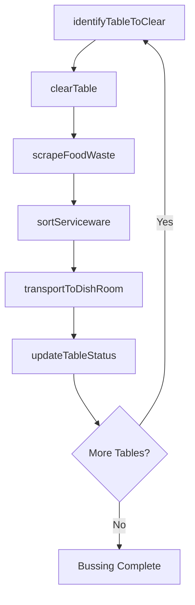
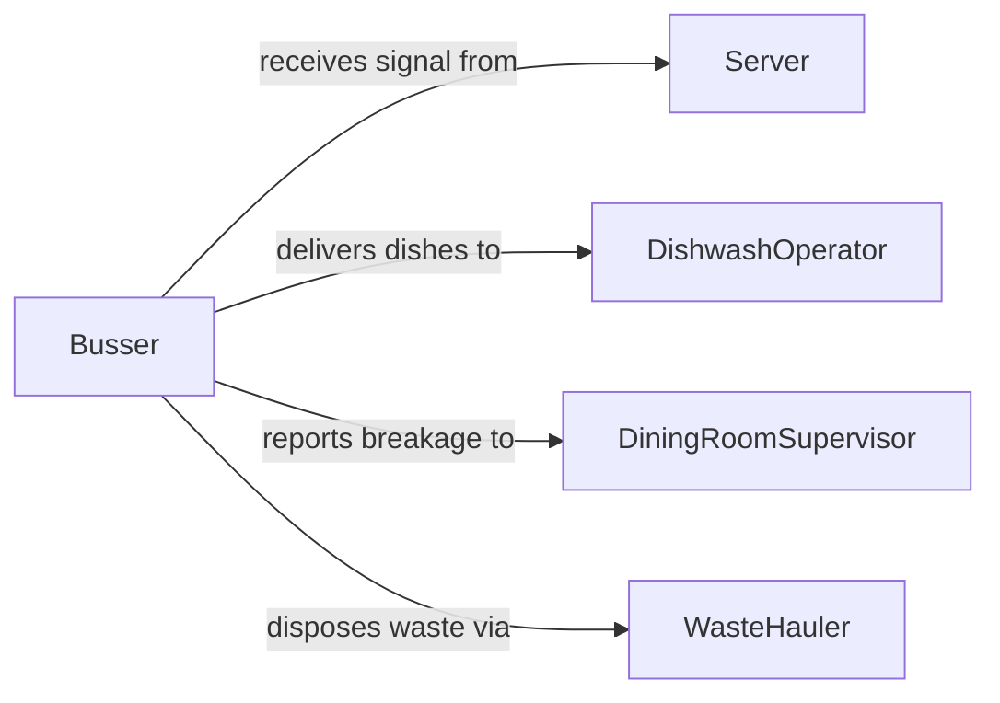

# Collect Dirty Dishes Tableware

> Business-as-Code definition for collecting dirty dishes and tableware. Models the bussing workflow from table clearance through dish room delivery, including sorting, scraping, and stacking used serviceware in restaurants, banquet halls, and institutional dining facilities.

## Overview

Collecting dirty dishes and tableware involves clearing used plates, glasses, utensils, and linen from dining tables and transporting them to the dish room or warewashing area for cleaning. This activity is essential for maintaining table turnover rates, ensuring guest comfort, and supporting continuous food service operations. The definition covers table-side clearing, tray loading, dish sorting by material type, and coordination with warewashing staff to maintain clean inventory flow.

## Actors

| Actor | Description |
|-------|-------------|
| Guest | The diner whose used tableware is being collected from the table |
| KitchenStaff | Receives sorted dirty dishes for warewashing and sanitization |
| TablesupplyVendor | Provides replacement serviceware for breakage and inventory replenishment |
| WasteHauler | Handles disposal of food waste scraped from dishes before washing |

## Roles

| Role | Description |
|------|-------------|
| Busser | Clears dirty dishes from tables and transports them to the dish room |
| DishwashOperator | Receives sorted dishes and operates warewashing equipment |
| DiningRoomSupervisor | Monitors table turnover and directs bussing priorities |
| Server | Signals the busser when a table is ready to be cleared |

## Entities

| Entity | Description |
|--------|-------------|
| BussTub | A container used to collect and carry dirty dishes from tables |
| DirtyDishBatch | A grouped set of used serviceware collected from one or more tables |
| TableStatus | The current state of a table such as occupied, needs-clearing, or clean |
| Serviceware | Plates, bowls, glasses, and utensils used during dining service |
| FoodWaste | Leftover food scraped from dishes before warewashing |

## Actions

| Action | Description |
|--------|-------------|
| identifyTableToClear | Determine which tables have finished dining and need clearing |
| clearTable | Remove dirty dishes, glasses, and utensils from the table surface |
| scrapeFoodWaste | Remove leftover food from dishes into waste receptacles |
| sortServiceware | Separate dishes, glassware, and silverware for proper washing |
| transportToDishRoom | Carry loaded bus tubs to the warewashing area |
| updateTableStatus | Mark the table as cleared and ready for reset |

## Events

| Event | Description |
|-------|-------------|
| tableIdentified | A table has been flagged as ready for clearing |
| tableCleared | All dirty dishes and tableware have been removed from the table |
| foodWasteScraped | Leftover food has been removed from collected dishes |
| servicewareSorted | Dishes, glasses, and utensils have been separated for washing |
| dishesDelivered | Dirty dishes have been transported to the warewashing area |
| tableStatusUpdated | The table status has been changed to cleared or ready-to-reset |

## Searches

| Search | Description |
|--------|-------------|
| findTablesToClear | List tables that are flagged as needing bussing by zone or server |
| getDishRoomQueue | Check the current volume of dirty dishes awaiting warewashing |
| getBreakageLog | Retrieve records of broken or damaged serviceware during clearing |

## Workflow



## Actor Relationships



## Usage

### Calling Actions

```typescript
import { collectDirtyDishesTableware } from '@headlessly/collect-dirty-dishes-tableware'

const bussing = collectDirtyDishesTableware()

// Identify tables ready for clearing in the main dining room
const tables = await bussing.identifyTableToClear({
  zone: 'main-dining',
  status: 'needs-clearing'
})

// Clear a specific table
await bussing.clearTable({
  tableId: 'table-22',
  busserId: 'busser-03',
  busTubId: 'tub-15',
  items: ['dinner-plates-4', 'wine-glasses-4', 'silverware-set-4', 'linen-napkins-4']
})

// Sort and deliver to dish room
await bussing.sortServiceware({
  busTubId: 'tub-15',
  categories: {
    plates: 4,
    glassware: 4,
    silverware: 16,
    linen: 4
  }
})

await bussing.transportToDishRoom({
  busTubId: 'tub-15',
  destination: 'dish-room-main'
})

// Update table status for reset
await bussing.updateTableStatus({
  tableId: 'table-22',
  status: 'ready-to-reset'
})
```

### Event-Driven Automation

```typescript
// Notify setup crew when table is cleared for reset
bussing.tableStatusUpdated(async ({ tableId, status }) => {
  if (status === 'ready-to-reset') {
    await notify({
      to: 'setup-crew',
      message: `Table ${tableId} cleared and ready for reset`
    })
  }
})

// Alert supervisor when dish room queue backs up
bussing.dishesDelivered(async ({ dishRoomId }) => {
  const queue = await bussing.getDishRoomQueue({ dishRoomId })
  if (queue.pendingTubs > 10) {
    await notify({
      to: 'dining-room-supervisor',
      message: `Dish room ${dishRoomId} has ${queue.pendingTubs} tubs queued. Consider additional warewash staffing.`
    })
  }
})
```
