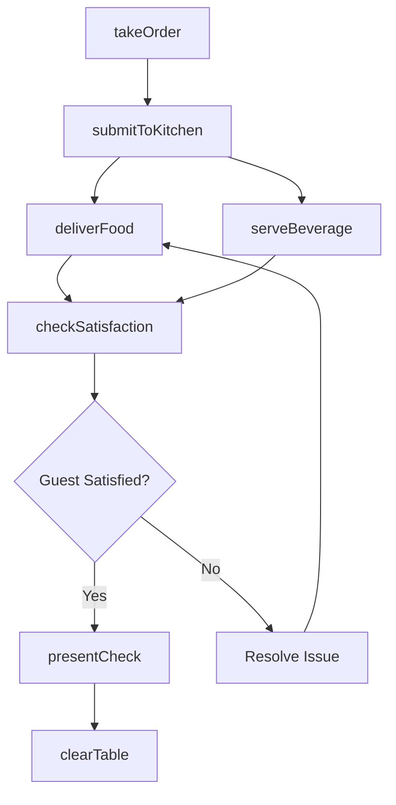
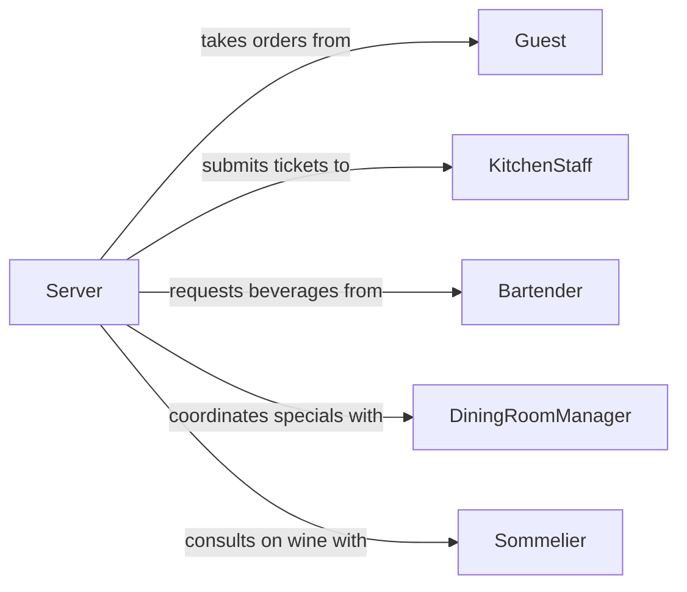

# Serve Food Beverages

> Business-as-Code definition for serving food and beverages. Models the front-of-house service workflow from order taking through delivery to the guest, including plating presentation, dietary accommodation, and service timing in restaurants, banquets, and institutional dining.

## Overview

Serving food and beverages involves presenting prepared dishes and drinks to guests at tables, counters, or buffet stations in a timely and professional manner. This activity includes confirming order accuracy, accommodating dietary restrictions and allergies, coordinating with the kitchen on timing, and ensuring proper food handling during delivery. The definition covers table service, banquet service, counter service, and room service across hospitality and institutional food service operations.

## Actors

| Actor | Description |
|-------|-------------|
| Guest | The individual or party receiving food and beverage service |
| KitchenStaff | Prepares and plates food items for service |
| Barista | Prepares specialty coffee and non-alcoholic beverages |
| Bartender | Prepares cocktails, wine, and other alcoholic beverages |
| FoodDistributor | Supplies ingredients and prepared items for the menu |

## Roles

| Role | Description |
|------|-------------|
| Server | Takes orders, delivers food and beverages, and attends to guest needs |
| FoodRunner | Expedites plated dishes from the kitchen to guest tables |
| DiningRoomManager | Oversees service flow, resolves guest concerns, and manages seating |
| Sommelier | Advises guests on wine selection and performs tableside wine service |

## Entities

| Entity | Description |
|--------|-------------|
| Order | A guest's food and beverage selections tied to a table or ticket |
| MenuItem | A specific dish or drink available for service |
| Table | A designated dining position assigned to guests |
| AllergyAlert | A flag indicating guest dietary restrictions or food allergies |
| ServiceTicket | A timed record tracking order placement through delivery |
| Check | The itemized bill presented to the guest after service |

## Actions

| Action | Description |
|--------|-------------|
| takeOrder | Record guest food and beverage selections and dietary requirements |
| submitToKitchen | Send the order to kitchen and bar preparation stations |
| deliverFood | Carry plated dishes from the kitchen and present to the correct guest |
| serveBeverage | Pour or deliver beverages to the table |
| checkSatisfaction | Follow up with guests to ensure order accuracy and quality |
| presentCheck | Deliver the itemized bill and process payment |
| clearTable | Remove used dishes and reset the table for the next service |

## Events

| Event | Description |
|-------|-------------|
| orderTaken | A guest order has been recorded with all selections and notes |
| orderSubmitted | The order has been sent to kitchen and bar stations |
| foodDelivered | Plated dishes have been served to the guest table |
| beverageServed | Drinks have been delivered to the guest |
| satisfactionConfirmed | Guest has confirmed their order is correct and satisfactory |
| checkPresented | The bill has been delivered to the guest |
| tableCleared | Used items have been removed and the table reset |

## Searches

| Search | Description |
|--------|-------------|
| findActiveOrders | List open orders by table, server, or status |
| getMenuAvailability | Check current availability of menu items and daily specials |
| getGuestHistory | Retrieve past orders and preferences for a returning guest |

## Workflow



## Actor Relationships



## Usage

### Calling Actions

```typescript
import { serveFoodBeverages } from '@headlessly/serve-food-beverages'

const service = serveFoodBeverages()

// Take a guest order with allergy notes
const order = await service.takeOrder({
  tableId: 'table-14',
  serverId: 'server-08',
  items: [
    { menuItem: 'grilled-salmon', modifications: ['no-butter'], quantity: 1 },
    { menuItem: 'caesar-salad', modifications: ['dressing-on-side'], quantity: 2 },
    { menuItem: 'house-cabernet', quantity: 2 }
  ],
  allergyAlerts: ['shellfish', 'dairy']
})

// Submit to kitchen and bar
await service.submitToKitchen({ orderId: order.id })

// Deliver and check satisfaction
await service.deliverFood({
  orderId: order.id,
  tableId: 'table-14',
  coursesDelivered: ['entree', 'salad']
})

await service.checkSatisfaction({
  orderId: order.id,
  tableId: 'table-14'
})
```

### Event-Driven Automation

```typescript
// Alert kitchen when allergy order is submitted
service.orderSubmitted(async ({ orderId, allergyAlerts }) => {
  if (allergyAlerts.length > 0) {
    await notify({
      to: 'kitchen-expo',
      message: `ALLERGY ALERT on order ${orderId}: ${allergyAlerts.join(', ')}`
    })
  }
})

// Track service timing for quality metrics
service.foodDelivered(async ({ orderId, tableId, deliveredAt }) => {
  const order = await service.findActiveOrders({ orderId })
  const waitMinutes = (deliveredAt - order.submittedAt) / 60000
  if (waitMinutes > 20) {
    await notify({
      to: 'dining-room-manager',
      message: `Table ${tableId} waited ${Math.round(waitMinutes)} minutes for food`
    })
  }
})
```
