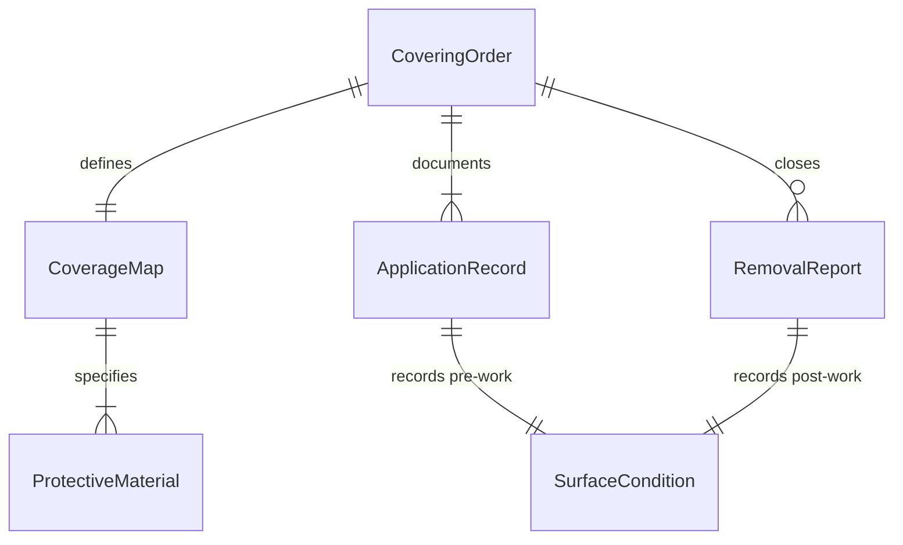
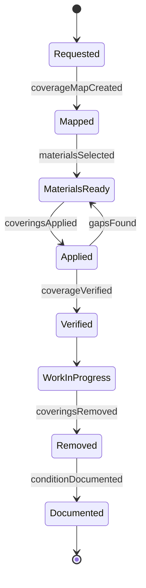
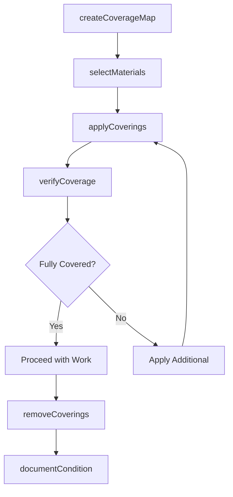
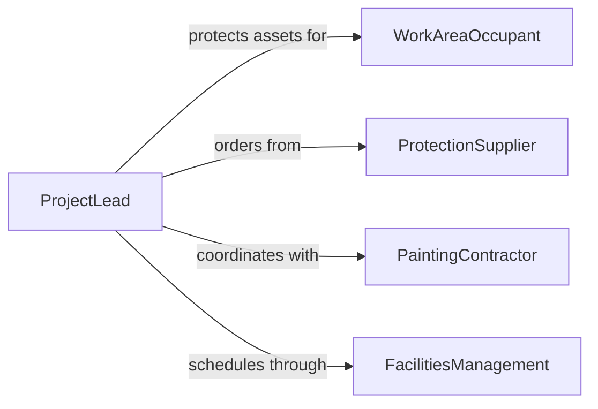

# Apply Protective Coverings to Objects and Surfaces

> Business-as-Code definition for applying drop cloths, plastic sheeting, masking tape, protective films, and other coverings to objects and surfaces near active work areas.

## Overview

Applying protective coverings involves selecting and installing physical barriers on furniture, fixtures, flooring, and other surfaces to prevent paint splatter, dust accumulation, chemical contact, or mechanical damage during nearby work. This definition models material selection based on the work hazard, application technique, coverage verification, and removal with condition documentation.

## Actors

| Actor | Description |
|-------|-------------|
| WorkAreaOccupant | Owns or manages the objects and surfaces to be protected |
| ProtectionSupplier | Provides films, tapes, cloths, and shielding materials |
| PaintingContractor | Performs work requiring nearby surface protection |
| FacilitiesManagement | Coordinates covering installation around building use |

## Roles

| Role | Description |
|------|-------------|
| CoveringInstaller | Applies protective materials to designated surfaces |
| ProjectLead | Specifies what areas need covering based on work scope |
| QualityChecker | Verifies complete and secure coverage before work starts |
| RemovalTechnician | Removes coverings and inspects surfaces after work |

## Entities

| Entity | Description |
|--------|-------------|
| CoveringOrder | A request to apply protective materials to specific areas |
| ProtectiveMaterial | A film, cloth, tape, or board used for surface coverage |
| CoverageMap | A diagram showing which surfaces receive which coverings |
| ApplicationRecord | Documentation of materials applied and technique used |
| RemovalReport | Record of covering removal and surface condition check |
| SurfaceCondition | Pre-work and post-work state of a protected surface |

## Actions

| Action | Description |
|--------|-------------|
| createCoverageMap | Identify and map all surfaces requiring protective covering |
| selectMaterials | Choose appropriate covering materials for each surface |
| applyCoverings | Install protective materials on designated surfaces |
| verifyCoverage | Check that all specified surfaces are fully covered |
| removeCoverings | Take down protective materials after work is complete |
| documentCondition | Record surface condition before and after covering |

## Events

| Event | Description |
|-------|-------------|
| coverageMapCreated | Surface coverage plan has been documented |
| materialsSelected | Appropriate covering materials have been chosen |
| coveringsApplied | Protective materials have been installed on surfaces |
| coverageVerified | All specified surfaces confirmed fully covered |
| coveringsRemoved | Protective materials have been taken down |
| conditionDocumented | Surface condition has been recorded |

## Searches

| Search | Description |
|--------|-------------|
| findOpenOrders | List covering orders awaiting application |
| getCoverageMaps | Retrieve coverage plans by project or area |
| getMaterialInventory | Check available covering material stock |
| getConditionReports | Pull surface condition records by project |

## Entity Relationships



## State Diagram



## Workflow



## Actor Relationships



## Usage

### Calling Actions

```typescript
import { applyProtectiveCoveringsObjectsSurfaces } from '@headlessly/apply-protective-coverings-objects-surfaces'

const coverings = applyProtectiveCoveringsObjectsSurfaces()

// Create coverage map for a painting project
const map = await coverings.createCoverageMap({
  projectId: 'PAINT-2026-08',
  surfaces: [
    { id: 'hardwood-floor', type: 'flooring', area: 400 },
    { id: 'reception-desk', type: 'furniture', area: 30 },
    { id: 'window-frames', type: 'trim', linearFeet: 120 }
  ]
})

// Select materials and apply
await coverings.selectMaterials({
  mapId: map.id,
  selections: [
    { surface: 'hardwood-floor', material: 'canvas-drop-cloth' },
    { surface: 'reception-desk', material: 'moving-blanket' },
    { surface: 'window-frames', material: 'painters-tape-and-film' }
  ]
})

await coverings.applyCoverings({ mapId: map.id, installerId: 'CI-004' })
await coverings.verifyCoverage({ mapId: map.id })
```

### Event-Driven Automation

```typescript
// Notify contractor when coverage is verified
coverings.coverageVerified(async ({ projectId }) => {
  await notify({
    to: 'painting-contractor',
    message: `Project ${projectId} surfaces are covered - clear to begin work`
  })
})

// Document condition and close out after removal
coverings.coveringsRemoved(async ({ projectId }) => {
  await coverings.documentCondition({
    projectId,
    type: 'post-work-inspection'
  })
})
```
