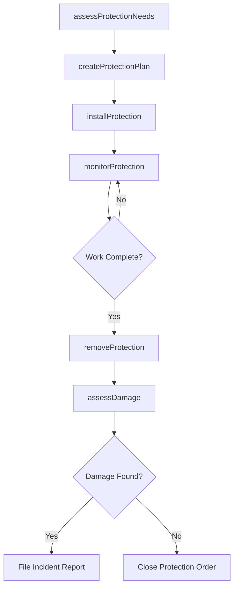
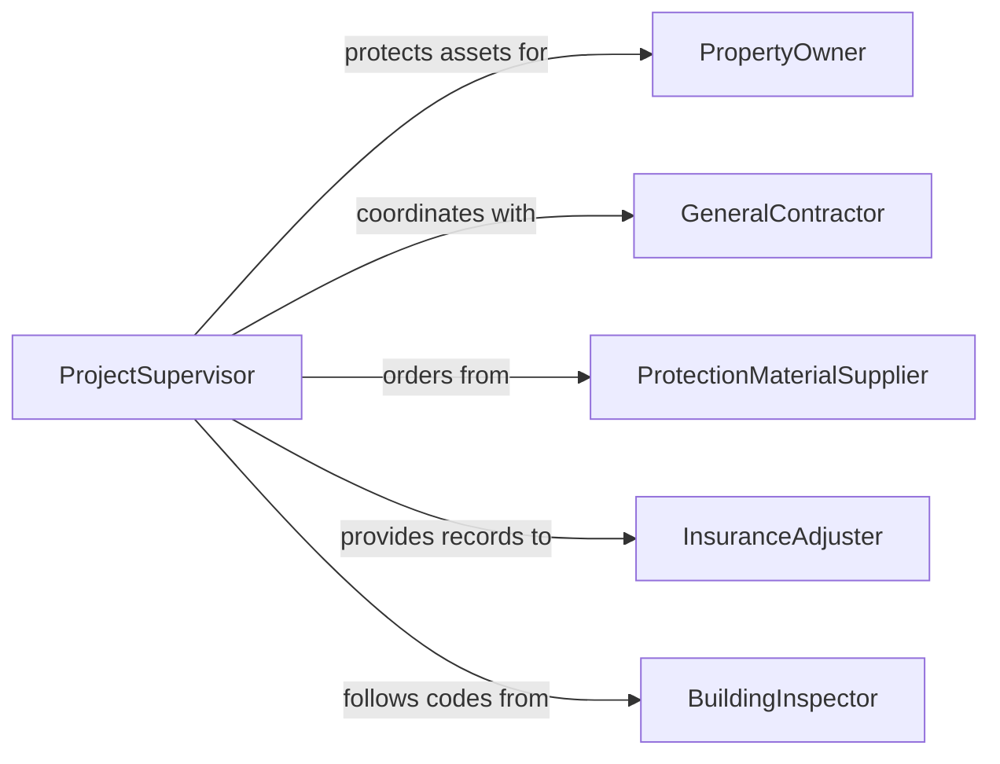

# Protect Structures and Surfaces Near Work Areas

> Business-as-Code definition for protecting adjacent structures and surfaces from damage during construction, renovation, painting, and other work activities.

## Overview

Protecting structures and surfaces near work areas involves identifying vulnerable assets, selecting appropriate protective measures, and installing barriers, coverings, or shielding before work begins. This definition models the risk assessment of adjacent surfaces, selection and deployment of protection methods, monitoring during work activities, and removal and condition verification after work completion.

## Actors

| Actor | Description |
|-------|-------------|
| PropertyOwner | Requires protection of existing structures and finishes |
| GeneralContractor | Coordinates protection measures across trade activities |
| ProtectionMaterialSupplier | Provides drop cloths, barrier boards, and protective films |
| InsuranceAdjuster | Assesses damage claims if protection fails |
| BuildingInspector | Verifies protection measures meet code requirements |

## Roles

| Role | Description |
|------|-------------|
| ProjectSupervisor | Plans protection requirements based on work scope |
| ProtectionInstaller | Deploys protective coverings and barriers on site |
| SiteMonitor | Inspects protection integrity during work activities |
| DamageAssessor | Evaluates any damage to protected surfaces after work |

## Entities

| Entity | Description |
|--------|-------------|
| ProtectionPlan | A documented strategy for safeguarding adjacent surfaces |
| ProtectedAsset | A structure, surface, or fixture requiring protection |
| ProtectionMaterial | Drop cloths, films, boards, or barriers used for coverage |
| DamageAssessment | An evaluation of surface condition before and after work |
| ProtectionLog | A record of installation, monitoring, and removal activities |
| IncidentReport | Documentation of any protection failure or damage event |

## Actions

| Action | Description |
|--------|-------------|
| assessProtectionNeeds | Identify surfaces and structures requiring protection |
| createProtectionPlan | Document protection methods for each vulnerable area |
| installProtection | Deploy coverings, barriers, or shields on site |
| monitorProtection | Check protection integrity during active work |
| removeProtection | Take down coverings and barriers after work completion |
| assessDamage | Evaluate protected surfaces for any damage sustained |

## Events

| Event | Description |
|-------|-------------|
| protectionNeedsAssessed | Vulnerable surfaces have been identified |
| protectionPlanCreated | Protection strategy has been documented |
| protectionInstalled | Coverings and barriers have been deployed |
| protectionMonitored | Integrity check has been completed during work |
| protectionRemoved | Coverings and barriers have been taken down |
| damageAssessed | Post-work surface condition has been evaluated |
| damageDetected | Protected surface has sustained damage despite measures |

## Searches

| Search | Description |
|--------|-------------|
| findProtectedAssets | List surfaces and structures under protection |
| getProtectionPlans | Retrieve protection strategies by project or zone |
| findActiveProtections | Locate protection installations currently in place |
| getDamageReports | Pull damage assessment records by project |

## Workflow



## Actor Relationships



## Usage

### Calling Actions

```typescript
import { protectStructuresSurfacesNearWork } from '@headlessly/protect-structures-surfaces-near-work'

const protection = protectStructuresSurfacesNearWork()

// Assess and plan protection for a renovation project
const needs = await protection.assessProtectionNeeds({
  projectId: 'RENO-2026-14',
  zones: ['lobby-marble-floor', 'stairwell-handrail', 'elevator-interior'],
  workType: 'painting-and-drywall'
})

const plan = await protection.createProtectionPlan({
  assessmentId: needs.id,
  measures: [
    { asset: 'lobby-marble-floor', method: 'ram-board-overlay' },
    { asset: 'stairwell-handrail', method: 'foam-wrap-and-tape' },
    { asset: 'elevator-interior', method: 'padded-panels' }
  ]
})

// Install protection
await protection.installProtection({ planId: plan.id, installerTeam: 'PROT-CREW-A' })
```

### Event-Driven Automation

```typescript
// Alert supervisor when damage is detected
protection.damageDetected(async ({ assetId, damage }) => {
  await notify({
    to: 'project-supervisor',
    message: `Damage detected on ${assetId}: ${damage.description}`
  })
})

// Schedule protection removal when work completes
protection.protectionMonitored(async ({ projectId, workStatus }) => {
  if (workStatus === 'complete') {
    await protection.removeProtection({ projectId })
  }
})
```
