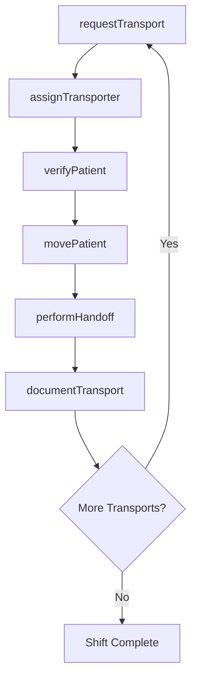
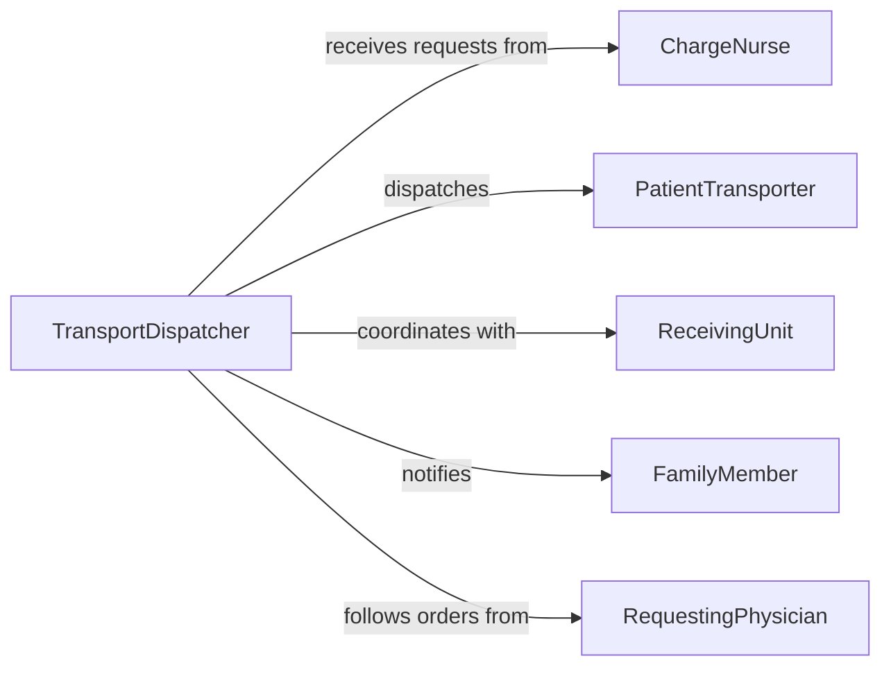

# Move Patients Treatment Areas

> Business-as-Code definition for moving patients to or from treatment areas. Models the safe transfer of patients between hospital departments, treatment rooms, surgical suites, and diagnostic areas while maintaining clinical safety and care continuity.

## Overview

Moving patients to or from treatment areas involves the physical transfer of patients using wheelchairs, stretchers, or hospital beds between locations such as emergency departments, operating rooms, radiology suites, and recovery wards. This activity requires coordination with clinical staff to ensure patient safety, proper handoff of medical information, and timely transport to prevent treatment delays. The definition covers transport request management, patient safety verification, route optimization, and handoff documentation.

## Actors

| Actor | Description |
|-------|-------------|
| Patient | The individual being transported between treatment areas |
| RequestingPhysician | Orders the patient transfer to a specific treatment location |
| ReceivingUnit | The department or treatment area accepting the patient |
| FamilyMember | May accompany the patient during transport and requires notification |
| EquipmentVendor | Supplies wheelchairs, stretchers, and transport monitoring devices |

## Roles

| Role | Description |
|------|-------------|
| PatientTransporter | Physically moves patients between departments using appropriate equipment |
| ChargeNurse | Initiates transport requests and coordinates timing with receiving units |
| TransportDispatcher | Assigns transport requests to available transporters based on priority |
| ReceivingNurse | Accepts the patient at the destination and confirms handoff |

## Entities

| Entity | Description |
|--------|-------------|
| TransportRequest | A formal request to move a patient to a specified treatment area |
| PatientRecord | Clinical information that travels with the patient during transport |
| TransportEquipment | Wheelchairs, stretchers, or beds used for patient movement |
| Handoff | The documented transfer of patient care between staff at origin and destination |
| Route | The path through the facility from origin to destination |
| SafetyChecklist | Pre-transport verification of patient identity, equipment, and readiness |

## Actions

| Action | Description |
|--------|-------------|
| requestTransport | Submit a request to move a patient to a treatment area |
| verifyPatient | Confirm patient identity and check pre-transport safety requirements |
| assignTransporter | Dispatch an available transporter to fulfill the request |
| movePatient | Physically transport the patient to the designated treatment area |
| performHandoff | Transfer care responsibility and clinical information to the receiving unit |
| documentTransport | Record transport details including times, route, and patient condition |

## Events

| Event | Description |
|-------|-------------|
| transportRequested | A patient transport request has been submitted |
| patientVerified | Patient identity and safety checks have been confirmed |
| transporterAssigned | A transporter has been dispatched to fulfill the request |
| patientInTransit | The patient is currently being moved between areas |
| patientDelivered | The patient has arrived at the destination treatment area |
| handoffCompleted | Care responsibility has been formally transferred to the receiving unit |
| transportDocumented | Transport details have been recorded in the system |

## Searches

| Search | Description |
|--------|-------------|
| findPendingTransports | List transport requests awaiting assignment or in progress |
| getTransportHistory | Retrieve completed transport records for a specific patient |
| getTransporterAvailability | Check which transporters are available and their current locations |

## Workflow



## Actor Relationships



## Usage

### Calling Actions

```typescript
import { movePatientsTreatmentAreas } from '@headlessly/move-patients-treatment-areas'

const transport = movePatientsTreatmentAreas()

// Request transport to radiology for imaging
const request = await transport.requestTransport({
  patientId: 'PT-884201',
  origin: 'med-surg-4th-floor',
  destination: 'radiology-suite-b',
  priority: 'routine',
  equipment: 'wheelchair',
  specialNeeds: ['oxygen-tank', 'iv-pole']
})

// Verify patient before transport
await transport.verifyPatient({
  requestId: request.id,
  patientId: 'PT-884201',
  identificationMethod: 'wristband-scan',
  safetyChecks: ['fall-risk-assessed', 'iv-secured', 'oxygen-flowing']
})

// Move and hand off
await transport.movePatient({
  requestId: request.id,
  transporterId: 'TR-055',
  departureTime: new Date()
})

await transport.performHandoff({
  requestId: request.id,
  receivingNurse: 'RN-Thompson',
  patientCondition: 'stable',
  clinicalNotes: 'Patient alert and oriented, scheduled for CT abdomen'
})
```

### Event-Driven Automation

```typescript
// Notify receiving unit when patient is in transit
transport.patientInTransit(async ({ patientId, destination, eta }) => {
  await notify({
    to: destination,
    message: `Patient ${patientId} in transit, ETA ${eta} minutes`
  })
})

// Alert dispatch on prolonged transport times
transport.transporterAssigned(async ({ requestId, assignedAt }) => {
  setTimeout(async () => {
    const status = await transport.findPendingTransports({ requestId })
    if (status.state === 'in-transit') {
      await notify({
        to: 'transport-dispatch',
        message: `Transport ${requestId} exceeding expected duration`
      })
    }
  }, 30 * 60 * 1000)
})
```
