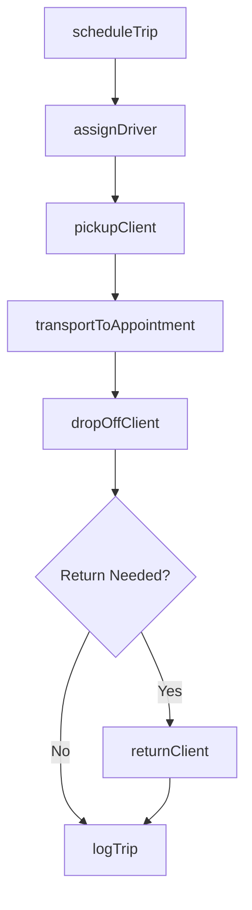
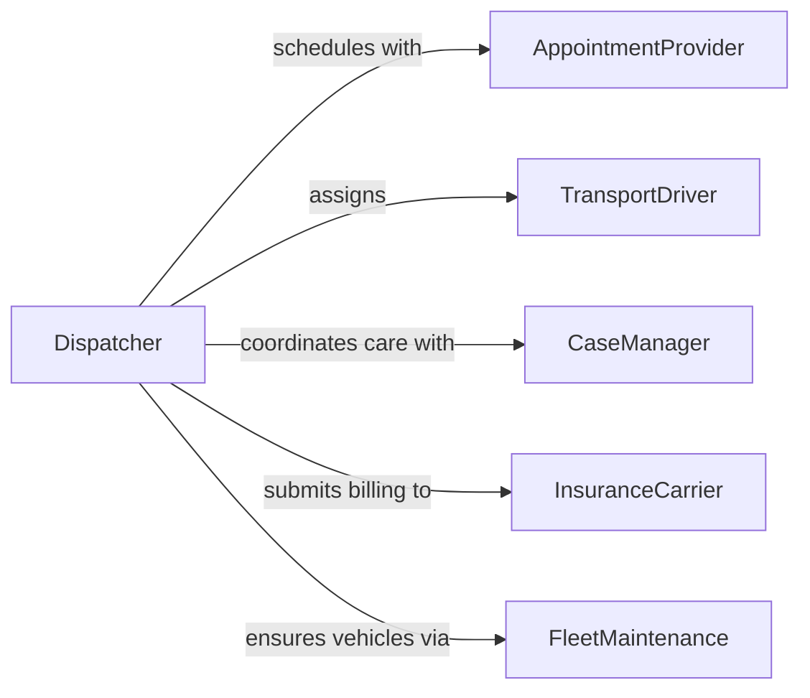

# Transport Clients Appointments

> Business-as-Code definition for transporting clients to appointments. Models the scheduling, dispatch, and execution of non-emergency medical transport and social service transportation for clients who need assistance reaching scheduled appointments.

## Overview

Transporting clients to appointments involves coordinating vehicle dispatch, driver assignment, and safe passage for individuals who require assistance traveling to medical visits, social service meetings, therapy sessions, or other scheduled engagements. This activity is common in home health agencies, senior care organizations, disability services, and community social programs. The definition covers ride scheduling, client pickup and drop-off, accessibility accommodations, and trip documentation for billing and compliance.

## Actors

| Actor | Description |
|-------|-------------|
| Client | The individual being transported to their scheduled appointment |
| AppointmentProvider | The clinic, office, or facility where the client is scheduled |
| InsuranceCarrier | Reimburses transportation costs for eligible medical appointments |
| CaseManager | Coordinates client care plans that include transportation needs |
| FleetMaintenance | Keeps transport vehicles in safe operating condition |

## Roles

| Role | Description |
|------|-------------|
| TransportDriver | Operates the vehicle and assists clients during pickup and drop-off |
| Dispatcher | Schedules rides, assigns drivers, and manages route logistics |
| TransportCoordinator | Oversees the transportation program and ensures service quality |
| ClientCareAide | Accompanies clients who need additional physical or cognitive support |

## Entities

| Entity | Description |
|--------|-------------|
| TripRequest | A scheduled request for client transportation to a specific appointment |
| Vehicle | A transport vehicle assigned to client trips |
| Route | The planned path from pickup location to appointment and return |
| AccessibilityRequirement | Special accommodations such as wheelchair ramp or oxygen support |
| TripLog | A record of completed transport including times, mileage, and client status |
| BillingRecord | Documentation submitted to insurance or funding sources for reimbursement |

## Actions

| Action | Description |
|--------|-------------|
| scheduleTrip | Create a transport request for a client appointment |
| assignDriver | Dispatch an available driver and vehicle for the trip |
| pickupClient | Arrive at the client location and assist with boarding |
| transportToAppointment | Drive the client safely to the scheduled destination |
| dropOffClient | Assist the client with exiting the vehicle at the appointment |
| returnClient | Transport the client back to their residence after the appointment |
| logTrip | Document trip details for compliance and billing |

## Events

| Event | Description |
|-------|-------------|
| tripScheduled | A transport request has been created and confirmed |
| driverAssigned | A driver and vehicle have been dispatched for the trip |
| clientPickedUp | The client has been successfully boarded at the pickup location |
| clientDelivered | The client has arrived at the appointment destination |
| clientReturned | The client has been transported back to their residence |
| tripLogged | Trip details have been recorded for billing and compliance |
| tripCancelled | A scheduled transport has been cancelled by the client or provider |

## Searches

| Search | Description |
|--------|-------------|
| findScheduledTrips | List upcoming trips by date, client, driver, or destination |
| getTripHistory | Retrieve completed trip logs for a specific client or period |
| getDriverAvailability | Check which drivers and vehicles are available for scheduling |
| getBillingRecords | Access trip documentation submitted for reimbursement |

## Workflow



## Actor Relationships



## Usage

### Calling Actions

```typescript
import { transportClientsAppointments } from '@headlessly/transport-clients-appointments'

const transport = transportClientsAppointments()

// Schedule a trip for a client's medical appointment
const trip = await transport.scheduleTrip({
  clientId: 'CLT-3392',
  pickup: { address: '450 Oak Street, Apt 2B', time: '2026-02-10T08:30:00' },
  destination: { name: 'Valley Medical Center', address: '1200 Health Blvd' },
  appointmentTime: '2026-02-10T09:15:00',
  accessibility: ['wheelchair-ramp'],
  returnTrip: true
})

// Assign a driver with an accessible vehicle
await transport.assignDriver({
  tripId: trip.id,
  driverId: 'DRV-018',
  vehicleId: 'VAN-ADA-05',
  estimatedPickup: '2026-02-10T08:30:00'
})

// Log the completed trip for billing
await transport.logTrip({
  tripId: trip.id,
  actualPickup: '2026-02-10T08:32:00',
  actualDropOff: '2026-02-10T09:05:00',
  mileage: 12.4,
  clientCondition: 'stable'
})
```

### Event-Driven Automation

```typescript
// Notify client and case manager when driver is en route
transport.driverAssigned(async ({ tripId, clientId, driverId, eta }) => {
  await notify({
    to: clientId,
    message: `Your driver is on the way. Estimated arrival: ${eta}`
  })
})

// Submit billing after trip completion
transport.tripLogged(async ({ tripId, clientId, mileage, insuranceId }) => {
  await transport.logTrip({
    tripId,
    billingSubmitted: true,
    carrier: insuranceId,
    totalMiles: mileage
  })
})
```
