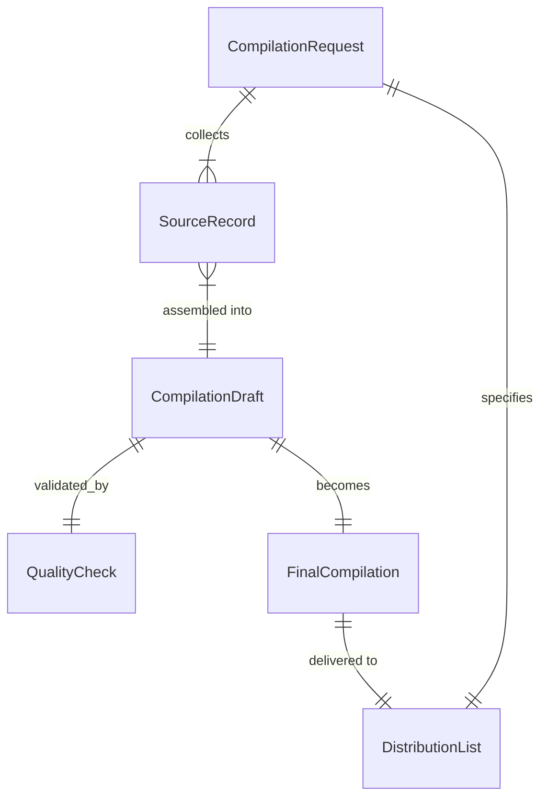
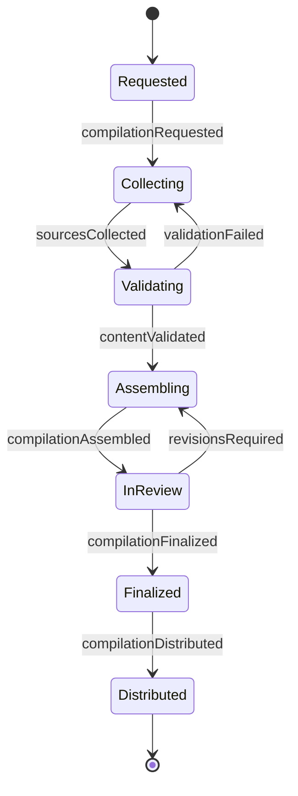
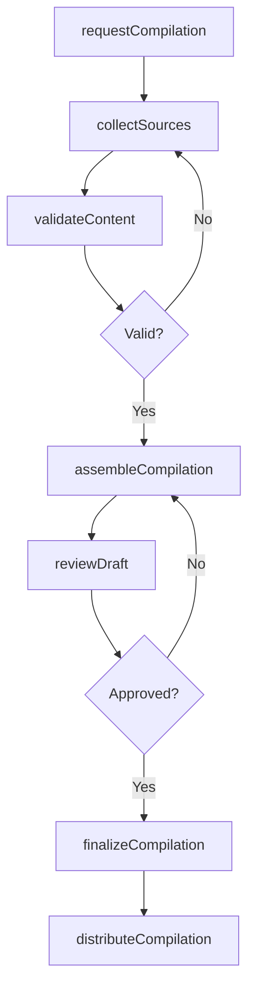
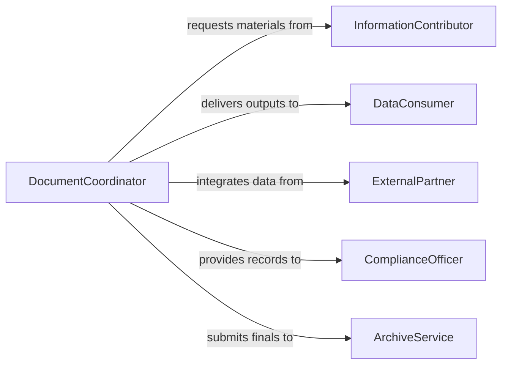

# Compile Data or Documentation

> Business-as-Code definition for compiling general data and documentation. Models the collection, organization, and assembly of diverse data sets and documents from multiple sources into unified, structured outputs.

## Overview

Compiling data or documentation is a general-purpose information management activity that spans all business functions. This definition covers the identification of required data, collection from internal and external sources, quality checking, organization into structured formats, and delivery to consumers. It applies to any scenario where scattered information must be brought together into a coherent compilation for decision-making, reporting, or record-keeping.

## Actors

| Actor | Description |
|-------|-------------|
| InformationContributor | Provides raw data or documentation from their area of responsibility |
| DataConsumer | Receives and uses the compiled output for analysis or action |
| ExternalPartner | Supplies data from outside the organization |
| ComplianceOfficer | Requires compiled records for regulatory or audit purposes |
| ArchiveService | Stores finalized compilations for long-term retention |

## Roles

| Role | Description |
|------|-------------|
| DataCompiler | Collects, verifies, and organizes data from multiple sources |
| DocumentCoordinator | Manages the compilation workflow and tracks contributor submissions |
| QualityAnalyst | Reviews compiled outputs for accuracy and completeness |
| RecordsManager | Ensures compiled documents meet retention and governance policies |

## Entities

| Entity | Description |
|--------|-------------|
| CompilationRequest | A formal request specifying what data or documents to compile |
| SourceRecord | An individual piece of data or document from a contributor |
| CompilationDraft | A working version of the compiled output in progress |
| QualityCheck | A validation pass over compiled content for accuracy |
| FinalCompilation | The approved and finalized compiled document or data set |
| DistributionList | The set of recipients designated to receive the compilation |

## Actions

| Action | Description |
|--------|-------------|
| requestCompilation | Initiate a compilation by specifying scope and requirements |
| collectSources | Gather data and documents from designated contributors |
| validateContent | Check collected materials for accuracy and completeness |
| assembleCompilation | Organize validated content into a structured compilation |
| reviewDraft | Submit the compiled draft for stakeholder review |
| finalizeCompilation | Approve and lock the compilation as the official version |
| distributeCompilation | Deliver the finalized compilation to designated recipients |

## Events

| Event | Description |
|-------|-------------|
| compilationRequested | A new compilation request has been submitted |
| sourcesCollected | All required source materials have been gathered |
| contentValidated | Collected content has passed quality checks |
| compilationAssembled | Content has been organized into the compilation structure |
| draftReviewed | Stakeholder review of the compilation draft is complete |
| compilationFinalized | The compilation has been approved as the official version |
| compilationDistributed | The finalized compilation has been delivered to recipients |

## Searches

| Search | Description |
|--------|-------------|
| findCompilations | List compilations by requester, date, or status |
| getSourceStatus | Check which contributors have submitted their materials |
| getPendingReviews | Find compilations awaiting stakeholder review |
| getDistributionHistory | Track where and when compilations were delivered |
| findOverdueSubmissions | Identify contributors who have not submitted by the deadline |

## Entity Relationships



## State Diagram



## Workflow



## Actor Relationships



## Usage

### Calling Actions

```typescript
import { compileDataDocumentation } from '@headlessly/compile-data-documentation'

const compiler = compileDataDocumentation()

// Initiate a compilation
const request = await compiler.requestCompilation({
  title: 'Q1 2026 Regional Performance Summary',
  scope: ['sales-data', 'customer-feedback', 'operational-metrics'],
  deadline: '2026-04-10',
  format: 'spreadsheet'
})

// Collect and validate sources
await compiler.collectSources({ requestId: request.id })
await compiler.validateContent({ requestId: request.id })

// Assemble and finalize
await compiler.assembleCompilation({ requestId: request.id })
await compiler.finalizeCompilation({ requestId: request.id })
```

### Event-Driven Automation

```typescript
// Chase overdue contributors
compiler.compilationRequested(async ({ requestId, deadline }) => {
  scheduleReminders({
    requestId,
    reminderDates: [daysBeforeDeadline(deadline, 3), daysBeforeDeadline(deadline, 1)]
  })
})

// Auto-distribute on finalization
compiler.compilationFinalized(async ({ requestId, compilationId }) => {
  await compiler.distributeCompilation({
    compilationId,
    channel: 'email',
    recipients: await getDistributionList({ requestId })
  })
})
```
