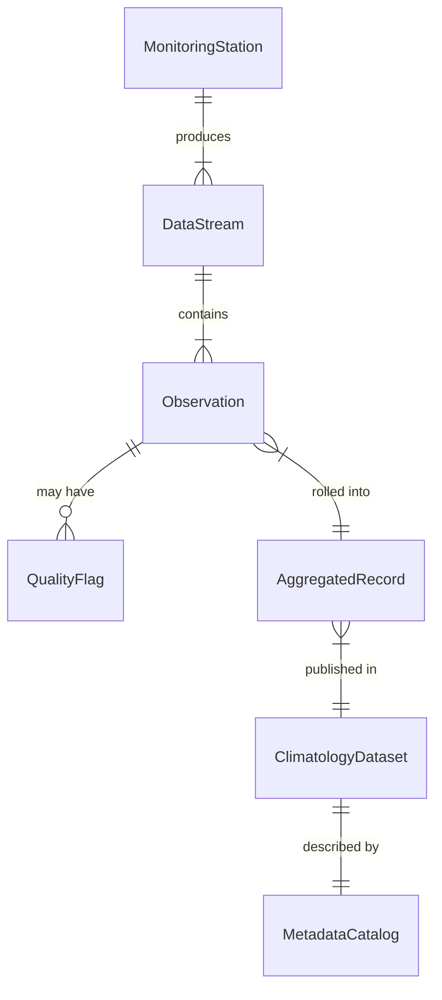
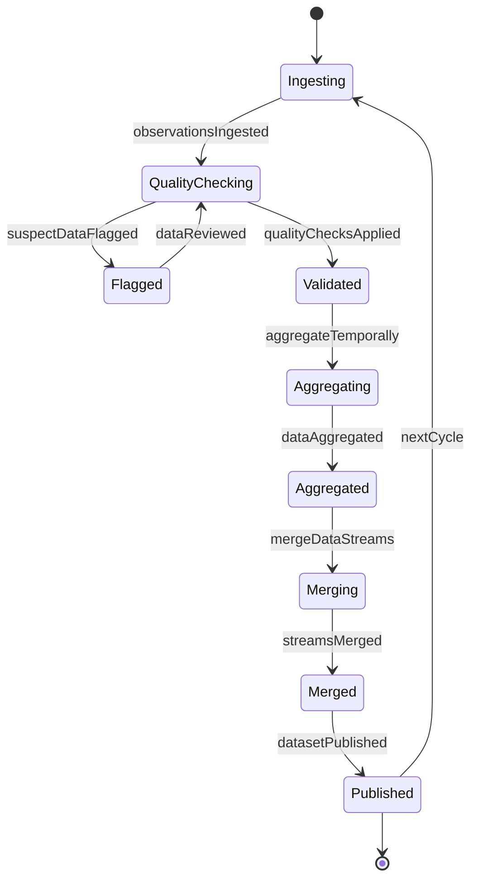
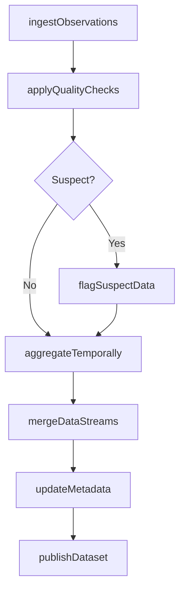
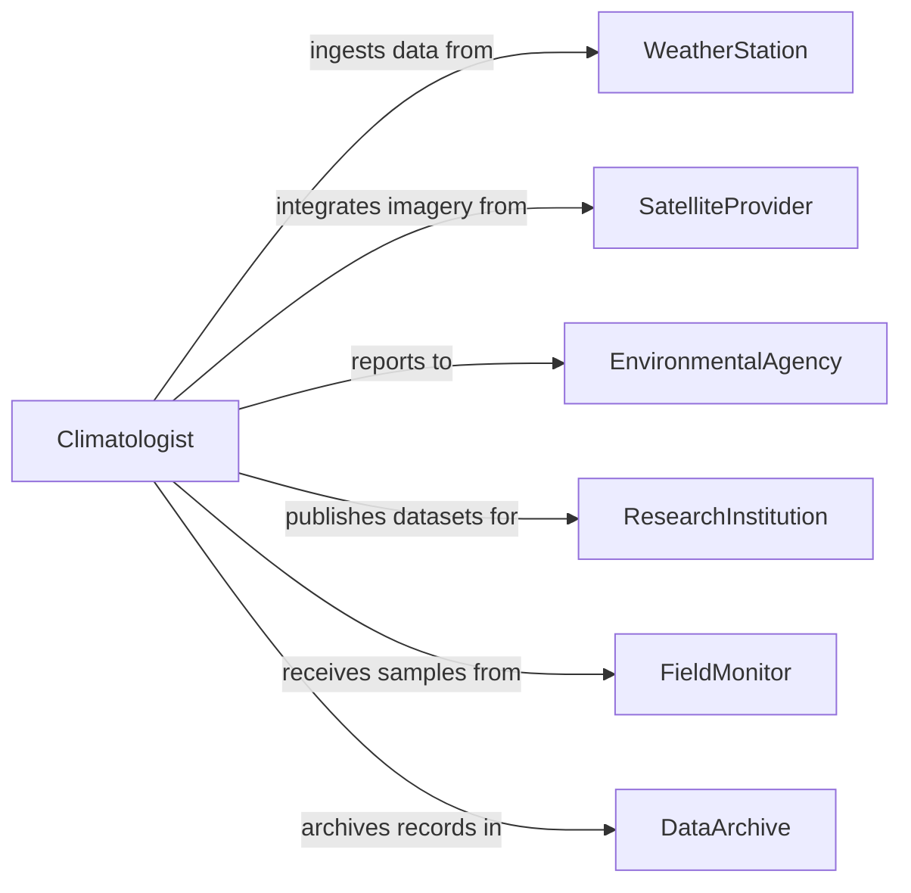

# Compile Environmental or Climatological Data

> Business-as-Code definition for compiling environmental and climatological data. Models the collection, quality control, and aggregation of weather observations, air quality measurements, water quality readings, and climate records from sensor networks and monitoring stations.

## Overview

Compiling environmental or climatological data involves gathering observations from weather stations, remote sensors, satellite feeds, and field instruments, then processing them into standardized datasets for analysis, forecasting, and regulatory reporting. This definition provides actions for data ingestion, quality assurance, temporal aggregation, and dataset publication. It supports meteorologists, environmental scientists, and regulatory compliance teams.

## Actors

| Actor | Description |
|-------|-------------|
| WeatherStation | Provides continuous meteorological observations |
| SatelliteProvider | Delivers remote sensing imagery and derived environmental products |
| EnvironmentalAgency | Mandates data collection standards and receives compiled reports |
| ResearchInstitution | Consumes compiled datasets for climate modeling and analysis |
| FieldMonitor | Collects ground-truth measurements at sampling sites |
| DataArchive | Stores long-term compiled environmental records |

## Roles

| Role | Description |
|------|-------------|
| DataCompiler | Ingests and processes raw environmental observations |
| Climatologist | Reviews compiled data for scientific accuracy and consistency |
| QualityController | Applies quality assurance checks to raw and compiled data |
| DatabaseAdministrator | Manages storage, indexing, and access to compiled datasets |

## Entities

| Entity | Description |
|--------|-------------|
| Observation | A single measurement of an environmental parameter at a point in time |
| MonitoringStation | A fixed location equipped with environmental sensors |
| DataStream | A continuous feed of observations from a sensor or station |
| QualityFlag | A marker indicating the reliability status of an observation |
| AggregatedRecord | A summary statistic computed from multiple observations over a period |
| ClimatologyDataset | A published collection of compiled environmental records |
| MetadataCatalog | Descriptions of data sources, methods, and quality standards |

## Actions

| Action | Description |
|--------|-------------|
| ingestObservations | Receive raw environmental data from monitoring sources |
| applyQualityChecks | Validate observations against expected ranges and consistency rules |
| flagSuspectData | Mark observations that fail quality thresholds for review |
| aggregateTemporally | Compute hourly, daily, or monthly summaries from raw observations |
| mergeDataStreams | Combine data from multiple sources into a unified dataset |
| publishDataset | Release a compiled environmental dataset for public or research use |
| updateMetadata | Maintain the catalog of data sources and quality documentation |

## Events

| Event | Description |
|-------|-------------|
| observationsIngested | Raw environmental data has been received and stored |
| qualityChecksApplied | Validation rules have been run against ingested observations |
| suspectDataFlagged | Observations failing quality thresholds have been marked |
| dataAggregated | Temporal summaries have been computed from raw data |
| streamsMerged | Multiple data sources have been combined into one dataset |
| datasetPublished | A compiled environmental dataset has been released |
| metadataUpdated | Data source catalog and documentation have been refreshed |

## Searches

| Search | Description |
|--------|-------------|
| findObservations | Query raw observations by station, parameter, or date range |
| getQualityFlags | Retrieve flagged observations by type or severity |
| getAggregatedData | Access computed summaries by location, parameter, and period |
| findDatasets | List published datasets by topic, region, or publication date |
| getStationStatus | Check operational status and last report time for monitoring stations |

## Entity Relationships



## State Diagram



## Workflow



## Actor Relationships



## Usage

### Calling Actions

```typescript
import { compileEnvironmentalClimatologicalData } from '@headlessly/compile-environmental-climatological-data'

const compiler = compileEnvironmentalClimatologicalData()

// Ingest daily observations
await compiler.ingestObservations({
  stationId: 'KORD-ORD-001',
  parameters: ['temperature', 'humidity', 'precipitation', 'wind-speed'],
  date: '2026-02-05'
})

// Run quality checks and aggregate
await compiler.applyQualityChecks({ stationId: 'KORD-ORD-001', date: '2026-02-05' })
await compiler.aggregateTemporally({
  stationId: 'KORD-ORD-001',
  period: 'daily',
  parameters: ['temperature', 'precipitation']
})

// Publish a monthly climate dataset
const dataset = await compiler.publishDataset({
  name: 'Great Lakes Region January 2026 Climate Summary',
  region: 'great-lakes',
  period: { start: '2026-01-01', end: '2026-01-31' }
})
```

### Event-Driven Automation

```typescript
// Alert on suspect data spikes
compiler.suspectDataFlagged(async ({ stationId, parameter, value }) => {
  await notify({
    to: 'quality-team',
    message: `Suspect ${parameter} reading of ${value} at station ${stationId}`
  })
})

// Auto-publish datasets on schedule
compiler.dataAggregated(async ({ region, period }) => {
  if (period === 'monthly') {
    await compiler.publishDataset({ region, period })
  }
})
```
