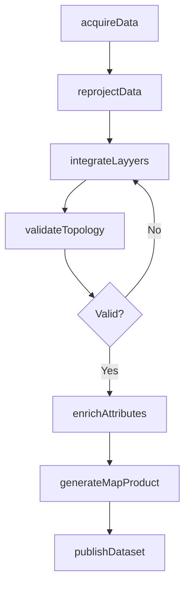
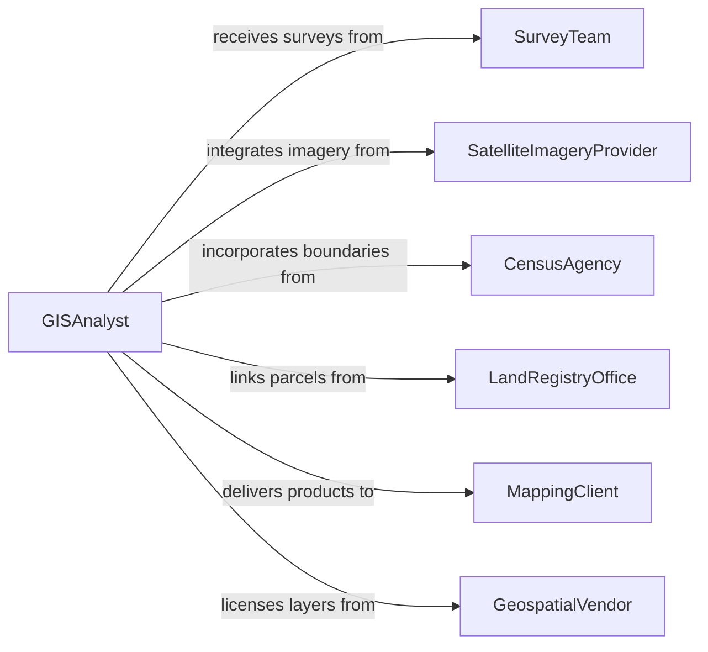

# Compile Geographic or Related Data

> Business-as-Code definition for compiling geographic and spatial data. Models the collection, georeferencing, integration, and publication of geographic information from surveys, remote sensing, and administrative records.

## Overview

Compiling geographic or related data involves gathering spatial information from GPS surveys, satellite imagery, census records, land registries, and field observations, then integrating it into georeferenced datasets suitable for mapping, analysis, and planning. This definition provides actions for data acquisition, coordinate transformation, spatial integration, and map product generation. It supports GIS analysts, surveyors, urban planners, and geospatial data managers.

## Actors

| Actor | Description |
|-------|-------------|
| SurveyTeam | Collects field measurements and GPS coordinates |
| SatelliteImageryProvider | Supplies remote sensing data and orthorectified imagery |
| CensusAgency | Provides demographic and administrative boundary data |
| LandRegistryOffice | Maintains parcel boundaries and property records |
| MappingClient | Commissions compiled geographic products for planning or analysis |
| GeospatialVendor | Supplies base map layers and commercial geographic datasets |

## Roles

| Role | Description |
|------|-------------|
| GISAnalyst | Integrates, processes, and compiles spatial data from multiple sources |
| Cartographer | Produces map products from compiled geographic datasets |
| DataGeodesist | Manages coordinate systems and spatial reference transformations |
| ProjectManager | Defines compilation requirements and timelines |

## Entities

| Entity | Description |
|--------|-------------|
| SpatialDataset | A georeferenced collection of geographic features or raster data |
| FeatureLayer | A set of geographic features sharing a common geometry type |
| CoordinateSystem | The spatial reference framework used for positioning data |
| FieldSurvey | A collection of measurements taken at specific geographic locations |
| BaseMap | A foundational geographic layer providing spatial context |
| MapProduct | A compiled cartographic output for distribution or analysis |
| AttributeTable | Tabular data linked to geographic features |

## Actions

| Action | Description |
|--------|-------------|
| acquireData | Obtain geographic data from designated sources |
| reprojectData | Transform spatial data between coordinate reference systems |
| integrateLayyers | Merge multiple spatial datasets into a unified compilation |
| validateTopology | Check spatial relationships and geometric consistency |
| enrichAttributes | Add non-spatial data to geographic feature records |
| generateMapProduct | Create a cartographic output from compiled spatial layers |
| publishDataset | Release the compiled geographic dataset for access |

## Events

| Event | Description |
|-------|-------------|
| dataAcquired | Geographic data has been obtained from a source |
| dataReprojected | Spatial data has been transformed to the target coordinate system |
| layersIntegrated | Multiple spatial datasets have been merged |
| topologyValidated | Spatial relationships and geometry have been verified |
| attributesEnriched | Non-spatial data has been linked to geographic features |
| mapProductGenerated | A cartographic output has been created |
| datasetPublished | The compiled geographic dataset has been released |

## Searches

| Search | Description |
|--------|-------------|
| findDatasets | List geographic datasets by region, theme, or date |
| getFeaturesByArea | Retrieve geographic features within a bounding box or polygon |
| getLayerMetadata | Access descriptions and quality information for spatial layers |
| findSurveys | Locate field surveys by date, area, or project |
| getAttributeValues | Query attribute data linked to geographic features |

## Workflow



## Actor Relationships



## Usage

### Calling Actions

```typescript
import { compileGeographicRelatedData } from '@headlessly/compile-geographic-related-data'

const compiler = compileGeographicRelatedData()

// Acquire source data
const survey = await compiler.acquireData({
  source: 'field-survey-team-alpha',
  region: 'downtown-district',
  coordinateSystem: 'EPSG:4326'
})

// Reproject and integrate layers
await compiler.reprojectData({
  datasetId: survey.id,
  targetCRS: 'EPSG:3857'
})

await compiler.integrateLayyers({
  layers: [survey.id, 'parcels-layer-2026', 'zoning-boundaries'],
  outputName: 'downtown-compiled-2026'
})

// Generate a map product
const map = await compiler.generateMapProduct({
  compilationId: 'downtown-compiled-2026',
  format: 'geotiff',
  scale: '1:5000'
})
```

### Event-Driven Automation

```typescript
// Validate topology after integration
compiler.layersIntegrated(async ({ compilationId }) => {
  await compiler.validateTopology({ compilationId })
})

// Auto-publish when map product is ready
compiler.mapProductGenerated(async ({ compilationId, productId }) => {
  await compiler.publishDataset({
    compilationId,
    distribution: 'gis-portal'
  })
})
```
