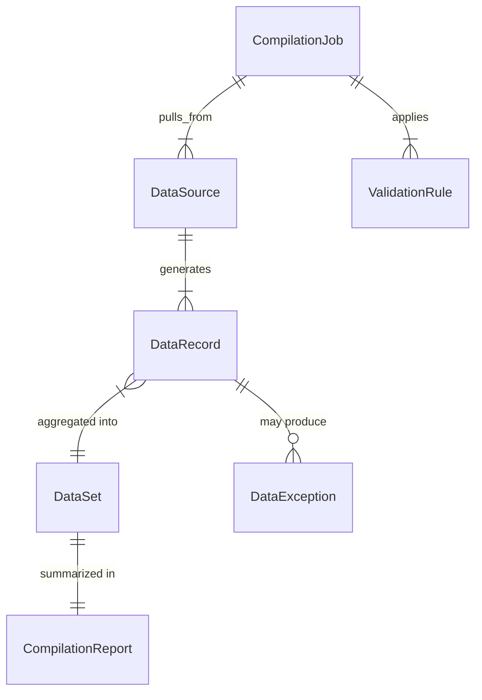
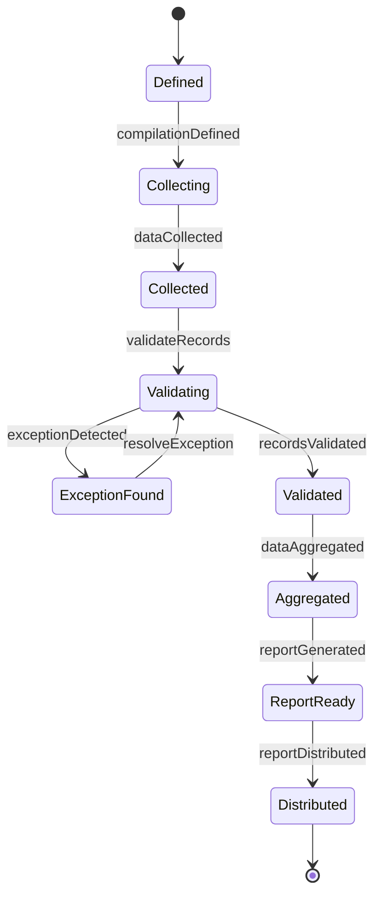
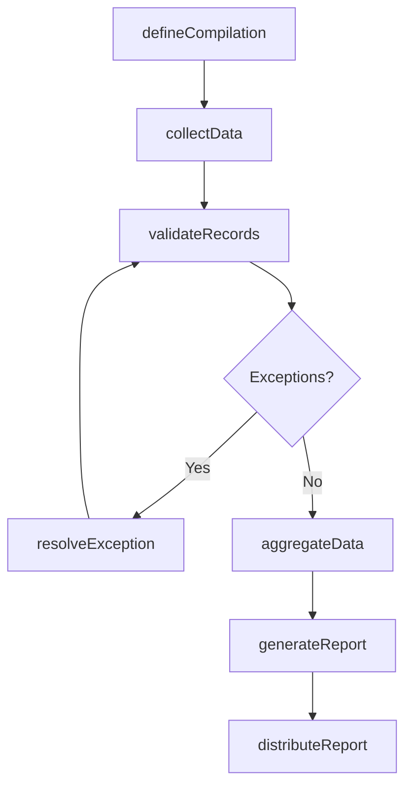
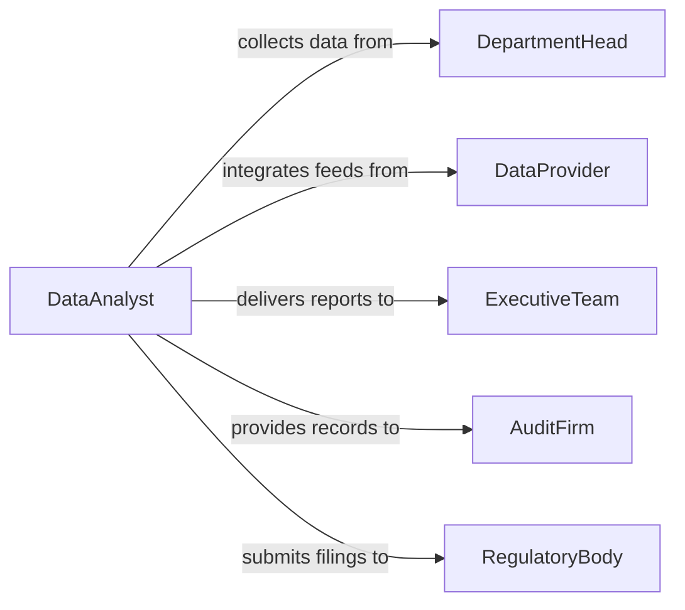

# Compile Operational Data

> Business-as-Code definition for compiling operational data. Models the collection, aggregation, and organization of operational metrics, production records, and performance indicators from across business units.

## Overview

Compiling operational data involves gathering information from multiple sources such as production systems, field reports, and departmental databases, then organizing it into structured formats for analysis and reporting. This definition provides actions for data collection, validation, aggregation, and distribution. It supports operations managers, analysts, and executive teams who need consolidated views of business performance.

## Actors

| Actor | Description |
|-------|-------------|
| DepartmentHead | Provides raw operational data from their business unit |
| DataProvider | External system or service that supplies operational metrics |
| ExecutiveTeam | Consumes compiled data for strategic decision-making |
| AuditFirm | Reviews compiled data for accuracy and completeness |
| RegulatoryBody | Requires compiled operational reports for compliance filings |

## Roles

| Role | Description |
|------|-------------|
| DataAnalyst | Collects, validates, and organizes operational data |
| OperationsManager | Defines data requirements and reviews compiled outputs |
| ReportingSpecialist | Formats and distributes compiled data to stakeholders |
| DataSteward | Ensures data quality standards are maintained |

## Entities

| Entity | Description |
|--------|-------------|
| DataSource | A system, department, or process that generates operational data |
| DataRecord | An individual unit of operational information |
| CompilationJob | A defined task to collect and aggregate data from specified sources |
| DataSet | An organized collection of compiled records ready for analysis |
| ValidationRule | A criterion for checking data accuracy and completeness |
| CompilationReport | A formatted summary of compiled operational data |
| DataException | A record that fails validation during compilation |

## Actions

| Action | Description |
|--------|-------------|
| defineCompilation | Specify the sources, scope, and format for a data compilation job |
| collectData | Retrieve raw data from designated operational sources |
| validateRecords | Check collected data against defined validation rules |
| aggregateData | Combine validated records into a unified data set |
| resolveException | Address data records that failed validation checks |
| generateReport | Produce a formatted compilation report from aggregated data |
| distributeReport | Send compiled data reports to designated stakeholders |

## Events

| Event | Description |
|-------|-------------|
| compilationDefined | A new data compilation job has been configured |
| dataCollected | Raw data has been retrieved from operational sources |
| recordsValidated | Data records have passed validation checks |
| dataAggregated | Validated records have been combined into a data set |
| exceptionDetected | A data record has failed validation during compilation |
| reportGenerated | A compilation report has been produced |
| reportDistributed | Compiled data has been sent to stakeholders |

## Searches

| Search | Description |
|--------|-------------|
| findCompilations | List compilation jobs by date, source, or status |
| getDataSources | Retrieve available data sources and their last collection date |
| getExceptions | Find data records that failed validation |
| getReports | Locate completed compilation reports by period or topic |
| getDataTrends | Query aggregated data over time for trend analysis |

## Entity Relationships



## State Diagram



## Workflow



## Actor Relationships



## Usage

### Calling Actions

```typescript
import { compileOperationalData } from '@headlessly/compile-operational-data'

const compiler = compileOperationalData()

// Define a monthly compilation
const job = await compiler.defineCompilation({
  name: 'January 2026 Operations Summary',
  period: { start: '2026-01-01', end: '2026-01-31' },
  sources: ['production-db', 'logistics-api', 'hr-system']
})

// Collect and validate
await compiler.collectData({ jobId: job.id })
const validation = await compiler.validateRecords({ jobId: job.id })

// Generate and distribute
const report = await compiler.generateReport({
  jobId: job.id,
  format: 'pdf',
  sections: ['throughput', 'downtime', 'labor-hours']
})
```

### Event-Driven Automation

```typescript
// Auto-resolve common data exceptions
compiler.exceptionDetected(async ({ jobId, recordId, reason }) => {
  if (reason === 'missing-timestamp') {
    await compiler.resolveException({ recordId, resolution: 'use-collection-time' })
  }
})

// Notify executives when monthly report is ready
compiler.reportGenerated(async ({ jobId, reportId }) => {
  await compiler.distributeReport({
    reportId,
    recipients: ['coo@company.com.ai', 'vp-ops@company.com.ai']
  })
})
```
