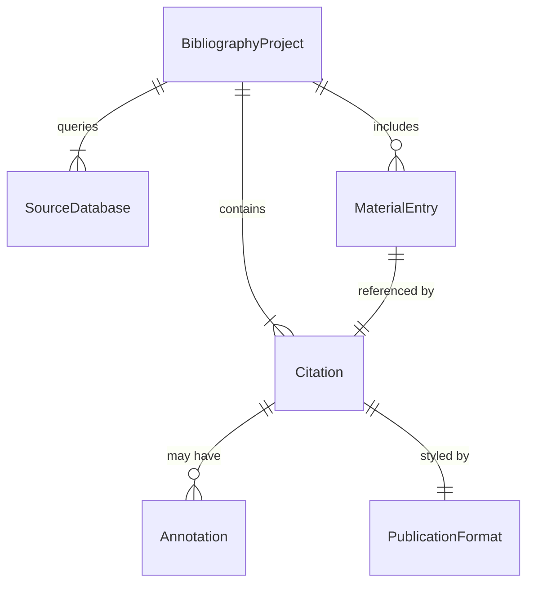
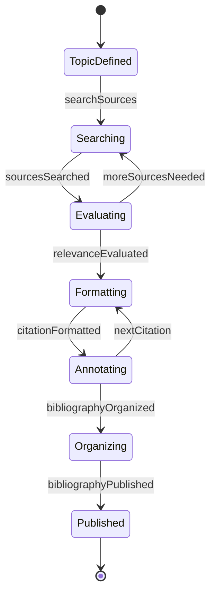
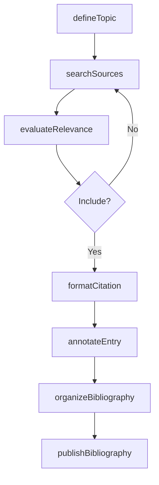
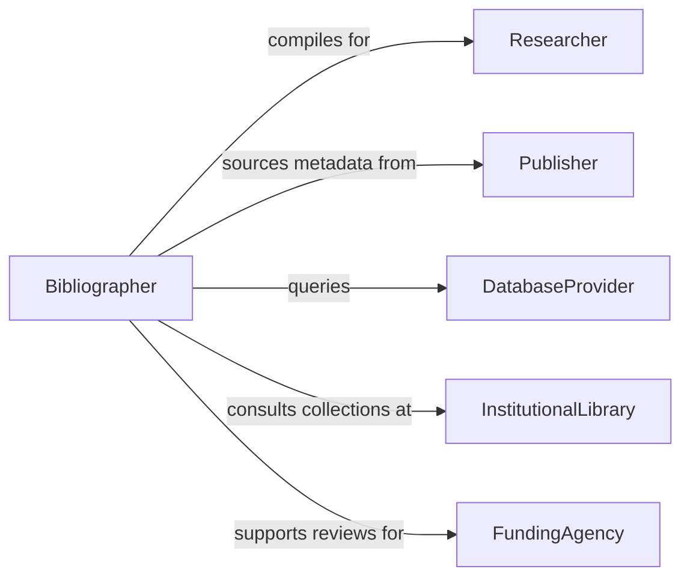

# Compile Specialized Bibliographies or Lists of Materials

> Business-as-Code definition for compiling specialized bibliographies and materials lists. Models the curation, citation management, and publication of reference collections for research, education, and professional use.

## Overview

Compiling specialized bibliographies or lists of materials involves identifying, evaluating, and organizing references such as books, journal articles, datasets, standards, and multimedia resources into curated collections for a specific topic or audience. This definition provides actions for source discovery, citation formatting, annotation, and list publication. It supports librarians, researchers, educators, and information specialists who build reference collections.

## Actors

| Actor | Description |
|-------|-------------|
| Researcher | Requests or consumes specialized bibliographies for academic work |
| Publisher | Supplies publications and metadata for inclusion in bibliographies |
| DatabaseProvider | Hosts indexes and catalogs from which references are sourced |
| InstitutionalLibrary | Maintains collections that inform bibliography compilation |
| FundingAgency | Requires literature reviews compiled from specialized bibliographies |

## Roles

| Role | Description |
|------|-------------|
| Bibliographer | Identifies, evaluates, and curates references for the bibliography |
| ReferencesLibrarian | Assists with source discovery and database searches |
| SubjectSpecialist | Reviews selections for topical relevance and authority |
| CatalogEditor | Formats citations and annotations to publication standards |

## Entities

| Entity | Description |
|--------|-------------|
| BibliographyProject | A defined effort to compile a bibliography on a specific topic |
| Citation | A formatted reference to a specific work or resource |
| Annotation | A descriptive or evaluative note accompanying a citation |
| SourceDatabase | An index or catalog queried during bibliography compilation |
| MaterialEntry | An item included in a materials list with its classification |
| PublicationFormat | The output specification such as APA, MLA, or Chicago style |

## Actions

| Action | Description |
|--------|-------------|
| defineTopic | Establish the subject scope and criteria for the bibliography |
| searchSources | Query databases and catalogs for relevant references |
| evaluateRelevance | Assess whether a source meets the inclusion criteria |
| formatCitation | Apply the designated citation style to a reference |
| annotateEntry | Add descriptive or evaluative notes to a citation |
| organizeBibliography | Arrange entries by subject, date, or other classification |
| publishBibliography | Release the compiled bibliography for distribution |

## Events

| Event | Description |
|-------|-------------|
| topicDefined | The subject scope for the bibliography has been established |
| sourcesSearched | Database queries for relevant references have been completed |
| relevanceEvaluated | A source has been assessed for inclusion |
| citationFormatted | A reference has been formatted to the designated style |
| entryAnnotated | A descriptive note has been added to a citation |
| bibliographyOrganized | Entries have been arranged in their final order |
| bibliographyPublished | The compiled bibliography has been released |

## Searches

| Search | Description |
|--------|-------------|
| findBibliographies | List bibliography projects by topic, date, or status |
| searchCitations | Query entries across bibliographies by author, keyword, or date |
| getPendingEvaluations | Find sources awaiting relevance assessment |
| getAnnotatedEntries | Retrieve citations that include annotations |
| findDuplicates | Identify duplicate references across bibliography entries |

## Entity Relationships



## State Diagram



## Workflow



## Actor Relationships



## Usage

### Calling Actions

```typescript
import { compileSpecializedBibliographiesListsMaterials } from '@headlessly/compile-specialized-bibliographies-lists-materials'

const compiler = compileSpecializedBibliographiesListsMaterials()

// Define a bibliography project
const project = await compiler.defineTopic({
  title: 'Machine Learning in Precision Agriculture',
  scope: ['crop-yield-prediction', 'remote-sensing', 'soil-analysis'],
  citationStyle: 'APA-7th',
  dateRange: { from: '2020-01-01', to: '2026-01-31' }
})

// Search and evaluate sources
const results = await compiler.searchSources({
  projectId: project.id,
  databases: ['web-of-science', 'scopus', 'pubmed']
})

// Format and annotate an entry
await compiler.formatCitation({
  projectId: project.id,
  sourceId: results.items[0].id
})

await compiler.annotateEntry({
  projectId: project.id,
  citationId: results.items[0].citationId,
  note: 'Foundational study on CNN-based crop classification from satellite imagery'
})
```

### Event-Driven Automation

```typescript
// Auto-detect duplicate entries
compiler.citationFormatted(async ({ projectId, citationId }) => {
  const duplicates = await compiler.findDuplicates({ projectId, citationId })
  if (duplicates.length > 0) {
    await flagForReview({ projectId, citationId, reason: 'potential-duplicate' })
  }
})

// Notify stakeholders on publication
compiler.bibliographyPublished(async ({ projectId, title }) => {
  await notify({
    to: 'research-team',
    message: `Bibliography "${title}" is now available`
  })
})
```
