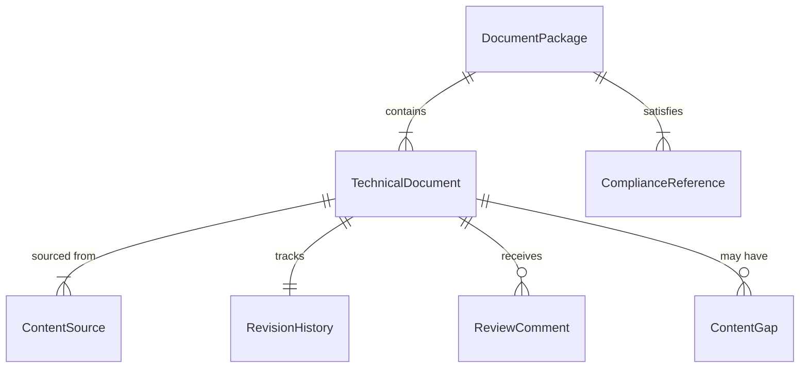
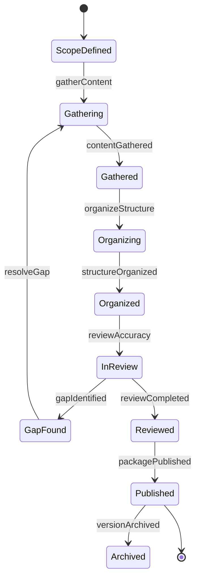
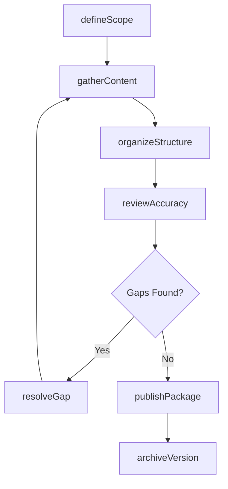
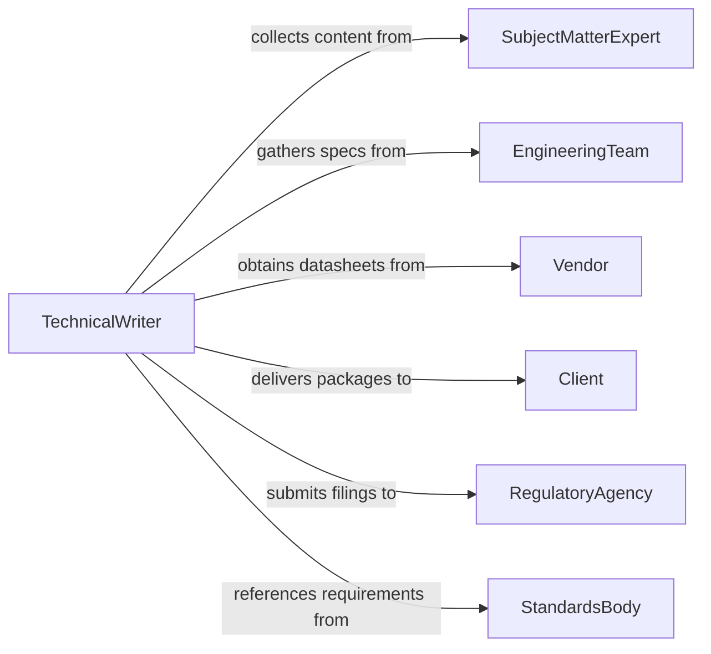

# Compile Technical Information or Documentation

> Business-as-Code definition for compiling technical information and documentation. Models the gathering, organizing, and packaging of technical specifications, engineering data, and system documentation from distributed sources.

## Overview

Compiling technical information and documentation involves collecting specifications, engineering drawings, test results, configuration data, and procedural guides from multiple contributors and systems. This definition provides actions for sourcing content, verifying technical accuracy, organizing materials by structure, and publishing compiled documentation packages. It supports engineering teams, technical writers, and project managers who need comprehensive technical reference materials.

## Actors

| Actor | Description |
|-------|-------------|
| SubjectMatterExpert | Provides specialized technical content and reviews accuracy |
| EngineeringTeam | Generates specifications, drawings, and design data |
| Vendor | Supplies product datasheets, manuals, and integration guides |
| Client | Receives compiled documentation as project deliverables |
| RegulatoryAgency | Requires technical documentation for certification or compliance |
| StandardsBody | Publishes standards that compiled documentation must reference |

## Roles

| Role | Description |
|------|-------------|
| TechnicalWriter | Gathers, organizes, and formats technical content |
| DocumentController | Manages version control and distribution of compiled documents |
| ProjectEngineer | Defines documentation requirements and reviews completeness |
| QualityReviewer | Verifies technical accuracy and compliance with standards |

## Entities

| Entity | Description |
|--------|-------------|
| TechnicalDocument | A specification, manual, drawing, or guide being compiled |
| ContentSource | An origin system or contributor providing technical data |
| DocumentPackage | A complete set of compiled technical materials for a project or product |
| RevisionHistory | A log of changes made to a document during compilation |
| ReviewComment | Feedback from a reviewer on document accuracy or completeness |
| ComplianceReference | A standard or regulation the documentation must satisfy |
| ContentGap | An identified missing section or data point in the compilation |

## Actions

| Action | Description |
|--------|-------------|
| defineScope | Specify the documents, sources, and standards for a compilation project |
| gatherContent | Collect technical data from designated sources and contributors |
| organizeStructure | Arrange gathered content into a logical document hierarchy |
| reviewAccuracy | Submit compiled content for technical review and validation |
| resolveGap | Address identified missing content or data in the compilation |
| publishPackage | Finalize and release the compiled documentation package |
| archiveVersion | Store a versioned copy of the compiled documentation |

## Events

| Event | Description |
|-------|-------------|
| scopeDefined | Documentation compilation scope has been established |
| contentGathered | Technical content has been collected from all sources |
| structureOrganized | Compiled content has been arranged into document hierarchy |
| reviewCompleted | Technical review of compiled documentation is complete |
| gapIdentified | A missing content section has been found during compilation |
| packagePublished | The compiled documentation package has been released |
| versionArchived | A versioned copy of the documentation has been stored |

## Searches

| Search | Description |
|--------|-------------|
| findPackages | List documentation packages by project, product, or status |
| getContentSources | Retrieve available sources and their contribution status |
| getReviewComments | Find reviewer feedback by document, reviewer, or severity |
| findGaps | Locate unresolved content gaps in active compilations |
| getRevisionHistory | Trace changes to a document across compilation cycles |

## Entity Relationships



## State Diagram



## Workflow



## Actor Relationships



## Usage

### Calling Actions

```typescript
import { compileTechnicalInformationDocumentation } from '@headlessly/compile-technical-information-documentation'

const compiler = compileTechnicalInformationDocumentation()

// Define compilation scope
const project = await compiler.defineScope({
  name: 'Product X Technical Manual v2.0',
  sources: ['engineering-cad', 'test-lab-results', 'vendor-datasheets'],
  standards: ['ISO-9001', 'IEC-62368-1'],
  deadline: '2026-03-15'
})

// Gather and organize content
await compiler.gatherContent({ projectId: project.id })
await compiler.organizeStructure({
  projectId: project.id,
  sections: ['overview', 'specifications', 'installation', 'maintenance', 'troubleshooting']
})

// Publish the final package
const pkg = await compiler.publishPackage({
  projectId: project.id,
  format: 'pdf',
  includeDrawings: true
})
```

### Event-Driven Automation

```typescript
// Notify contributors when gaps are found
compiler.gapIdentified(async ({ projectId, section, description }) => {
  const owner = await findSectionOwner({ projectId, section })
  await notify({
    to: owner.email,
    message: `Content gap in ${section}: ${description}`
  })
})

// Auto-archive when package is published
compiler.packagePublished(async ({ projectId, packageId }) => {
  await compiler.archiveVersion({ packageId, repository: 'document-vault' })
})
```
