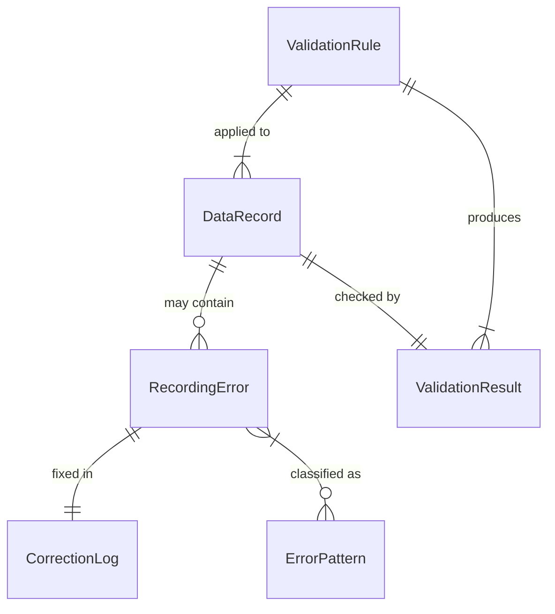
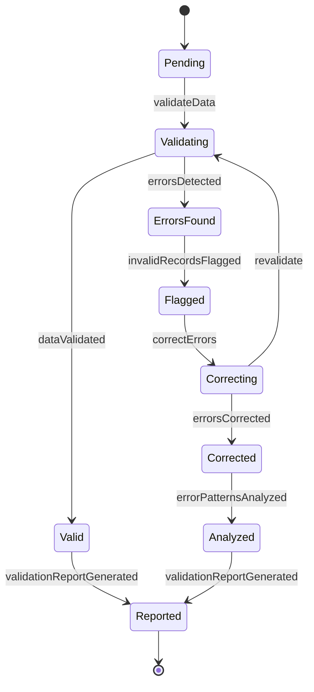
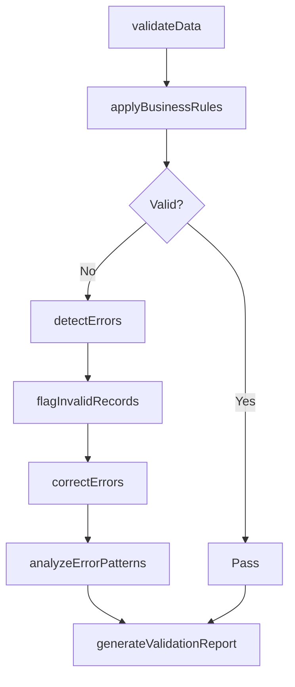
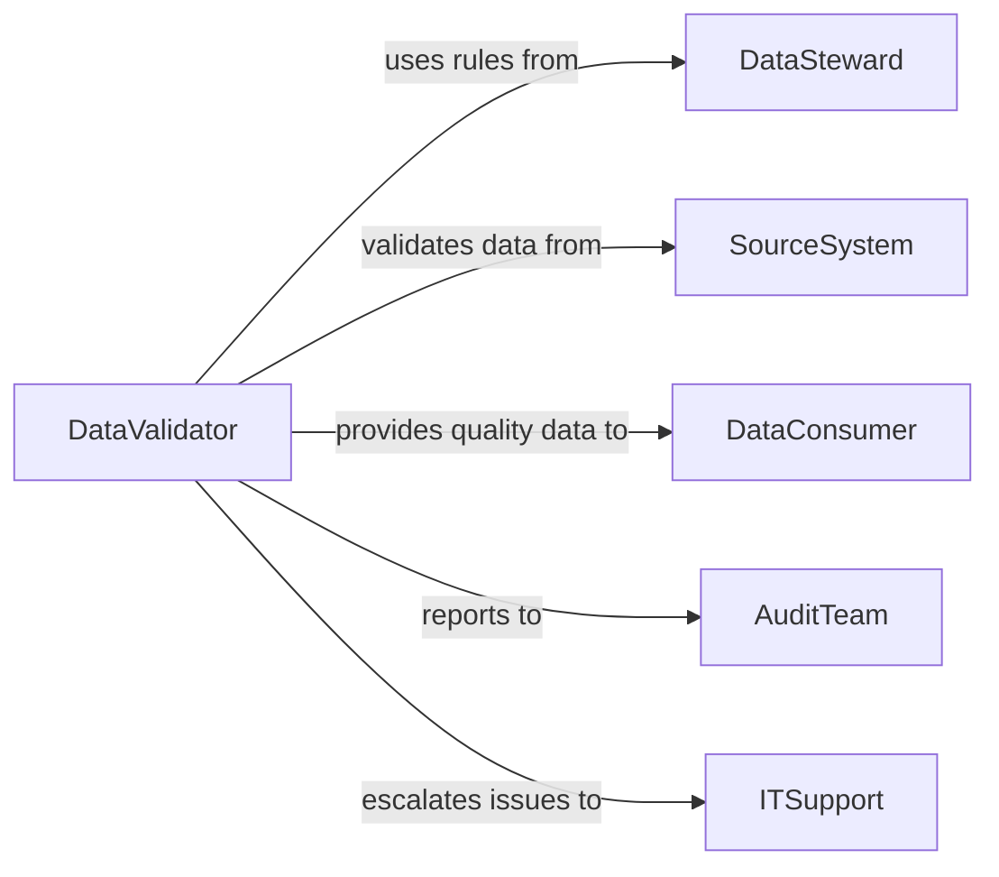

# Check Data Recording Errors

> Business-as-Code definition for checking data recording errors. Provides automated data validation, error detection, and quality assurance for data entry and recording processes.

## Overview

Checking data for recording errors involves systematic validation of data entries against defined rules, formats, and business logic to identify and correct mistakes before data is used in downstream processes. This definition exposes validation actions, error detection capabilities, and event-driven alerts to maintain data integrity and accuracy.

## Actors

| Actor | Description |
|-------|-------------|
| DataSteward | Defines data quality standards and validation rules |
| SourceSystem | Provides data through automated or manual entry |
| DataConsumer | Uses validated data for analysis or operations |
| AuditTeam | Reviews data quality and validation effectiveness |
| ITSupport | Maintains data validation systems and tools |
| ComplianceOfficer | Ensures data accuracy meets regulatory requirements |

## Roles

| Role | Description |
|------|-------------|
| DataValidator | Performs systematic checking of data entries |
| QualityAnalyst | Analyzes error patterns and validation effectiveness |
| DataClerk | Corrects identified data recording errors |
| ValidationManager | Oversees data quality assurance processes |

## Entities

| Entity | Description |
|--------|-------------|
| DataRecord | An individual data entry subject to validation |
| ValidationRule | A defined criterion for data accuracy and format |
| RecordingError | An identified mistake in data entry or recording |
| ValidationResult | The outcome of data accuracy checking process |
| ErrorPattern | A recurring type of data recording mistake |
| CorrectionLog | Documentation of data error fixes |

## Actions

| Action | Description |
|--------|-------------|
| validateData | Check data entries against validation rules |
| detectErrors | Identify recording mistakes and inconsistencies |
| flagInvalidRecords | Mark data entries that fail validation |
| correctErrors | Fix identified data recording mistakes |
| analyzeErrorPatterns | Identify recurring types of data errors |
| applyBusinessRules | Verify data conforms to business logic |
| generateValidationReport | Create documentation of data checking findings |

## Events

| Event | Description |
|-------|-------------|
| dataValidated | Data entries have been checked against rules |
| errorsDetected | Recording mistakes have been identified |
| invalidRecordsFlagged | Failed data entries have been marked |
| errorsCorrected | Data recording mistakes have been fixed |
| errorPatternsAnalyzed | Recurring error types have been identified |
| businessRulesApplied | Data business logic verification completed |
| validationReportGenerated | Data checking documentation created |

## Searches

| Search | Description |
|--------|-------------|
| findInvalidRecords | Retrieve data entries that failed validation |
| getRecordingErrors | List identified data mistakes by type or severity |
| getValidationResults | Find validation outcomes by dataset or period |
| getErrorPatterns | Retrieve recurring data error analyses |

## Entity Relationships



## State Diagram



## Workflow



## Actor Relationships



## Usage

### Calling Actions

```typescript
import { checkDataRecordingErrors } from '@headlessly/check-data-recording-errors'

const validator = checkDataRecordingErrors()

// Validate data entries
const result = await validator.validateData({
  datasetId: 'CUSTOMER-ORDERS-2026-02',
  records: 1500,
  validationRules: ['requiredFields', 'dataTypes', 'formatPatterns', 'valueRanges']
})

// Detect specific errors
const errors = await validator.detectErrors({
  datasetId: 'CUSTOMER-ORDERS-2026-02',
  checkTypes: ['duplicates', 'missingValues', 'invalidFormats', 'outliers'],
  severity: ['critical', 'high']
})

// Correct identified errors
await validator.correctErrors({
  errorIds: errors.map(e => e.id),
  correctionMethod: 'automated',
  notifyDataSteward: true
})
```

### Event-Driven Automation

```typescript
// Auto-flag critical errors for immediate review
validator.errorsDetected(async ({ errors, datasetId }) => {
  const criticalErrors = errors.filter(e => e.severity === 'critical')

  if (criticalErrors.length > 0) {
    await notify({
      to: 'data-steward',
      priority: 'urgent',
      message: `${criticalErrors.length} critical data errors detected in ${datasetId}`,
      action: 'review-immediately'
    })
    await validator.flagInvalidRecords({ errorIds: criticalErrors.map(e => e.id) })
  }
})

// Trigger pattern analysis on high error rates
validator.dataValidated(async ({ datasetId, validationResult }) => {
  const errorRate = validationResult.errorsFound / validationResult.recordsChecked

  if (errorRate > 0.05) {
    await validator.analyzeErrorPatterns({
      datasetId,
      focus: 'root-cause-analysis',
      period: 'last-30-days'
    })
  }
})
```
