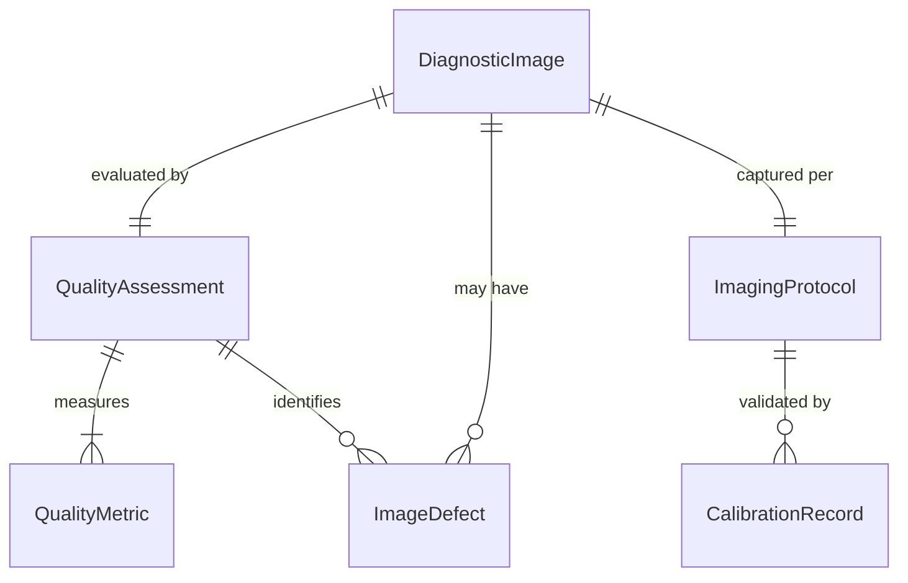
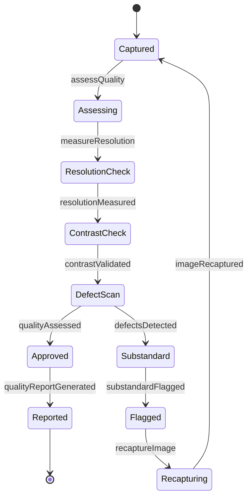
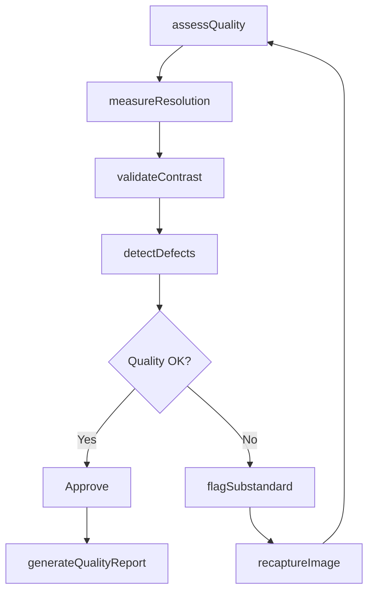
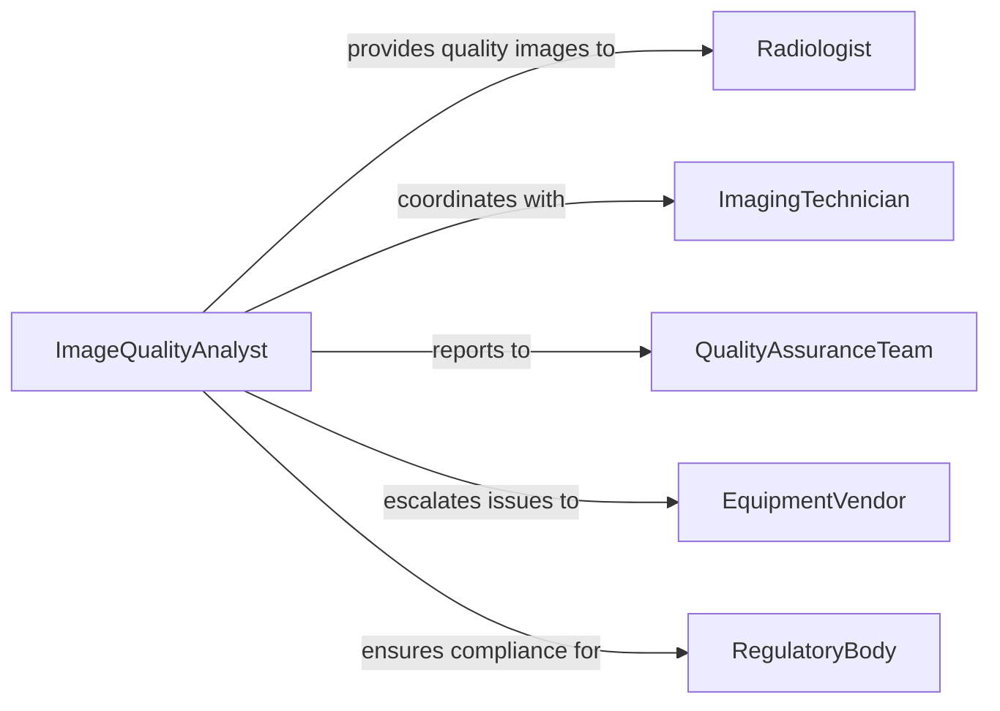

# Check Quality Diagnostic Images

> Business-as-Code definition for checking quality of diagnostic images. Provides automated image quality assessment, defect detection, and validation for medical imaging, industrial inspection, and quality control applications.

## Overview

Checking diagnostic image quality involves systematic evaluation of image clarity, resolution, contrast, and diagnostic value to ensure images meet standards for accurate interpretation and analysis. This definition exposes image quality validation actions, automated defect detection, and event-driven alerts to maintain imaging standards across diagnostic applications.

## Actors

| Actor | Description |
|-------|-------------|
| Radiologist | Interprets medical diagnostic images |
| ImagingTechnician | Captures diagnostic images using equipment |
| QualityAssuranceTeam | Defines and enforces image quality standards |
| EquipmentVendor | Provides and maintains imaging hardware |
| RegulatoryBody | Sets medical imaging quality requirements |
| InspectionEngineer | Uses images for industrial quality control |

## Roles

| Role | Description |
|------|-------------|
| ImageQualityAnalyst | Evaluates diagnostic image quality systematically |
| ImagingSpecialist | Optimizes image capture parameters |
| QualityControlManager | Oversees image quality assurance processes |
| CalibrationTechnician | Maintains imaging equipment performance |

## Entities

| Entity | Description |
|--------|-------------|
| DiagnosticImage | A captured image for medical or industrial analysis |
| QualityMetric | A measurable criterion for image quality |
| ImageDefect | An identified quality issue affecting diagnostic value |
| QualityAssessment | Evaluation result of image quality check |
| ImagingProtocol | Standard procedure for image capture and quality |
| CalibrationRecord | Documentation of equipment quality validation |

## Actions

| Action | Description |
|--------|-------------|
| assessQuality | Evaluate diagnostic image against quality standards |
| detectDefects | Identify artifacts, noise, or quality issues in images |
| measureResolution | Quantify image sharpness and detail level |
| validateContrast | Verify image contrast meets diagnostic requirements |
| flagSubstandard | Mark images that fail quality criteria |
| recaptureImage | Request new image acquisition due to quality issues |
| generateQualityReport | Create documentation of image quality findings |

## Events

| Event | Description |
|-------|-------------|
| qualityAssessed | Diagnostic image quality has been evaluated |
| defectsDetected | Image quality issues have been identified |
| resolutionMeasured | Image sharpness has been quantified |
| contrastValidated | Image contrast has been verified |
| substandardFlagged | Low-quality images have been marked |
| imageRecaptured | New image acquisition has been requested |
| qualityReportGenerated | Image quality documentation created |

## Searches

| Search | Description |
|--------|-------------|
| findImages | List diagnostic images by type, date, or quality status |
| getDefects | Retrieve image quality issues by type or severity |
| getQualityAssessments | Find image evaluations by facility or period |
| getCalibrationRecords | List equipment quality validation history |

## Entity Relationships



## State Diagram



## Workflow



## Actor Relationships



## Usage

### Calling Actions

```typescript
import { checkQualityDiagnosticImages } from '@headlessly/check-quality-diagnostic-images'

const imageQuality = checkQualityDiagnosticImages()

// Assess diagnostic image quality
const assessment = await imageQuality.assessQuality({
  imageId: 'XRAY-CHEST-2026-0205-001',
  imagingModality: 'chest-xray',
  qualityCriteria: ['resolution', 'contrast', 'positioning', 'exposure'],
  standardProtocol: 'ACR-CHEST-XRAY-2025'
})

// Detect image defects
const defects = await imageQuality.detectDefects({
  imageId: 'XRAY-CHEST-2026-0205-001',
  checkTypes: ['artifacts', 'noise', 'blur', 'underexposure', 'overexposure'],
  sensitivity: 'high'
})

// Flag substandard image and request recapture
if (assessment.qualityScore < 0.80 || defects.length > 0) {
  await imageQuality.flagSubstandard({
    imageId: 'XRAY-CHEST-2026-0205-001',
    reasons: assessment.failedCriteria,
    defects: defects
  })

  await imageQuality.recaptureImage({
    originalImageId: 'XRAY-CHEST-2026-0205-001',
    reason: 'quality-below-threshold',
    recommendations: ['adjust-exposure', 'reposition-patient']
  })
}
```

### Event-Driven Automation

```typescript
// Auto-flag and recapture low-quality images
imageQuality.defectsDetected(async ({ imageId, defects, severity }) => {
  const criticalDefects = defects.filter(d => d.severity === 'critical')

  if (criticalDefects.length > 0) {
    await imageQuality.flagSubstandard({ imageId, reasons: criticalDefects })
    await imageQuality.recaptureImage({
      originalImageId: imageId,
      priority: 'immediate',
      reason: 'critical-quality-defects'
    })

    await notify({
      to: 'imaging-technician',
      message: `Image ${imageId} requires immediate recapture due to critical defects`
    })
  }
})

// Trigger equipment calibration on quality degradation
imageQuality.qualityAssessed(async ({ equipmentId, qualityTrend }) => {
  if (qualityTrend.direction === 'declining' && qualityTrend.duration > 7) {
    await notify({
      to: 'calibration-technician',
      message: `Equipment ${equipmentId} showing declining image quality over ${qualityTrend.duration} days`,
      action: 'schedule-calibration'
    })
  }
})
```
