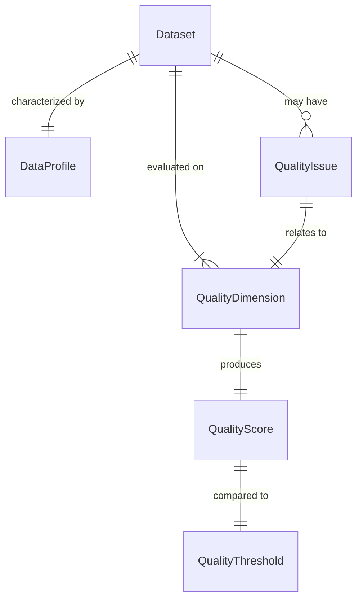
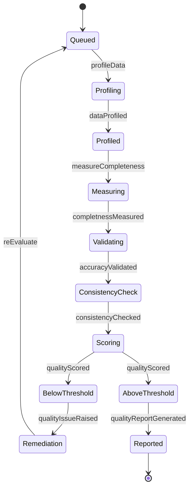
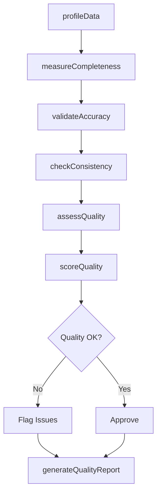
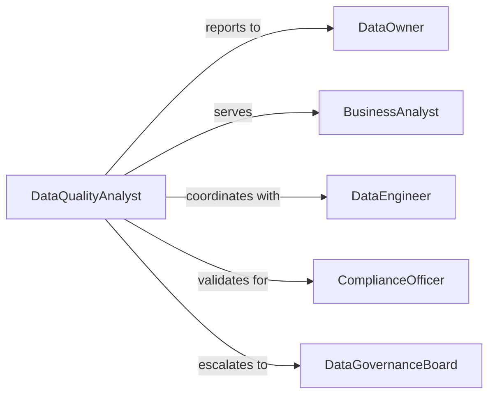

# Evaluate Data Quality

> Business-as-Code definition for evaluating data quality. Provides comprehensive data quality assessment, profiling, and monitoring to ensure data fitness for business and analytical purposes.

## Overview

Evaluating data quality involves systematic assessment of data completeness, accuracy, consistency, timeliness, and validity to determine fitness for intended use. This definition exposes data quality evaluation actions, multi-dimensional quality scoring, and event-driven alerts to maintain high data quality standards across the organization.

## Actors

| Actor | Description |
|-------|-------------|
| DataOwner | Accountable for data quality within their domain |
| BusinessAnalyst | Uses data for analysis and decision-making |
| DataEngineer | Builds and maintains data pipelines and systems |
| ComplianceOfficer | Ensures data meets regulatory quality requirements |
| DataGovernanceBoard | Sets enterprise data quality policies and standards |
| ThirdPartyProvider | Supplies external data to the organization |

## Roles

| Role | Description |
|------|-------------|
| DataQualityAnalyst | Evaluates data against quality dimensions |
| DataSteward | Manages data quality for specific domains |
| QualityManager | Oversees enterprise data quality program |
| DataProfilingSpecialist | Analyzes data characteristics and patterns |

## Entities

| Entity | Description |
|--------|-------------|
| Dataset | A collection of data subject to quality evaluation |
| QualityDimension | A measurable aspect of data quality |
| QualityScore | Quantified assessment of data quality |
| QualityIssue | An identified deficiency in data quality |
| DataProfile | Statistical characterization of dataset |
| QualityThreshold | Defined minimum acceptable quality level |

## Actions

| Action | Description |
|--------|-------------|
| assessQuality | Evaluate data across multiple quality dimensions |
| profileData | Analyze statistical characteristics of dataset |
| measureCompleteness | Quantify presence of required data values |
| validateAccuracy | Verify data correctness against source of truth |
| checkConsistency | Ensure data uniformity across systems and time |
| scoreQuality | Calculate overall data quality rating |
| generateQualityReport | Create documentation of data quality findings |

## Events

| Event | Description |
|-------|-------------|
| qualityAssessed | Data has been evaluated across quality dimensions |
| dataProfiled | Statistical dataset analysis has been completed |
| completnessMeasured | Data value presence has been quantified |
| accuracyValidated | Data correctness has been verified |
| consistencyChecked | Data uniformity has been confirmed |
| qualityScored | Overall quality rating has been calculated |
| qualityReportGenerated | Data quality documentation has been created |

## Searches

| Search | Description |
|--------|-------------|
| findDatasets | List datasets by quality score or domain |
| getQualityIssues | Retrieve quality deficiencies by type or severity |
| getQualityScores | Find quality ratings by dataset or dimension |
| getDataProfiles | Retrieve statistical dataset analyses |

## Entity Relationships



## State Diagram



## Workflow



## Actor Relationships



## Usage

### Calling Actions

```typescript
import { evaluateDataQuality } from '@headlessly/evaluate-data-quality'

const quality = evaluateDataQuality()

// Assess overall data quality
const assessment = await quality.assessQuality({
  datasetId: 'CUSTOMER-MASTER-DATA',
  dimensions: ['completeness', 'accuracy', 'consistency', 'timeliness', 'validity'],
  evaluationDate: new Date()
})

// Profile dataset characteristics
const profile = await quality.profileData({
  datasetId: 'CUSTOMER-MASTER-DATA',
  analysis: ['recordCount', 'fieldPopulation', 'valueDistribution', 'outliers', 'duplicates'],
  sampleSize: 10000
})

// Calculate quality score
const score = await quality.scoreQuality({
  datasetId: 'CUSTOMER-MASTER-DATA',
  weightings: {
    completeness: 0.25,
    accuracy: 0.30,
    consistency: 0.20,
    timeliness: 0.15,
    validity: 0.10
  },
  threshold: 0.85
})
```

### Event-Driven Automation

```typescript
// Alert on quality degradation
quality.qualityScored(async ({ datasetId, score, threshold }) => {
  if (score.overall < threshold) {
    await notify({
      to: 'data-steward',
      priority: 'high',
      message: `Data quality score for ${datasetId} below threshold: ${score.overall} (minimum: ${threshold})`,
      action: 'investigate-quality-issues'
    })

    await quality.generateQualityReport({
      datasetId,
      includeRecommendations: true,
      focus: score.lowestDimensions
    })
  }
})

// Auto-validate accuracy on completeness issues
quality.completnessMeasured(async ({ datasetId, completeness }) => {
  if (completeness.criticalFields < 0.95) {
    await quality.validateAccuracy({
      datasetId,
      focus: completeness.incompleteFields,
      verificationMethod: 'source-system-comparison'
    })
  }
})

// Trigger profiling on data ingestion
quality.qualityAssessed(async ({ datasetId, lastProfileDate }) => {
  const daysSinceProfile = (Date.now() - lastProfileDate.getTime()) / (1000 * 60 * 60 * 24)

  if (daysSinceProfile > 30) {
    await quality.profileData({
      datasetId,
      reason: 'scheduled-refresh',
      fullAnalysis: true
    })
  }
})
```
