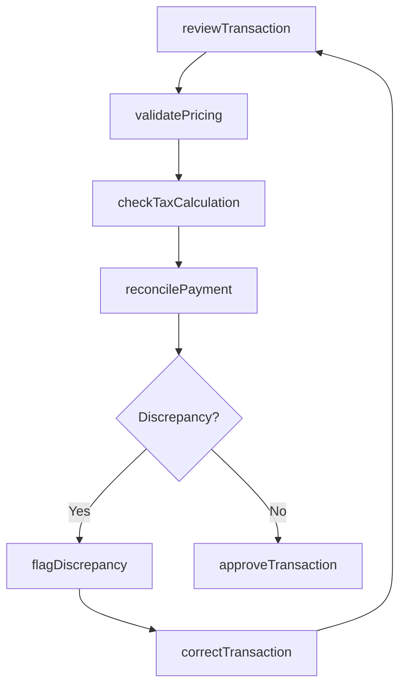
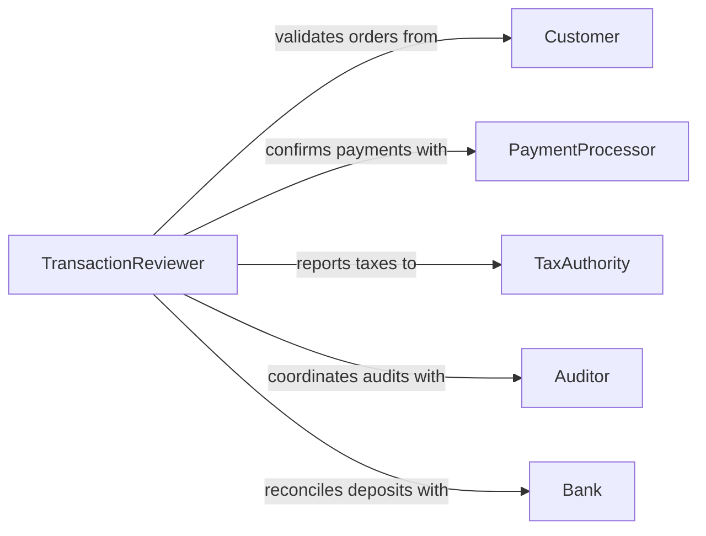

# Review Accuracy Sales Transactions

> Business-as-Code definition for sales transaction accuracy review. Models validation workflows for transaction completeness, pricing, discounts, and payment reconciliation.

## Overview

Sales transaction review ensures that revenue records, order details, and payment processing are accurate and complete. This definition provides actions for validating transactions, detecting discrepancies, and coordinating corrections across finance and sales operations.

## Actors

| Actor | Description |
|-------|-------------|
| Customer | Places orders and makes payments |
| PaymentProcessor | Handles credit card and payment gateway transactions |
| TaxAuthority | Requires accurate sales tax reporting |
| Auditor | Reviews transaction records for compliance |
| Bank | Processes settlements and deposits |
| Vendor | Provides products or services sold in transactions |

## Roles

| Role | Description |
|------|-------------|
| TransactionReviewer | Validates transaction accuracy and completeness |
| SalesOperations | Manages order processing and fulfillment |
| FinanceAnalyst | Reconciles payments and revenue recognition |
| ComplianceOfficer | Ensures regulatory compliance in transactions |

## Entities

| Entity | Description |
|--------|-------------|
| Transaction | A completed sales or revenue event |
| LineItem | Individual product or service within transaction |
| Payment | Customer payment linked to transaction |
| Discount | Promotional or negotiated price reduction |
| TaxCalculation | Sales tax applied to transaction |
| Discrepancy | Identified error or mismatch in transaction data |

## Actions

| Action | Description |
|--------|-------------|
| reviewTransaction | Validate transaction data for accuracy |
| validatePricing | Confirm prices match catalog and contracts |
| reconcilePayment | Match payment to transaction and deposit |
| checkTaxCalculation | Verify sales tax accuracy |
| flagDiscrepancy | Mark transaction as requiring correction |
| correctTransaction | Update transaction with corrected data |
| approveTransaction | Confirm transaction accuracy and finalize |

## Events

| Event | Description |
|-------|-------------|
| transactionReviewed | Transaction validation is complete |
| pricingValidated | Pricing has been confirmed accurate |
| paymentReconciled | Payment matched to transaction and deposit |
| taxCalculationChecked | Sales tax calculation verified |
| discrepancyFlagged | Error or mismatch detected in transaction |
| transactionCorrected | Transaction data updated with corrections |
| transactionApproved | Transaction validated and finalized |

## Searches

| Search | Description |
|--------|-------------|
| findTransactions | List transactions by date, customer, or status |
| getDiscrepancies | Retrieve transactions flagged for review |
| getUnreconciled | Find transactions with unmatched payments |
| getTaxErrors | List transactions with tax calculation issues |

## Workflow



## Actor Relationships



## Usage

### Calling Actions

```typescript
import { reviewAccuracySalesTransactions } from '@headlessly/review-accuracy-sales-transactions'

const transactions = reviewAccuracySalesTransactions()

// Review a recent transaction
const review = await transactions.reviewTransaction({
  transactionId: 'txn_2026_001234',
  includeLineItems: true
})

// Validate pricing against catalog
const pricing = await transactions.validatePricing({
  transactionId: 'txn_2026_001234',
  catalogVersion: '2026-Q1'
})

// Reconcile payment to bank deposit
await transactions.reconcilePayment({
  transactionId: 'txn_2026_001234',
  paymentId: 'pmt_567890',
  depositId: 'dep_abc123'
})
```

### Event-Driven Automation

```typescript
// Auto-flag high-value discrepancies
transactions.discrepancyFlagged(async ({ transactionId, amount, type }) => {
  if (amount > 1000) {
    await notify({
      to: 'finance-team',
      priority: 'high',
      message: `${type} discrepancy of $${amount} on ${transactionId}`
    })
  }
})

// Auto-approve low-value transactions
transactions.transactionReviewed(async ({ transactionId, totalAmount }) => {
  if (totalAmount < 50 && review.discrepancies.length === 0) {
    await transactions.approveTransaction({ transactionId })
  }
})
```
